# Description générale

<h3 class="lua-cmd" id="block_type" >Type</h3>

Les blocs de la programmation par blocs peuvent être divisés en quatre catégories principales en fonction de leur forme.

**Blocs à tête ronde**


Les blocs de cette forme sont utilisés en tête de la colonne de blocs et tous les blocs à exécuter doivent être connectés sous ce type de bloc. Seuls les [jeux de blocs pour événements](event.md) contiennent ce type de bloc.

**Blocs rectangulaires**


Les blocs de cette forme sont utilisés pour exécuter des instructions et constituent l'élément principal d'un programme de blocs. Les emplacements de paramètres ovales et en forme de losange dans les blocs peuvent être remplis par des blocs de la forme correspondante.

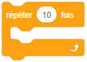

Il existe une classe de variantes de blocs rectangulaires qui peuvent être utilisées pour le contrôle des processus en imbriquant d'autres blocs à l'intérieur du bloc.

Exemple :

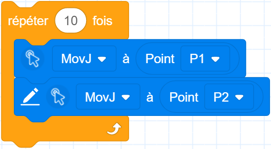

**Blocs ellipses**


Les blocs ovales renvoient des variables (valeurs, chaînes, tableaux, etc.) après leur exécution, qui peuvent être utilisées comme paramètres dans les emplacements de paramètres des blocs rectangulaires de la forme correspondante.

Exemple :

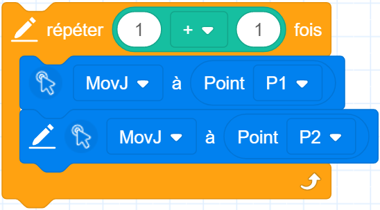

**Losange**


Les blocs en forme de losange sont utilisés pour les jugements conditionnels et renvoient des valeurs vraies ou fausses après exécution, qui sont utilisées comme paramètres dans les emplacements de paramètres des blocs rectangulaires de la forme correspondante.

Exemple :

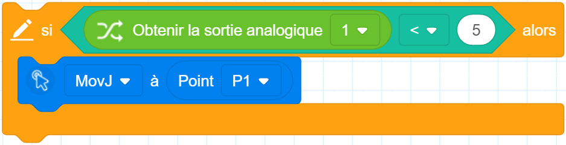

<h3 class="lua-cmd" id="motion_type" >Mode de mouvement</h3>

Les mouvements pris en charge par le bras robotique peuvent être classés dans les catégories suivantes.

**Mouvement articulaire**

Le bras robotique planifie le mouvement de chaque articulation en fonction de la différence entre l'angle actuel de chaque articulation et l'angle de chaque articulation au point cible, de sorte que chaque articulation effectue le mouvement en même temps. Le mouvement des articulations n'est pas limité par la trajectoire du point central de l'outil (TCP), qui n'est généralement pas linéaire.

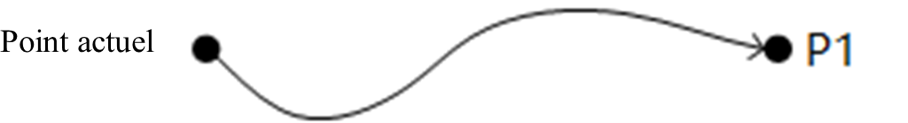

Le mouvement conjoint n'est pas contraint par la position de singularité (voir le manuel du matériel correspondant du bras robotique pour plus de détails sur la position de singularité), il est donc recommandé d'utiliser le mouvement conjoint s'il n'y a pas d'exigence concernant la trajectoire du mouvement ou si le point cible est proche de la position de singularité.

**Mouvement linéaire**

Le bras du robot planifie la trajectoire du mouvement en fonction de la position actuelle et de la position du point cible, de sorte que la trajectoire du mouvement du TCP est une ligne droite et que la position finale change à une vitesse uniforme au cours du mouvement.

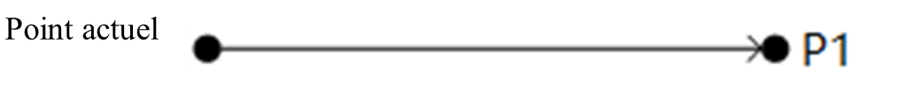

Lorsque la trajectoire de mouvement passe par la position singulière, l'envoi d'une commande de mouvement en ligne droite au bras robotique génère un rapport d'erreur ; il est donc recommandé de replanifier la position du point ou d'utiliser un mouvement conjoint à proximité de la position singulière.

**Mouvement en arc**

Le bras robotique détermine un arc ou un cercle entier passant par la position actuelle, P1, P2 trois points non colinéaires. L'attitude finale du bras du robot pendant le mouvement est calculée en interpolant l'attitude du point actuel et de P2, et l'attitude de P1 n'intervient pas dans le calcul (c'est-à-dire que l'attitude du bras du robot lorsqu'il arrive à P1 pendant le mouvement peut être différente de l'attitude enseignée).

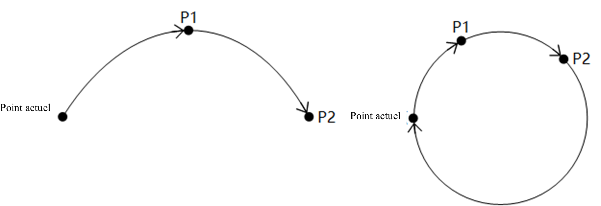

Lorsque la trajectoire du mouvement passe par la position impaire, l'envoi de la commande de mouvement d'arc au bras robotique génère un rapport d'erreur, et il est recommandé de replanifier la position du point ou d'utiliser le mouvement de l'articulation à proximité de la position impaire.

<h3 class="lua-cmd" id="coord" >Paramètres de systèmes de coordonnées</h3>

Les blocs de mouvement peuvent spécifier le système de coordonnées de l'utilisateur et le système de coordonnées de l'outil correspondant à la position du point par le biais de la configuration avancée, et la priorité des paramètres est la suivante :

1. Lorsqu'un système de coordonnées est spécifié via la configuration avancée, le système de coordonnées spécifié est utilisé. Si le paramètre de point est un point d'apprentissage, les coordonnées de la position du bit du point d'apprentissage sont converties en valeur dans le système de coordonnées spécifié pour être utilisées.
2. Si le paramètre de point est un point d'apprentissage, l'index du système de coordonnées du point d'apprentissage est utilisé si le système de coordonnées n'est pas spécifié par la configuration avancée.
3. Lorsqu'un système de coordonnées n'est pas spécifié par la configuration avancée, si le paramètre de point est une variable d'articulation ou d'attitude, le système de coordonnées global défini dans le groupe de blocs de **contrôle** est utilisé (voir **Paramétrage du système de coordonnées de l'utilisateur** et **Paramétrage des blocs du système de coordonnées de l'outil** pour plus de détails ; le système de coordonnées par défaut est 0 lorsqu'aucun bloc n'est défini).

<div class="info1"><b> Description : </b><div>Lors du démarrage d'un projet, le système de coordonnées global par défaut est réinitialisé à zéro, indépendamment des valeurs définies dans le panneau de jog avant le démarrage du projet. </div></div>

<h3 class="lua-cmd" id="speed" >Paramètres de vitesse</h3>

**Vitesse relative**

Les blocs de mouvement peuvent être configurés pour spécifier l'accélération (Accel) et l'échelle de vitesse (V) du bras du robot lorsqu'il exécute cette commande de mouvement.

```
Vitesse de mouvement réelle du robot = Vitesse maximale x Taux global x Taux de commande
Accélération de mouvement réelle du robot = Accélération maximale x Taux de commande
```

La vitesse/accélération maximale est contrôlée par les **paramètres de reproduction**, qui peuvent être visualisés et modifiés sur la page Paramètres de mouvement du logiciel de commande ;

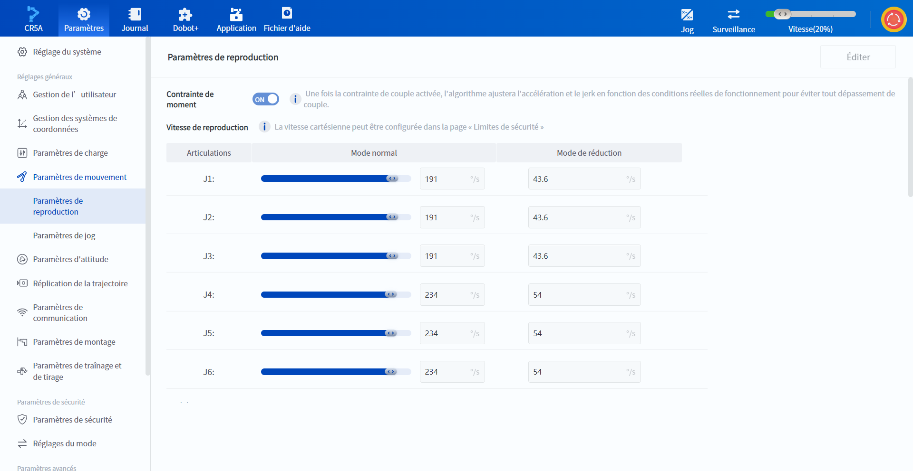

<br/>

La vitesse globale peut être réglée via le logiciel de commande (coin supérieur droit de l'image ci-dessus) ou le bloc de construction **Set Global Rate** ;
Le taux de commande est le taux spécifié par la configuration avancée des blocs de mouvement. Si le rapport accélération/vitesse du mouvement n'est pas spécifié par la configuration avancée, la valeur par défaut définie par le bloc de **rapport vitesse/accélération linéaire/joint** correspondant sera utilisée, et la valeur par défaut est 100 lorsque le bloc n'est pas utilisé.

**Vitesse absolue**

La configuration avancée des blocs Mouvement linéaire et Mouvement d'arc permet de spécifier la vitesse absolue (Vitesse) à laquelle le bras exécute la commande de mouvement.

La vitesse absolue n'est pas affectée par la vitesse globale, mais elle est limitée par la vitesse maximale du **paramètre de reproduction** (ou la vitesse maximale réduite si le bras est en mode réduit), c'est-à-dire que si la vitesse absolue est supérieure à la vitesse maximale du paramètre Reproduction, c'est la vitesse maximale qui prévaut.

Par exemple, si la vitesse absolue du mouvement linéaire est fixée à 1000, ce qui est inférieur à 2000 de la vitesse maximale dans les paramètres de reproduction, le bras robotique se déplacera à une vitesse cible de 1000 mm/s, ce qui est indépendant de la vitesse globale à ce moment-là. Toutefois, si le bras robotique est en mode de réduction (en supposant un taux de réduction de 10 %), la vitesse maximale devient 200, ce qui est inférieur à 1000, et le bras robotique se déplacera à une vitesse cible de 200 mm/s à ce moment-là.

La vitesse absolue et l'échelle de vitesse ne peuvent pas être réglées en même temps.

<h3 class="lua-cmd" id="cp_r" >Transition lisse</h3>

Dans certains cas, le bras du robot doit passer par plusieurs points de transition avant d'atteindre le point cible. Ces points de transition sont généralement utilisés pour que la trajectoire de déplacement du robot évite les obstacles, et il n'est pas nécessaire que le bras du robot atteigne le point avec précision. En définissant le paramètre Transition douce, le bras du robot commencera à tourner à l'avance avant d'atteindre les points de transition, de sorte que la vitesse et la trajectoire du bras du robot seront plus douces lorsqu'il tournera.
L'utilisateur peut spécifier le ratio de transition douce (CP) ou le rayon de transition douce (R) lorsque le bras passe d'une commande de mouvement à la suivante via la configuration avancée de la commande de mouvement.

<div class="info1"><b> Description : </b><div><ul><li>Mode de mouvement d’articulaire ne prend pas en charge la définition du rayon de transition lisse (R). </li><li>Si les points de trajectoire spécifiés par l'utilisateur sont basés sur des systèmes de coordonnées d'outil différents, la transition lisse n'est pas possible. </li></ul></div></div>

<br/>

**CP**

Lors du réglage du rapport de transition douce, le système calcule automatiquement la courbure de la courbe de transition. Plus la valeur CP est élevée, plus la courbe est douce, comme le montre la figure ci-dessous. La courbe de transition CP est affectée par la vitesse/accélération du mouvement, même si la position du point et la valeur CP sont identiques, l'arc de la courbe de transition sera différent lorsque la vitesse/accélération du mouvement est différente.

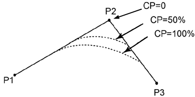

**R**

Lorsque vous définissez le rayon de transition lisse, le système prend le point de transition comme centre et calcule la courbe de transition en fonction du rayon spécifié. La courbe de transition R n'est pas affectée par la vitesse/accélération du mouvement, elle est uniquement déterminée par la position du point et le rayon de transition.

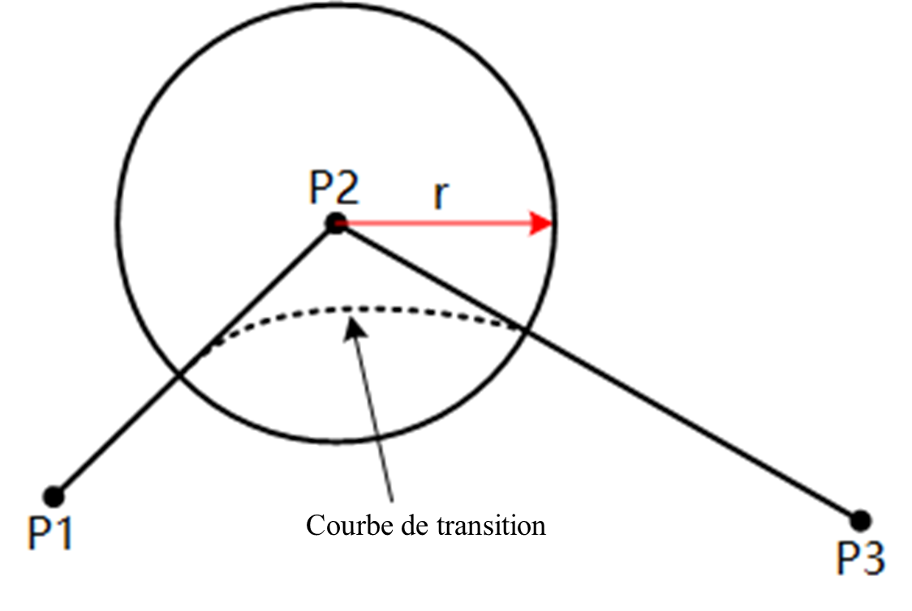

Si le rayon de transition défini par l'utilisateur est trop grand (supérieur à la distance entre le point de départ/fin et le point de transition), le système utilise automatiquement la moitié de la distance la plus courte entre le point de départ/fin et le point de transition (L dans la figure ci-dessous) comme rayon de transition pour calculer la courbe de transition.

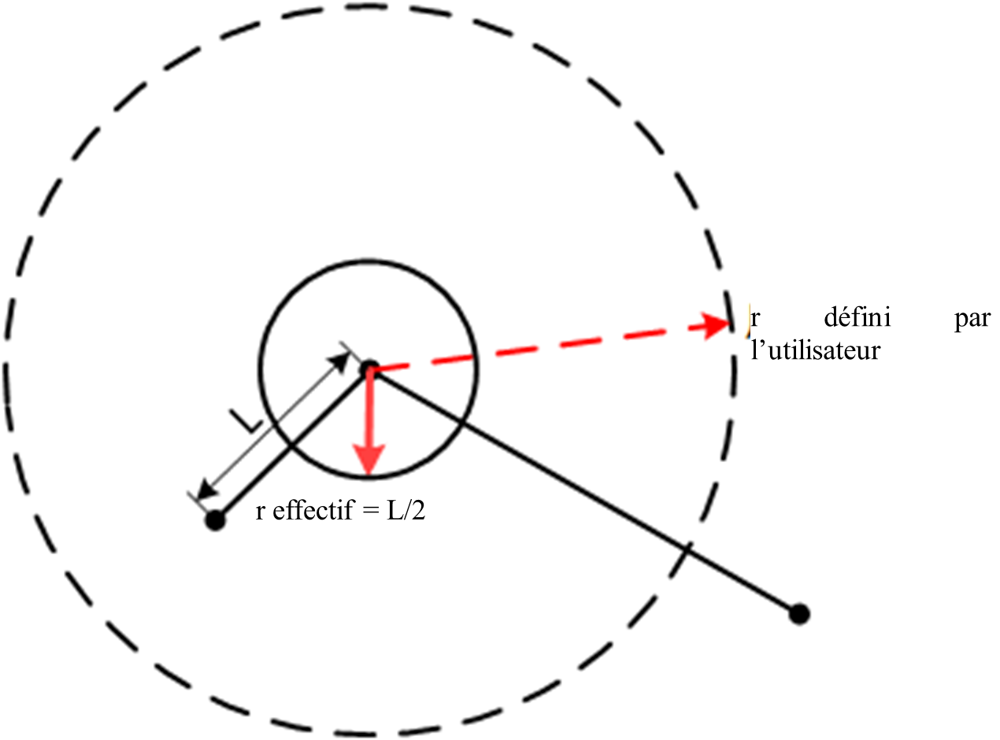

Lorsque deux rayons de transition consécutifs (r1 et r2 dans la figure ci-dessous) coïncident, le système utilise le point après la fin de la transition du premier mouvement comme point de départ du second mouvement, puis calcule le second r qui est réellement en vigueur en fonction de la logique selon laquelle le rayon de transition est trop grand.

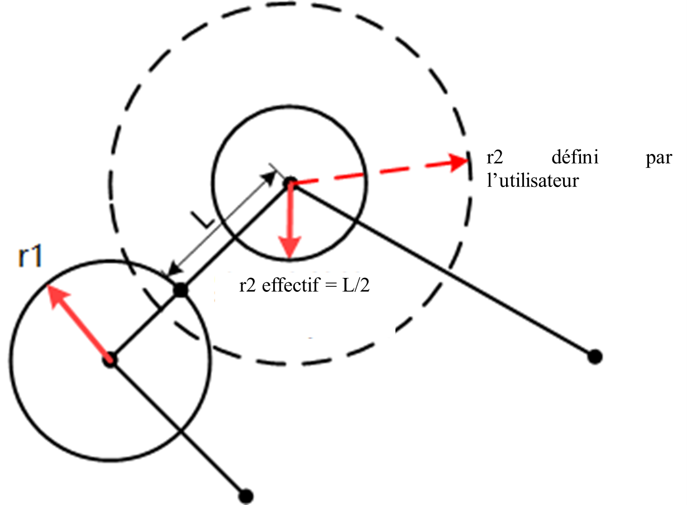

**Valeur par défaut**

Lorsque vous ne spécifiez pas de ratio ou de rayon de transition fluide via les paramètres avancés, la valeur définie pour le paramètre du bloc de construction Définir le ratio de transition fluide est utilisée par défaut, et la valeur par défaut lorsque le paramètre du bloc de construction n'est pas utilisé est 0.

<div class="info1"><b>Description : </b><div>La transition lisse fait en sorte que le mouvement du bras du robot ne passe pas par le point intermédiaire, de sorte que lorsque la transition lisse est définie, la sortie du signal d'E/S ou la commande de réglage de la fonction (par exemple, la commutation de la peau de sécurité) entre deux commandes de mouvement sera exécutée pendant la transition. <br/>Si vous souhaitez pouvoir exécuter l'instruction lorsque le bras du robot atteint exactement le point intermédiaire, réglez le paramètre de Transition lisse de l'instruction précédente sur zéro. </div></div>

<br/>

<h3 class="lua-cmd" id="stopcond" >Conditions d'arrêt</h3>

Certains blocs de mouvement prennent en charge la spécification d'une condition d'arrêt via la configuration avancée. Si la condition d'arrêt spécifiée est remplie pendant l'exécution d'une instruction de mouvement par le robot, ce dernier met fin au mouvement en cours et exécute directement l'instruction suivante.

- Les conditions d'arrêt prises en charge comprennent les entrées-sorties, les variables et toutes les expressions compatibles avec Lua.
- Prend en charge jusqu'à 3 conditions de jugement, les conditions multiples sont reliées par les mots-clés and (toutes les conditions sont satisfaites) / or (l'une des conditions est satisfaite), et ne prend pas en charge l'utilisation mixte de and et or.


<br/>

<div class="info2"><b> Description : </b><div><ul><li>La spécification d'une condition d'arrêt rendra les paramètres de transition lisse invalides. </li><li>Après avoir spécifié une condition d'arrêt, les paramètres de transition lisse cp peuvent entrer en vigueur, mais la zone de transition (partie courbe) n'est pas comprise dans la portée d'application de la condition d'arrêt. </li><li>Si une transition lisse est ajoutée à l'instruction précédant celle contenant la condition d'arrêt, la condition d'arrêt ne sera déclenchée qu'après avoir quitté la zone de transition. </li></ul></div></div>
