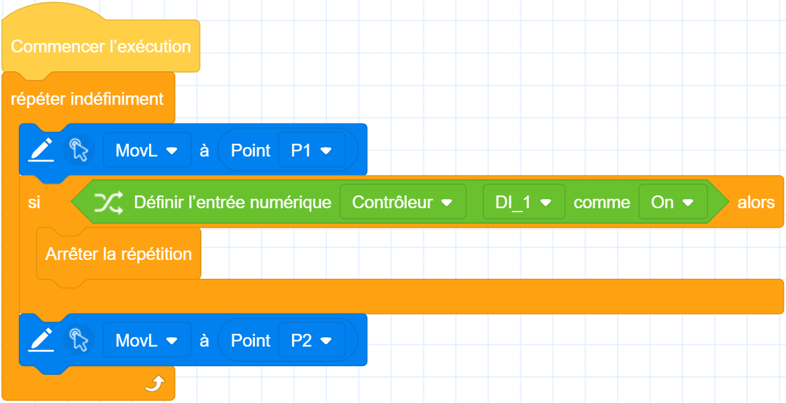

# Blocs de contrôle

Les blocs de contrôle sont utilisés pour contrôler le déroulement du programme.

<h3 class="lua-cmd" id="waitfor" >Attendre que la condition soit remplie</h3>

**Description:** Le programme s'arrête jusqu'à ce que le paramètre soit vrai avant de continuer.

**Paramètre:** Utilisez d'autres blocs hexagonaux comme paramètres.

**Exemple :**

Le bras du robot se déplace vers P1 et attend que DI1 soit activé avant de se déplacer vers P2.

<h3 class="lua-cmd" id="repeatn" >Répéter n fois</h3>

**Description:** Imbriquez d'autres blocs au milieu de ce bloc, et l'instruction de bloc imbriqué sera répétée le nombre de fois spécifié.

**Paramètres:** Le nombre de fois que l'exécution doit être répétée.

**Exemple 1 :**

Le bras robotique répète l'exécution de deux instructions de mouvement 10 fois.

**Exemple 2 :**

Le bras robotique exécute deux instructions de mouvement n fois de manière incorrecte, n étant la valeur de la variable numérique count.

<h3 class="lua-cmd" id="repeat" >Répétition continue</h3>

**Description:** En imbriquant d'autres blocs au milieu de ce bloc, les instructions du bloc imbriqué seront répétées jusqu'à ce que le bloc répétitif de fin soit rencontré. Aucun autre bloc ne peut être attaché en dessous de ce bloc.

<h3 class="lua-cmd" id="break" >Arrêter la répétition</h3>

**Description:** Utilisé pour l'imbrication dans la classe suivante de blocs à exécution répétée, l'exécution du programme mettra directement fin à la répétition lorsqu'elle atteindra ce bloc de base et exécutera l'instruction du bloc après le bloc répété.

  

**Exemple :**

Exécution répétée de P1 et P2 pendant le mouvement réciproque, si le bras du robot se déplace vers le point P1 après l'activation de DI1, la répétition s'arrête immédiatement.

<h3 class="lua-cmd" id="if" >Exécuter lorsque la condition est remplie</h3>

**Description:** Si le paramètre est vrai, l'instruction de bloc imbriquée est exécutée. Si le paramètre est faux, l'instruction de bloc imbriquée est exécutée. Si le paramètre est faux, l'instruction de bloc suivante est exécutée.

**Paramètres:** Utilise d'autres blocs hexagonaux (avec des valeurs de retour booléennes, c'est-à-dire vrai ou faux) en tant que paramètres.

<h3 class="lua-cmd" id="ifelse" >Exécuter séparément lorsque la condition est remplie ou non remplie</h3>

**Description:** Si le paramètre est vrai, l'instruction bloc imbriquée est exécutée avant "else". Si le paramètre est faux, les instructions du bloc imbriqué après "else" sont exécutées.

**Paramètres:** Utilisez d'autres blocs hexagonaux (dont la valeur de retour est booléenne, c'est-à-dire vraie ou fausse) comme paramètres.

**Exemple :**

Si DI1 est activé, le bras se déplace vers le point P1, sinon il se déplace vers le point P2.

<h3 class="lua-cmd" id="repeatu" >Répéter jusqu'à ce que la condition soit remplie</h3>

**Description:** Répétez l'instruction du bloc imbriqué jusqu'à ce que le paramètre soit vrai.

**Paramètres:** Utilisez d'autres blocs hexagonaux (avec des valeurs de retour booléennes, c'est-à-dire vrai ou faux) comme paramètres.

<h3 class="lua-cmd" id="label" >Définir l'étiquette</h3>

**Description:** Définit une étiquette qui, une fois définie, peut être utilisée pour passer d'un bloc à l'autre en sautant d'une étiquette à l'autre.

**Paramètres:** Le nom de l'étiquette doit commencer par une lettre, sans caractères spéciaux tels que les espaces.

<h3 class="lua-cmd" id="goto" >Étiquette sautant</h3>

**Description:** Après que le programme a exécuté ce bloc de construction, il passe directement à l'étiquette spécifiée et exécute l'instruction du bloc de construction qui suit l'étiquette.

**Paramètres:** Le nom de l'étiquette qui a été définie.

**Exemple :**

Si DI1 est activé, le bras du robot se déplace directement vers P1 ; sinon, le bras du robot se déplace d'abord vers P2, puis vers P1.

<b>Description : </b>

Ce bloc ne peut sauter qu’à une étiquette dans la même colonne (y compris les sous-programmes) et ne peut pas sauter entre les colonnes, par exemple, il ne peut pas sauter d’une fonction personnalisée au fil d’exécution principal. 

<h3 class="lua-cmd" id="fold" >Replier la commande</h3>

**Description:** Les blocs imbriqués peuvent être pliés pour être affichés. Il ne s'agit pas d'un contrôle, mais d'un moyen d'embellir le programme et d'en faciliter la lecture. Cliquez sur les doubles flèches en bas à droite des blocs pour basculer vers l'état réduit.

**Paramètre:** Décrit les blocs réduits, un nom indirect et intuitif est recommandé.

<h3 class="lua-cmd" id="pause" >Pause</h3>

**Description:** Le programme se met automatiquement en pause lorsqu'il atteint ce bloc et doit être commandé par le logiciel de contrôle ou la télécommande avant de pouvoir continuer à fonctionner.

<h3 class="lua-cmd" id="stop" >Arrêter le programme</h3>

**Description:** Le programme s'exécute jusqu'à ce bloc, puis s'arrête automatiquement et cesse de fonctionner.

<h3 class="lua-cmd" id="log" >Personnaliser le journal</h3>

**Description:** Produit un niveau personnalisé d'informations de journal, qui peuvent être visualisées et exportées dans la page de journal du logiciel de contrôle.

<h3 class="lua-cmd" id="colli" >Définir la détection de collision</h3>

**Description:** Définir la détection de collision comme %1 Le niveau de détection des collisions défini par ce bloc de construction ne prend effet que pendant la période d'exécution du projet et sera rétabli à la valeur avant modification après l'arrêt du projet.

**Paramètre:** Sélectionnez la sensibilité de la fonction de détection des collisions. Vous pouvez choisir de désactiver la détection des collisions ou d'utiliser les niveaux 1 à 5, plus le niveau est élevé, plus la détection des collisions est sensible.

<h3 class="lua-cmd" id="backd" >Définir la distance de retour après collision</h3>

**Description:** Définir la distance de retour du bras après avoir détecté une collision La valeur définie par ce bloc ne s'applique qu'au projet en cours d'exécution et revient à la valeur d'origine après l'arrêt du projet.

**Paramètre:** Définit la distance de repli des collisions, plage de valeurs : [0,50], unité : mm.

<h3 class="lua-cmd" id="modu" >Modifier le système de coordonnées d’utilisateurs ou d'outils</h3>

**Description:** Modifie le système de coordonnées de l'utilisateur ou de l'outil spécifié.

**Paramètres :**

- Indique s'il faut modifier le système de coordonnées de l'utilisateur ou le système de coordonnées de l'outil.
- Modifier le système de coordonnées d'utilisateurs
- Modifier le système de coordonnées d'utilisateurs
- Spécifie la plage effective de la modification :
  - Effectif uniquement pour le script : le système de coordonnées modifié par cette commande n'est effectif que dans le projet en cours d'exécution et reprend sa valeur d'origine après l'arrêt du projet.
  - Sauvegarde globale : le système de coordonnées modifié par cette commande est sauvegardé globalement, et la valeur modifiée est conservée après l'arrêt du projet.

**Exemple :**

<h3 class="lua-cmd" id="calcu" >Calculer et mise à jour le système de coordonnées d'utilisateurs</h3>

**Description:** Calcule et met à jour le système de coordonnées de l'utilisateur spécifié. La modification ne prend effet que dans le projet en cours d'exécution, et le système de coordonnées sera rétabli à la valeur précédant la modification après l'arrêt du projet.

**Paramètres :**

- Spécifie le numéro du système de coordonnées de l'utilisateur à utiliser comme référence pour le calcul. La valeur initiale du système de coordonnées de l'utilisateur 0 est le système de coordonnées de base.
- Spécifie la direction du calcul.
  - Multiplication à gauche : indique que le système de coordonnées spécifié par l'argument précédent est dévié le long du système de coordonnées de base.
  - Multiplication à droite : indique que le système de coordonnées spécifié par le paramètre précédent est dévié le long de lui-même.
- Spécifiez la valeur de décalage du système de coordonnées.
- Le système calcule un nouveau système de coordonnées de l'utilisateur à l'aide des paramètres ci-dessus, et vous devez spécifier le système de coordonnées de l'utilisateur dans lequel vous souhaitez mettre à jour le résultat du calcul.

**Exemple :**

- Calculer le système de coordonnées de l'utilisateur **1 Multiplication à gauche** Valeur de décalage : X **10** Y **10** Z **10** RX **10** RY **10** RZ **10** Mise à jour du résultat à **1**.
  
  L'instruction ci-dessus indique un système de coordonnées ayant la même position initiale que le système de coordonnées de l'utilisateur 1. Après la translation {x=10, y=10, z=10} et la rotation {rx=10, ry=10, rz=10} le long du système de coordonnées de base, le nouveau système de coordonnées résultant sera attribué au système de coordonnées de l'utilisateur 1.

- Calculer le décalage de **multiplication à droite** du système de coordonnées de l'utilisateur 1 : X **10** Y **10** Z **10** RX **10** RY **10** RZ **10** Le résultat est mis à jour à **1**.
  
  L'instruction ci-dessus représente un système de coordonnées ayant la même attitude positionnelle initiale que le système de coordonnées de l'utilisateur 1. Après avoir effectué une translation {x=10, y=10, z=10} et une rotation {rx=10, ry=10, rz=10} le long du système de coordonnées de l'utilisateur 1, le nouveau système de coordonnées obtenu est affecté au système de coordonnées de l'utilisateur 1.

<h3 class="lua-cmd" id="calct" >Calculer et mise à jour le système de coordonnées d'outils</h3>

**Description:** Calcule et met à jour le système de coordonnées de l'outil spécifié. La modification ne prend effet que pendant l'exécution du projet en cours, et le système de coordonnées revient à sa valeur avant modification après l'arrêt du projet.

**Paramètres :**

- Spécifie le numéro du système de coordonnées de l'outil à utiliser comme référence pour le calcul. La valeur initiale du système de coordonnées de l'outil 0 est le système de coordonnées de la bride.
- Spécifie la direction du calcul.
  - Multiplication à gauche : indique que le système de coordonnées spécifié par le paramètre précédent est dévié le long du système de coordonnées de la bride.
  - Multiplication à droite : indique que le système de coordonnées spécifié par le paramètre précédent est dévié le long de lui-même.
- Spécifiez la valeur de décalage du système de coordonnées.
- Le système calcule un nouveau système de coordonnées de l'outil à l'aide des paramètres ci-dessus, et l'utilisateur doit spécifier le système de coordonnées de l'outil dans lequel les résultats du calcul doivent être mis à jour.

**Exemple :**

- Calculer le système de coordonnées de l'outil **1 Multiplication à gauche** Valeur de décalage : X **10** Y **10** Z **10** RX **10** RY **10** RZ **10** Mise à jour du résultat à **1**.
  
  L'instruction ci-dessus indique un système de coordonnées ayant la même position initiale que le système de coordonnées de l'outil 1. Après la translation {x=10, y=10, z=10} et la rotation {rx=10, ry=10, rz=10} le long du système de coordonnées de la bride, le nouveau système de coordonnées résultant est affecté au système de coordonnées de l'outil 1.

- Calculer le décalage de **multiplication vers la droite** du système de coordonnées de l'outil 1 : X **10** Y **10** Z **10** RX **10** RY **10** RZ **10** Mise à jour du résultat à **1.**
  
  Après avoir effectué une translation {x=10, y=10, z=10} et une rotation {rx=10, ry=10, rz=10} le long du système de coordonnées de l'outil 1, le nouveau système de coordonnées obtenu est affecté au système de coordonnées de l'outil 1.

<h3 class="lua-cmd" id="setu" >Définir le système de coordonnées d'utilisateurs</h3>

**Description:** Définit le système de coordonnées de l'utilisateur utilisé par le projet en cours et le rétablit à sa valeur d'origine après l'arrêt du projet.

**Paramètres :** Index du système de coordonnées de l'utilisateur actuel.

<h3 class="lua-cmd" id="sett" >Définir le système de coordonnées d'outils</h3>

**Description:** Définit le système de coordonnées de l'outil utilisé par le projet en cours et le rétablit à sa valeur d'origine après l'arrêt du projet.

**Paramètres :** Index du système de coordonnées de l'outil actuel.

<h3 class="lua-cmd" id="setpl" >Définir les paramètres de charge</h3>

**Description:** Définir le poids et les coordonnées d'excentricité de la charge finale, qui sont restaurés à leur valeur d'origine après l'arrêt du projet.

**Paramètres :**

- Entrez le poids de la charge actuelle. Unité : kg.
- Entrez les coordonnées excentriques de la charge actuelle et reportez-vous à la figure suivante pour la direction des axes. Unité : mm.

 

<h3 class="lua-cmd" id="waittime" >Durée spécifiée d'attente</h3>

**Description:** Attendre le temps spécifié avant d'exécuter l'instruction suivante.

**Paramètre:** Le temps de retard de l'instruction à émettre. La valeur maximale du temps d'attente est de 2147483647ms. Si vous dépassez la valeur maximale, l'instruction ne sera pas valide.

<h3 class="lua-cmd" id="safewall" >Réglage de l'interrupteur du mur de sécurité</h3>

**Description:** Définit le commutateur pour un seul mur de sécurité, qui revient à sa valeur d'origine lorsque le projet est arrêté.

**Paramètres :**

- Index du mur de sécurité %1 %2 La paroi de sécurité actuellement sélectionnée est affichée sous la forme d'un point d'interrogation lorsqu'elle est supprimée.
- Sélectionne l'état de l'interrupteur de la paroi de sécurité.

<h3 class="lua-cmd" id="safearea" >Réglage de l'interrupteur de la zone de sécurité</h3>

**Description:** Définit l'interrupteur pour une zone de sécurité individuelle, qui reprend sa valeur d'origine lorsque le projet est arrêté.

**Paramètres :**

- Index de la zone de sécurité %1 %2 Un point d'interrogation s'affiche lorsque la zone de sécurité sélectionnée est supprimée.
- Sélectionne l'état de l'interrupteur de la zone de sécurité.

<h3 class="lua-cmd" id="systime" >Obtenir l’heure du système</h3>

**Description:** Obtenir l'heure du système.

**Valeur de retour:** Horodatage Unix de l'heure actuelle du système, l'unité est convertie en millisecondes, c'est-à-dire le nombre de millisecondes entre 0:00 GMT le 1er janvier 1970 et l'heure actuelle, qui est généralement utilisé pour calculer le décalage horaire. Si vous souhaitez obtenir l'heure locale, veuillez utiliser la conversion de l'heure moyenne de Greenwich obtenue pour l'obtenir en fonction du fuseau horaire local.

**Exemple :**

Si la valeur est 1686304295963, il s'agira de 2023-06-09 17:51:35 (plus 963 millisecondes) à l'heure de Pékin ;

Si la valeur est 1686304421968, il s'agira de 2023-06-09 17:53:41 (plus 968 millisecondes) à l'heure de Pékin ;

La différence de temps peut être calculée en soustrayant les valeurs obtenues plusieurs fois.

<h3 class="lua-cmd" id="timer1" >Réinitialiser le comptage-temps</h3>

**Description:** Le chronométrage sera lancé lorsque le projet s'exécutera dans ce bloc, il doit être utilisé avec le bloc suivant **Get Timing Result** (Obtenir le résultat du chronométrage).

<h3 class="lua-cmd" id="timer2" >Obtenir le résultat de comptage-temps</h3>

**Description:** Termine le chronométrage et renvoie la différence de temps.

**Valeur de retour :** différence de temps entre le début et la fin du chronométrage en millisecondes. Le décompte maximal est de 4294967295ms (environ 49,7 jours), après quoi le décompte recommence à partir de 0.

**Exemple :**

Imprime le temps écoulé pour que le robot se déplace de l'articulation P1 à P2.

<h3 class="lua-cmd" id="settmode" >Définir l'outil de terminal</h3>

**Description:** Pour les modèles (séries CR et CR A) dans lesquels les interfaces AI1 et AI2 à l'extrémité du bras du robot sont multiplexées avec les terminaux d'interface 485, le mode des terminaux multiplexés d'extrémité peut être défini via cette interface. Le mode par défaut est le mode 485.

<b>Description : </b>
Un bras robotique qui ne prend pas en charge le changement de mode d’extrémité n’aura aucun effet lors de l’appel de cette interface. 

 

**Paramètres :**

- Sélectionnez le mode d'extrémité. Le mode 485 et le mode d'entrée analogique sont pris en charge. Les deux paramètres suivants n'ont pas besoin d'être définis pour le mode 485.
- Mode d'entrée analogique Prend en charge le mode d'entrée de tension 0~10V, le mode courant et le mode d'entrée de tension 0~5V.
- Mode d'entrée analogique Les modes pris en charge sont les mêmes que ceux de AI1.

<h3 class="lua-cmd" id="sett485" >Réglage du format de données de l'extrémité 485</h3>

**Description:** Définit le format de données correspondant à l'interface RS485 de l'outil final.

**Paramètres :**

- Entrer le débit en bauds de l'interface RS485.
- Choisir s'il y a un bit de parité.
- Sélectionnez la longueur du bit d'arrêt.

<h3 class="lua-cmd" id="settpower" >Définir l'alimentation électrique terminale</h3>

**Description:** Définit l'état de l'alimentation électrique de l'outil terminal, généralement utilisé pour redémarrer l'alimentation électrique de l'outil terminal, par exemple pour réalimenter la pince terminale en vue de l'initialisation. Si vous devez appeler cette interface en permanence, il est recommandé d'avoir un intervalle d'au moins 4 ms.

<b>Description : </b>
Une fois l'alimentation d’extrémité éteinte, le terminal DO cessera également de fonctionner. 

 

**Paramètre:** Sélectionne l'état de l'interrupteur d'alimentation.

<h3 class="lua-cmd" id="popup" >Fenêtre pop-up personnalisée</h3>

**Description:** Utilisé pour afficher un message défini par l'utilisateur pendant que le script est en cours d'exécution. DobotStudio Pro n'affichera qu'une seule fenêtre popup à la fois avec le dernier message popup.

Si le projet est en cours d'exécution sans que DobotStudio Pro soit ouvert (par exemple, en démarrant le projet via IO ou Modbus), aucune fenêtre popup n'apparaîtra, mais les commandes popup de type avertissement et erreur entraîneront toujours la mise en pause du projet.

**Paramètres :**

- Type de message :
  
  - Information : ce type de pop-up n'affecte pas le fonctionnement du projet. Cliquer sur **Arrêter** arrête le projet et cliquer sur **OK** ferme la fenêtre pop-up. Après l'apparition de la fenêtre pop-up, les utilisateurs peuvent également arrêter le projet via IO ou Modbus, et la fenêtre pop-up disparaît automatiquement après l'arrêt du projet.
    
    
  
  - Attention : ce type de fenêtre pop-up suspend le projet. Cliquez sur **Arrêter** pour arrêter le projet, cliquez sur **Continuer** pour continuer à exécuter le projet. Après l'apparition de la fenêtre contextuelle, l'utilisateur peut également arrêter/continuer le projet via IO ou Modbus, et la fenêtre contextuelle disparaît automatiquement après l'arrêt/continuation du projet.
    
    
  
  - Type d'erreur : ce type de fenêtre contextuelle met le projet en pause. Cliquez sur **Arrêter** pour arrêter le projet, cliquez sur **Continuer** pour continuer à exécuter le projet. Après l'apparition de la fenêtre contextuelle, l'utilisateur peut également arrêter/continuer le projet via IO ou Modbus, et la fenêtre contextuelle disparaît automatiquement après l'arrêt/continuation du projet.
    
    

- Titre de la fenêtre contextuelle à afficher. La longueur ne peut pas dépasser 128 caractères

- Indication Diverses variables, y compris des chaînes, sont prises en charge. S'il s'agit d'une chaîne, sa longueur ne peut excéder 128 ; s'il s'agit d'un autre type de variable, elle sera convertie en caractère, et la taille du caractère converti ne peut excéder 512 octets.

- Le contenu de la fenêtre popup sera ou non écrit dans le journal.
  
  - Non : pas d'écriture dans le journal.
  
  - Oui : écriture du type de journal correspondant (le message popup "Information" correspond au journal de type "Custom"). Le contenu du journal est le suivant : "Popup Title : Popup Content".
    
    

<h3 class="lua-cmd" id="comment" >Commentaire</h3>

**Description:** Ajoutez un commentaire. Le commentaire n'affecte pas l'exécution du projet et est principalement utilisé pour aider les personnes qui consultent le projet à en comprendre la logique.

**Paramètres:** Le contenu du commentaire.