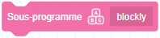

# Blocs de construction personnalisés

Le groupe blocs de construction personnalisés est utilisé pour créer et gérer de nouveaux blocs personnalisés, ainsi que pour appeler des variables globales.

<h3 class="lua-cmd" id="gvar" >Appeler les variables globales</h3>

**Description:** Appelle les variables globales définies dans le logiciel de contrôle.

**Paramètres:** Sélectionnez le nom de la variable globale. La variable globale actuellement sélectionnée est affichée sous la forme d'un point d'interrogation lorsqu'elle est supprimée.

**Valeur de retour:** La valeur de la variable globale.

<h3 class="lua-cmd" id="setgvar" >Définir les variables globales</h3>

**Description:** Définit la variable spécifiée. Notez que les blocs de construction pour la définition des variables globales et des variables personnalisées ont la même forme, mais des fonctions légèrement différentes.

**Paramètres :**

- Sélectionnez le nom de la variable à modifier. La variable globale actuellement sélectionnée est affichée sous la forme d'un point d'interrogation lorsqu'elle est supprimée.
- La valeur modifiée peut être remplie directement ou en utilisant l'un des autres blocs ovales.

<h3 class="lua-cmd" id="newvar" >Création d'une nouvelle variable personnalisée</h3>

Cliquez sur pour créer une nouvelle variable personnalisée. Le type de variable peut être numérique ou chaîne de caractères, et le nom de la variable doit commencer par une lettre ; aucun caractère spécial tel que des espaces ne peut être utilisé. Après avoir créé au moins une variable, les blocs suivants liés à la variable personnalisée apparaîtront dans la liste des blocs.

<h3 class="lua-cmd" id="numvar" >Variable de la valeur personnalisée</h3>

**Description:** Une variable numérique personnalisée nouvellement créée avec une valeur par défaut de nil, il est recommandé de lui attribuer une valeur avant de l'utiliser. Il est recommandé de lui attribuer une valeur avant de l'utiliser. Le nom de la variable sélectionnée peut être modifié ou la variable peut être supprimée à l'aide de la liste déroulante de sélection des variables.

**Valeur de retour:** La valeur de la variable.

<h3 class="lua-cmd" id="setnumvar" >Définition de la valeur d'une variable numérique personnalisée</h3>

**Description:** Définit la variable avec la valeur spécifiée. Notez que les blocs de construction pour la définition des variables globales et des variables personnalisées ont la même forme, mais des fonctions légèrement différentes.

**Paramètres :**

- Sélectionnez le nom de la variable à modifier.
- La valeur modifiée peut être remplie directement ou en utilisant d'autres blocs ovales.

<h3 class="lua-cmd" id="addnumvar" >Augmenter ou diminuer la valeur d'une variable numérique personnalisée</h3>

**Description:** Augmente la variable de la valeur spécifiée de la valeur spécifiée.

**Paramètres :**

- Sélectionnez le nom de la variable à modifier.
- La valeur à augmenter peut être remplie directement ou en utilisant d'autres blocs ovales. La diminution de la valeur peut être obtenue en définissant un nombre négatif.

<h3 class="lua-cmd" id="strvar" >Variable de la chaîne de caractères personnalisée</h3>

**Description:** Une nouvelle variable personnalisée de type chaîne de caractères avec une valeur par défaut de nil, il est recommandé d'assigner une valeur avant de l'utiliser. Il est recommandé de lui attribuer une valeur avant de l'utiliser. Le nom de la variable sélectionnée peut être modifié ou la variable peut être supprimée à l'aide de la liste déroulante de sélection des variables.

**Valeur de retour:** La valeur de la variable.

<h3 class="lua-cmd" id="setstrvar" >Définition de la valeur d'une variable personnalisée de type chaîne de caractères</h3>

**Description:** Définit la variable de chaîne spécifiée.

**Paramètres :**

- Sélectionnez le nom de la variable à modifier.
- Pour la valeur modifiée, saisissez directement la chaîne de caractères.

<h3 class="lua-cmd" id="newarr" >Création d'un tableau</h3>

Cliquez sur pour créer un nouveau tableau personnalisé. Le nom du tableau doit commencer par une lettre et aucun caractère spécial, tel qu'un espace, ne peut être utilisé. Après avoir créé au moins un tableau, les blocs suivants relatifs aux tableaux apparaissent dans la liste des blocs.

<h3 class="lua-cmd" id="arr" >Tableau personnalisé</h3>

**Description:** Le tableau personnalisé nouvellement créé est vide par défaut, il est donc recommandé de lui attribuer une valeur avant de l'utiliser. Vous pouvez modifier le nom du tableau ou le supprimer en cliquant avec le bouton droit de la souris (PC)/en appuyant longuement (mobile) sur le bloc dans la liste des blocs. Vous pouvez également modifier le nom du tableau sélectionné ou le supprimer en utilisant la liste déroulante de sélection des tableaux dans d'autres blocs de tableaux. La case à cocher située devant le bloc de construction du tableau n'a pas d'effet pour le moment et peut être ignorée.

**Valeur de retour:** La valeur du tableau.

<h3 class="lua-cmd" id="addarr" >Ajouter des variables à un tableau</h3>

**Description:** Ajoute la variable au tableau spécifié. La variable nouvellement ajoutée sera le dernier élément du tableau.

**Paramètres :**

- La variable à ajouter peut être remplie directement ou en utilisant d'autres blocs de construction ovale.
- Sélectionnez le tableau à modifier.

<h3 class="lua-cmd" id="delarr" >Suppression d'un élément spécifique d'un tableau</h3>

**Description:** Supprime l'élément spécifié du tableau spécifié.

**Paramètres :**

- Sélectionnez le tableau à modifier.
- Le numéro de l'élément à supprimer, qui peut être renseigné directement ou à l'aide d'autres blocs de construction ovales qui renvoient une valeur numérique.

<h3 class="lua-cmd" id="delarrall" >Supprimer tous les éléments d'un tableau</h3>

**Description:** Supprime tous les éléments du tableau spécifié.

**Paramètres:** Sélectionnez le tableau à modifier.

<h3 class="lua-cmd" id="insarr" >Insérer des éléments dans un tableau</h3>

**Description:** Insère une variable à la position spécifiée dans le tableau.

**Paramètres :**

- Sélectionnez le tableau à modifier.
- La position à insérer peut être remplie directement ou en utilisant d'autres blocs ovales qui renvoient une valeur numérique.
- La variable à ajouter peut être remplie directement ou en utilisant d'autres blocs de construction ovale.

<h3 class="lua-cmd" id="reparr" >Remplacer un élément spécifié dans un tableau</h3>

**Description:** Remplace l'élément spécifié dans le tableau par la variable spécifiée.

**Paramètres :**

- Sélectionnez le tableau à modifier.
- Le numéro de l'élément à remplacer, qui peut être renseigné directement ou en utilisant d'autres blocs elliptiques qui renvoient une valeur numérique.
- La variable à remplacer, qui peut être remplie directement ou en utilisant d'autres blocs ovales.

<h3 class="lua-cmd" id="getarri" >Obtenir l'élément spécifié dans un tableau</h3>

**Description:** Obtient la valeur de l'élément spécifié dans le tableau.

**Paramètres :**

- Sélectionnez le tableau dans lequel l'élément doit être récupéré.
- Le numéro de l'élément à récupérer, qui peut être renseigné directement ou en utilisant d'autres blocs de construction ovales dont la valeur de retour est une valeur numérique.

**Valeur de retour:** La valeur de l'élément spécifié.

<h3 class="lua-cmd" id="getarrn" >Obtenir le nombre total d'éléments d'un tableau</h3>

**Description:** Obtenir le nombre total d'éléments dans le tableau.

**Paramètres:**Sélectionnez le tableau à partir duquel les éléments sont obtenus.

**Valeur de retour:** Le nombre total d'éléments dans le tableau spécifié.

<h3 class="lua-cmd" id="newfunc" >Création d'une nouvelle fonction</h3>

Cliquez sur pour créer une nouvelle fonction. Une fonction est un segment de programme fixe, vous pouvez définir un ensemble de blocs de construction pour réaliser une fonction commune spécifique en tant que fonction, et ensuite chaque fois que vous voulez utiliser la fonction, vous appelez simplement cette fonction, il n'est pas nécessaire de construire le même ensemble de blocs de construction encore et encore. Pour créer une nouvelle fonction, vous devez déclarer et définir la fonction. Après avoir créé une nouvelle fonction avec succès, les blocs fonctionnels correspondants apparaîtront dans la liste des blocs.

1. **Lettre de déclaration**

Dans cet écran, vous devez définir le nom de la fonction, le type, le nombre et le nom des entrées (paramètres). Les noms des fonctions et des paramètres ne peuvent pas contenir de caractères spéciaux tels que des espaces. Vous pouvez également ajouter des étiquettes à la fonction, qui peuvent être utilisées comme commentaires pour fournir une description supplémentaire de la fonction ou de l'entrée.

2. **définir la fonction de noyau :**

Lorsque vous avez fini de déclarer une fonction, un bloc d'en-tête de définition pour cette fonction apparaît dans la zone de programmation.

Vous devrez programmer un bloc successeur en dessous de ce bloc pour définir la fonctionnalité de la fonction.

Les entrées de l'en-tête de définition peuvent être déplacées et utilisées dans les blocs inférieurs, ce qui indique que les entrées de l'appel réel à la fonction sont utilisées comme paramètres.

<h3 class="lua-cmd" id="func" >Fonction personnalisée</h3>

**Description:** Les blocs de construction de fonctions définies par l'utilisateur avec des noms et des paramètres d'entrée définis par l'utilisateur sont utilisés pour appeler des fonctions définies. La déclaration de cette fonction peut être modifiée en cliquant avec le bouton droit de la souris (PC) / en appuyant longuement (mobile) sur le bloc de construction dans la liste des blocs de construction. Si vous devez supprimer la fonction, supprimez le bloc de construction de l'en-tête de définition de la fonction.

<h3 class="lua-cmd" id="newsubro" >Créer un nouveau sous-programme</h3>

Créer un nouveau sous-programme.

<b>Description: </b>
La différence entre un sous-programme et une fonction réside dans le fait que le sous-programme n'est pas encapsulé, son essence étant un bloc de code réutilisable. L'effet de l'appel d'un sous-programme est équivalent à la copie et collage du code du sous-programme à l'endroit correspondant. 

 

La programmation graphique prend en charge les sous-programmes d'appel imbriqués, les sous-programmes prennent en charge la programmation graphique et la programmation de scripts, l'imbrication maximale étant de deux niveaux. Après avoir créé une nouvelle sous-routine, le bloc de sous-routine correspondant apparaît dans la liste des blocs.

- Après avoir sélectionné la programmation du bloc de construction, la page passe à la page de programmation du bloc de construction de la sous-routine, où vous pouvez définir la description de la sous-routine et écrire la sous-routine.
  
  
  
   
  
- Après avoir choisi la programmation de script, une fenêtre de programmation de script de sous-programme apparaît, permettant de définir la description du sous-programme et de rédiger le sous-programme.
  
  
  
<h3 class="lua-cmd" id="subro" >Sous-programme</h3>

- Sous-programme de programmation graphique
  
  
  
- Programmation de script
  
  

**Description:** Blocs de sous-routines, la description est définie par l'utilisateur lors de la création d'une sous-routine, et est utilisée pour appeler une sous-routine sauvegardée. Le sous-programme peut être modifié ou supprimé en cliquant avec le bouton droit de la souris (PC)/en appuyant longuement (mobile) sur le bloc de construction dans la liste des blocs de construction.