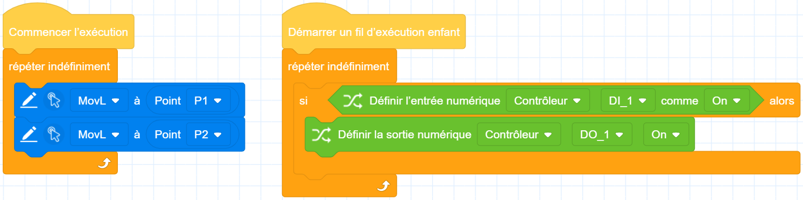

# Groupes de blocs d'événements

Le groupe de blocs d'événements est utilisé comme identificateur pour le démarrage d'un programme. Seuls les blocs connectés sous le bloc d'événements seront exécutés.

<h3 class="lua-cmd" id="start" >Commencer l’exécution</h3>

**Description:** Un identifiant pour le fil conducteur du programme. Après la création d'un nouveau projet, la zone de programmation aura un marqueur Start Run par défaut, veuillez programmer d'autres blocs non événementiels en dessous.

**Restrictions:** Il ne peut y avoir qu'un seul bloc «&nbsp;Start Run&nbsp;» dans un projet.

<h3 class="lua-cmd" id="sub" >Démarrer un fil d’exécution enfant</h3>

**Description:** Identifie un sous-programme d'un programme. Le sous-programme s'exécutera en synchronisation avec le programme principal, mais le sous-programme ne peut pas utiliser les commandes de contrôle du bras du robot, seulement l'arithmétique variable ou le contrôle des entrées-sorties, etc. Veuillez choisir d'utiliser ou non les sous-filières en fonction des besoins de la logique du programme.

**Restrictions:** Il ne peut y avoir qu'un maximum de 4 sous-filières dans un projet.

**Exemple :**

Dans l'exemple suivant, après l'exécution du projet, le thread principal et les sousthreads commenceront à fonctionner en même temps. Les commandes de mouvement du thread principal et les commandes IO des sousthreads n'interféreront pas les unes avec les autres et seront exécutées en fonction de leurs files d'attente respectives.

