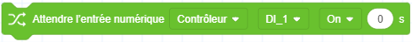

# Blocs de construction E/S

Le groupe de blocs de construction E/S est utilisé pour gérer les entrées et les sorties des bornes E/S du robot. La plage de valeurs des ports d'entrée et de sortie est déterminée par le nombre de bornes correspondantes du robot, veuillez vous référer au manuel du matériel du robot correspondant.

<h3 class="lua-cmd" id="setdo" >Définir un groupe de sorties numériques</h3>

**Description:** Active ou désactive l'unité de commande spécifiée.

**Paramètres :**

- Sélectionnez l'emplacement du terminal DO, y compris l'armoire de commande et l'extrémité.
- Sélectionnez le numéro du terminal DO.
- Sélectionnez l'état (ON ou OFF) de la sortie.

<h3 class="lua-cmd" id="judgedo" >Juger l’état de sorties numériques</h3>

**Description:** Détermine si l'état actuel de l'unité de mesure spécifiée satisfait à la condition.

**Paramètres :**

- Sélectionnez l'emplacement du terminal DO, y compris l'armoire de commande et l'extrémité.
- Sélectionnez le numéro du terminal DO.
- Sélectionnez l'état à considérer comme vrai.

**Valeur de retour:** Retourne vrai si l'état actuel de DO spécifié satisfait à la condition, sinon retourne faux.

<h3 class="lua-cmd" id="setdog" >Définir un groupe de sorties numériques</h3>

**Description:** Définit un ensemble DO.

**Paramètres:** Cliquez sur pour définir les DO et les états après avoir fait glisser les blocs dans la zone de programmation.

- Les touches **+** ou **-** permettent d'augmenter ou de diminuer le nombre DO à définir.
- La liste déroulante de gauche sélectionne le numéro de la borne DO.
- La case déroulante de droite sélectionne l'état (On ou Off) de la sortie.

<h3 class="lua-cmd" id="waitdog" >Attendre un groupe de sorties numériques</h3>

**Description:** Attendre que les états d'un groupe DO remplissent tous les conditions avant de passer à l'exécution suivante.

**Paramètres :**

- Sélectionnez l'état (On ou Off) à attendre.
- Le délai d'attente, s'il est fixé à 0, attend que la condition soit remplie.
- Faites glisser le bloc dans la zone de programmation et cliquez pour définir DO à attendre. 

- Les touches **+** ou **-** permettent d'augmenter ou de diminuer le nombre DO à attendre.
- La liste déroulante permet de sélectionner le numéro du terminal DO.

<h3 class="lua-cmd" id="waitdi" >Attente d'une entrée numérique</h3>

**Description:** Attendre que l'entrée logique spécifiée remplisse la condition ou attendre un délai d'attente avant d'exécuter les instructions de bloc suivantes.

**Paramètres :**

- Sélectionnez l'emplacement du terminal DI, y compris l'armoire de commande et l'extrémité.
- Sélectionnez le numéro du terminal DI.
- Sélectionnez l'état (On ou Off) à attendre.
- Le délai d'attente, s'il est fixé à 0, attend que la condition soit remplie.

<h3 class="lua-cmd" id="waitdig" >Attendre un groupe d'entrées numériques</h3>

**Description:** Attendre que les états d'un groupe d'ID satisfassent tous à la condition, puis passer à l'exécution suivante.

**Paramètres :**

- Sélectionnez l'état (On ou Off) à attendre.
- Le délai d'attente, s'il est fixé à 0, attend que la condition soit remplie.
- Faites glisser le bloc dans la zone de programmation et cliquez pour définir la DI à attendre. 

- Les touches **+** ou **-** permettent d'augmenter ou de diminuer le nombre de DI à attendre.
- La liste déroulante permet de sélectionner le numéro de la borne d'entrée.

<h3 class="lua-cmd" id="setao" >Définir la sortie analogique</h3>

**Description : ** Définir la valeur du port de sortie analogique La signification des valeurs (tension/courant) peut être visualisée et modifiée dans la page **Surveillance > Armoire de commande AI/AO** de DobotStudio Pro.

**Paramètres :**

- Sélectionnez le numéro de la borne de sortie analogique.
- La valeur à sortir peut être remplie directement ou en utilisant d'autres blocs ovales qui renvoient une valeur numérique.

<h3 class="lua-cmd" id="getao" >Obtenir la sortie analogique</h3>

**Description : ** Obtenir la valeur actuelle du port de sortie analogique La signification des valeurs (tension/courant) peut être visualisée et modifiée dans la page **Surveillance > Armoire de commande AI/AO** de DobotStudio Pro.

**Paramètre : ** Sélectionne le numéro de la borne de sortie analogique.

**Valeur de retour : ** La tension actuelle ou la valeur de courant définie par l'AO.

<h3 class="lua-cmd" id="judgedi" >Juger l'état du port d'entrée numérique</h3>

**Description : ** Détermine si l'état actuel de la DI spécifiée répond aux conditions.

**Paramètres :**

- Sélectionnez l'emplacement du terminal DI, y compris l'armoire de commande et l'extrémité.
- Sélectionnez le numéro du terminal DI.
- Sélectionnez l'état à considérer comme vrai.

**Valeur de retour : ** Retourne vrai si l'état actuel de DI spécifiée remplit les conditions, sinon retourne faux.

<h3 class="lua-cmd" id="getai" >Obtenir l'entrée analogique</h3>

**Description : ** Obtient la valeur de l'entrée analogique spécifiée.

La signification de la valeur de l'entrée analogique de l'armoire de commande (tension/courant) peut être visualisée et modifiée dans la page **Surveillance > Armoire de commande AI/AO** de DobotStudio Pro ;

Pour obtenir les entrées analogiques de fin, vous devez d'abord régler le [mode de l'outil de fin](control.md#settmode) sur le mode d'entrée analogique en réglant le bloc de mode de l'outil de fin.

**Paramètres :**

- Sélectionnez l'emplacement des bornes d'entrée analogique, à la fois dans l'armoire de commande et à l'extrémité.
- Sélectionnez le numéro de la borne d'entrée analogique.

**Valeur de retour:** Spécifie la valeur de l'entrée analogique.