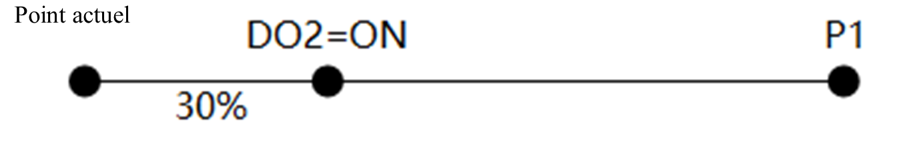

# Blocs de construction de mouvement

Le groupe de blocs de mouvement est utilisé pour contrôler le mouvement du bras du robot et effectuer les réglages liés au mouvement.

Les paramètres de point peuvent être sélectionnés ici après l'ajout de la **liste des points stockés** dans le projet ; les blocs contrôlant le mouvement permettent également de retirer les blocs variables par défaut et de les remplacer par d'autres blocs elliptiques dont la valeur de retour est un point.

<h3 class="lua-cmd" id="move" >Mouvement vers la position cible</h3>

**Description:** Contrôle le mouvement du bras robotique depuis sa position actuelle jusqu'à un point spécifié. Après avoir fait glisser les blocs dans la zone de programmation, cliquez sur pour effectuer une configuration avancée.

**Paramètres :**

- Sélectionnez le mode de mouvement, qui prend en charge les mouvements articulés et les mouvements linéaires.

- Cible Les blocs de variables de point par défaut prennent en charge les fonctions suivantes :
  
  
  
  - Sélectionner la position du point dans la liste des points stockés.
  - Ajouter la position actuelle du bras du robot en tant que nouvelle position de point et la sélectionner automatiquement.
  - Remplacer le point sélectionné avec la posture actuelle du bras.

**Paramètres avancés**

Le mouvement articulé peut être configuré avec moins de paramètres que le mouvement linéaire. La figure ci-dessous montre la fenêtre contextuelle du mouvement linéaire à titre d'exemple ; les différences sont expliquées en détail ci-dessous.

 

Les paramètres suivants doivent être cochés pour être pris en compte. Les descriptions détaillées des paramètres se trouvent dans la [description générale](block_common.md).

- Velocity Ratio (V) : le rapport de vitesse du mouvement, plage de valeurs : 1~100.

- Vitesse absolue (Speed) Valeur absolue de la vitesse du mouvement, mutuellement exclusive avec V.

- Accélération (Accel) : rapport d'accélération du mouvement, plage de valeurs : 1~100.

- Transition douce (CP) : rapport de transition douce, plage de valeurs : 0~100.

- Rayon de transition (R) : pris en charge par le mouvement linéaire uniquement. Rayon de la courbe de transition, mutuellement exclusif avec CP.

- Système de coordonnées de l'utilisateur : index du système de coordonnées de l'utilisateur pour le paramètre de point.

- Système de coordonnées de l'outil : indice du système de coordonnées de l'outil pour le paramètre de point.

- Définition des E/S intermédiaires:
  
  

  
   
  
  **Il est impossible de cocher en même temps la configuration des E/S intermédiaires et les conditions d'arrêt**.
  
  Utilisé pour définir l'état de l'OD spécifié lorsque le robot se déplace à la distance ou au pourcentage spécifié.
  
  il s'agit de la distance du point de départ ; si la distance est une valeur négative, il s'agit de la distance du point cible. Si l'option Transition douce est activée, le bras du robot n'atteindra pas le point cible, ce qui peut avoir une incidence sur la synchronisation de la sortie DO.
  
  Lorsque le mode de mouvement est le mouvement articulaire, la distance représente le vecteur d'angle synthétique de chaque angle d'articulation, ce qui est plus compliqué à calculer ; il est donc recommandé d'utiliser le mode pourcentage pour un effet plus intuitif.
  
  Cliquez sur le **+** en bas pour ajouter des OI de processus, et sur le **-** à droite pour supprimer les OI de processus correspondantes.
  
  Vous trouverez ci-dessous quelques exemples de paramètres d'OI de processus.
  
  **Exemple 1** : Mouvement de l'articulation vers P1, index DO : DO_02, état DO : ON, mode de déclenchement : pourcentage, distance : 30 %.
  
  Indique que DO2 est activé lorsque l'articulation se déplace à une position située à 30 % du point de départ.
  
  
  
  **Exemple 2** : Mouvement de l'articulation vers P1, index DO : DO_03, état DO : OFF, mode de déclenchement : distance, distance : -15°.
  
  Indique que DO3 est réglé sur OFF lorsque l'articulation se déplace à une position éloignée de 15° du point final.
  
  
  
  **Exemple 3** : Mouvement en ligne droite vers P1, index DO : DO_02, état DO : ON, mode de déclenchement : pourcentage, distance : 30 %.
  
  Indique que DO2 est activé lorsque le mouvement linéaire atteint la position située à 30 % du point de départ.
  
  
  
  **Exemple 4** : Mouvement linéaire vers P1, index DO : DO_03, état DO : OFF, mode de déclenchement : distance, distance : -15 mm.
  
  Indique que DO3 est réglé sur OFF lorsque le mouvement linéaire atteint la position située à 15 mm de la fin.
  
  

- Conditions d'arrêt:
  
  

  
   
  
  **Il est impossible de cocher en même temps la configuration des E/O intermédiaires et les conditions d'arrêt**.
  
  Définissez la condition d'arrêt du mouvement. Lorsque la condition est remplie, le robot met fin au mouvement en cours et exécute directement l'instruction suivante.
  
  **Exemple 1** : Définissez une seule ligne de condition "lorsque DI1==ON", ce qui signifie que pendant l'exécution de l'instruction de mouvement, le robot saute le mouvement en cours lorsqu'il détecte que DI1 est ON.
  
  **Exemple 2** : Définissez deux lignes de condition "When DI1==ON and DI2~=ON", cela signifie que pendant l'exécution de l'instruction de mouvement, le mouvement en cours est ignoré lorsque DI1 est détecté comme étant ON et que DI2 n'est pas ON.
  
  **Exemple 3** : Définir deux lignes de condition "when DI1==ON, or global variable var<=10", cela signifie que pendant l'exécution de l'instruction de mouvement, lorsque DI1 est détecté comme étant ON ou que la variable globale var est inférieure ou égale à 10, le mouvement en cours sera ignoré.

<h3 class="lua-cmd" id="rel" >Déplacement décalé le long du système de coordonnées</h3>

**Description:** Commande le bras robotique pour qu'il se décale de la distance spécifiée par rapport à la position actuelle le long du système de coordonnées spécifié. Après avoir fait glisser le bloc dans la zone de programmation, cliquez sur pour effectuer une configuration avancée.

**Paramètres :**

- Sélectionnez le mode de mouvement, prenez en charge le mouvement articulaire relatif et le mouvement linéaire relatif.
- Spécifiez le décalage du bras le long du système de coordonnées de l'utilisateur ou du système de coordonnées de l'outil.
- Le décalage dans le système de coordonnées spécifié, x, y, z indique le décalage spatial en millimètres ; rx, ry, rz indique le décalage angulaire en degrés.

**Paramètres avancés**

Le mouvement d'articulation peut être configuré avec moins de paramètres que le mouvement linéaire. La figure ci-dessous montre la fenêtre contextuelle pour le mouvement linéaire à titre d'exemple, la différence est détaillée dans la description ci-dessous.

 

Les paramètres suivants doivent être cochés pour être pris en compte. Les descriptions détaillées des paramètres se trouvent dans la [description générale](block_common.md).

- Velocity Ratio (V) : le rapport de vitesse du mouvement, plage de valeurs : 1~100.

- Vitesse absolue (Speed) Valeur absolue de la vitesse du mouvement, mutuellement exclusive avec V.

- Accélération (Accel) : taux d'accélération du mouvement, plage de valeurs : 1~100.

- Smooth transition (CP) : taux de transition douce, plage de valeurs : 0~100.

- Rayon de transition (R) : pris en charge par le mouvement linéaire uniquement. Rayon de la courbe de transition, mutuellement exclusif avec CP.

- Système de coordonnées de l'utilisateur : index du système de coordonnées de l'utilisateur référencé lors de la compensation.

- Système de coordonnées de l'outil : indice du système de coordonnées de l'outil référencé lors du décalage.

- Conditions d'arrêt :
  
  

  
   
  
  Définit la condition d'arrêt du mouvement. Lorsque la condition est remplie, le robot met fin au mouvement en cours et exécute directement l'instruction suivante.

<h3 class="lua-cmd" id="relp" >Obtenir le point après décalage le long du système de coordonnées</h3>

**Description:** Après avoir décalé le point spécifié le long du système de coordonnées spécifié de la distance spécifiée, le robot renvoie la nouvelle position du point après le décalage.

**Paramètres :**

- Sélectionnez le point à décaler.
- Sélectionnez le système de coordonnées sur lequel le décalage est basé pour le point de démonstration, soit le système de coordonnées de l'utilisateur, soit le système de coordonnées de l'outil.
- Entrez la distance de décalage dans chaque direction.

**Valeur de retour :** La nouvelle position du point après le décalage.

<h3 class="lua-cmd" id="relj" >Mouvement articulaire</h3>

**Description:** Contrôle le mouvement de l'articulation du bras robotique à partir de la position actuelle en fonction du décalage spécifié. Après avoir fait glisser le bloc dans la zone de programmation, cliquez sur pour effectuer une configuration avancée.

**Paramètre:** Décalage de chaque articulation en degrés.

**Paramètres avancés**

 

Les paramètres suivants doivent être cochés pour être pris en compte. Les descriptions détaillées des paramètres se trouvent dans la [description générale](block_common.md).

- Velocity Ratio (V) : le rapport de vitesse du mouvement, plage de valeurs : 1~100.
- Accélération (Accel) : taux d'accélération du mouvement, plage de valeurs : 1~100.
- Smooth transition (CP) : taux de transition douce, plage de valeurs : 0~100.
- Système de coordonnées de l'utilisateur/système de coordonnées de l'outil : ces deux paramètres ne sont pas valides dans ce bloc.

<h3 class="lua-cmd" id="relpj" >Obtenir le point décalé le long de l'articulation</h3>

**Description:** Après avoir décalé le point spécifié le long de chaque articulation selon l'angle spécifié, renvoyer la nouvelle position du point après décalage.

**Paramètres :**

- Sélectionnez le point à décaler.
- Saisissez l'angle de décalage pour chaque articulation.

**Valeur de retour :** La nouvelle position du point après le décalage.

<h3 class="lua-cmd" id="arc" >Mouvement curviligne</h3>

**Description:** Commande le bras du robot pour qu'il se déplace de la position actuelle à un point spécifié dans le système de coordonnées cartésiennes par interpolation circulaire. Les coordonnées de la position actuelle ne doivent pas se trouver sur une ligne droite définie par les points médian et final. Après avoir fait glisser le bloc dans la zone de programmation, cliquez sur pour effectuer une configuration avancée.

L'attitude finale du bras du robot pendant le mouvement est calculée en interpolant l'attitude du point actuel et de P2, et l'attitude de P1 n'intervient pas dans le calcul (c'est-à-dire que l'attitude du bras du robot lorsqu'il arrive à P1 pendant le mouvement peut être différente de l'attitude enseignée).

**Paramètres :**

- Le point central fait référence au point central utilisé pour déterminer l'arc.
- Le point final est le point cible.

**Paramètres avancés**

 

Les paramètres suivants doivent être cochés pour être pris en compte. Les descriptions détaillées des paramètres se trouvent dans la [description générale](block_common.md).

- Velocity Ratio (V) : le rapport de vitesse du mouvement, plage de valeurs : 1~100.

- Vitesse absolue (Speed) : valeur de la vitesse absolue du mouvement, mutuellement exclusive avec V.

- Accélération (Accel) : taux d'accélération du mouvement, plage de valeurs : 1~100.

- Smooth transition (CP) : taux de transition douce, plage de valeurs : 0~100.

- Transition Radius (R) : rayon de la courbe de transition, mutuellement exclusif avec CP.

- Système de coordonnées de l'utilisateur : index du système de coordonnées de l'utilisateur pour le paramètre de point.

- Système de coordonnées de l'outil : indice du système de coordonnées de l'outil pour le paramètre de point.

- Conditions d'arrêt:
  
  

  
   
  
  Définit la condition d'arrêt du mouvement. Lorsque la condition est remplie, le robot met fin au mouvement en cours et exécute directement l'instruction suivante.

<h3 class="lua-cmd" id="circle" >Mouvement circulaire</h3>

**Description:** Commande le bras du robot pour effectuer le mouvement d'interpolation du cercle entier à partir de la position actuelle et revenir à la position actuelle après le nombre de cercles spécifié. Les coordonnées de la position actuelle ne doivent pas se trouver sur une ligne droite définie par les points médian et final. Après avoir fait glisser le bloc dans la zone de programmation, cliquez sur pour effectuer une configuration avancée.

L'attitude finale du bras du robot pendant le mouvement est calculée en interpolant l'attitude du point actuel et de P2, et l'attitude de P1 n'intervient pas dans le calcul (c'est-à-dire que l'attitude du bras du robot lorsqu'il arrive à P1 pendant le mouvement peut être différente de l'attitude enseignée).

**Paramètres :**

- Le point central fait référence au point de positionnement 1 utilisé pour déterminer le cercle entier.
- Le point final fait référence au point de positionnement 2 utilisé pour déterminer le cercle entier.
- Saisissez le nombre de tours pour effectuer le mouvement du cercle entier, la plage de valeurs est comprise entre 1 et 999.

**Paramètres avancés**

 

Les paramètres suivants doivent être cochés pour être pris en compte. Les descriptions détaillées des paramètres se trouvent dans la [description générale](block_common.md).

- Velocity Ratio (V) : le rapport de vitesse du mouvement, plage de valeurs : 1~100.

- Vitesse absolue (Speed) : valeur de la vitesse absolue du mouvement, mutuellement exclusive avec V.

- Accélération (Accel) : taux d'accélération du mouvement, plage de valeurs : 1~100.

- Smooth transition (CP) : taux de transition douce, plage de valeurs : 0~100.

- Transition Radius (R) : rayon de la courbe de transition, mutuellement exclusif avec CP.

- Système de coordonnées de l'utilisateur : index du système de coordonnées de l'utilisateur pour le paramètre de point.

- Système de coordonnées de l'outil : indice du système de coordonnées de l'outil pour le paramètre de point.

- Conditions d'arrêt:
  
  

  
   
  
  Définit la condition d'arrêt du mouvement. Lorsque la condition est remplie, le robot met fin au mouvement en cours et exécute directement l'instruction suivante.

<h3 class="lua-cmd" id="track" >Réplication de la trajectoire</h3>

**Description:** La reproduction de la trajectoire est effectuée après que le bras du robot se soit déplacé jusqu'au point de départ de la trajectoire, et le fichier de la trajectoire reproduite doit être enregistré dans le processus de reproduction de la trajectoire. Après avoir fait glisser le bloc dans la zone de programmation, cliquez sur pour effectuer une configuration avancée.

**Paramètres :**

- Sélectionnez le mode de mouvement lors du déplacement vers le point de départ de la trajectoire, prenez en charge le mouvement articulaire et le mouvement linéaire.
- Sélectionnez le fichier de trajectoire à reproduire. Le fichier de trajectoire actuellement sélectionné s'affiche sous la forme d'un point d'interrogation lorsqu'il est supprimé.
- Sélectionnez la vitesse de mouvement lors de la reproduction :
  - Vitesse uniforme, le bras du robot reproduira la trajectoire à une vitesse uniforme en fonction du taux global.
  - Vitesse x 0,25, basée sur la vitesse originale de l'enregistrement de la trajectoire est mise à l'échelle, cette fois la vitesse de mouvement du bras n'est pas affectée par le taux global, la suite est la même.
  - Vitesse x 0,5
  - Vitesse x 1
  - Vitesse x 2

**Paramètres avancés**

 

Les paramètres suivants doivent être cochés pour être pris en compte.

- Intervalle de récurrence : intervalle d'échantillonnage des points de trace, c'est-à-dire la différence de temps d'échantillonnage entre deux points adjacents lors de la génération du fichier de trace. Plage de valeurs : [8, 1000], unité : ms, la valeur par défaut est 50 (l'intervalle d'échantillonnage lorsque le contrôleur enregistre le fichier de trajectoire).
- Coefficient de filtrage : plus la valeur de ce paramètre est petite, plus la courbe de la trajectoire reproduite est lisse, mais plus la déformation par rapport à la trajectoire originale est importante, veuillez régler le coefficient de filtrage approprié en fonction de la finesse de la trajectoire originale. Plage de valeurs : (0,1), 1 signifie que le filtrage est désactivé, la valeur par défaut est 0,2.
- Système de coordonnées de l'utilisateur : spécifie l'indice du système de coordonnées de l'utilisateur correspondant aux points de la trajectoire ; si aucune valeur n'est spécifiée, l'indice du système de coordonnées de l'utilisateur enregistré dans le fichier de trajectoire est utilisé.
- Système de coordonnées de l'outil : spécifie l'index du système de coordonnées de l'outil correspondant aux points de la trajectoire ; si non spécifié, utilise l'index du système de coordonnées de l'outil enregistré dans le fichier de trajectoire.

<h3 class="lua-cmd" id="cp" >Définir le taux de transition lisse</h3>

**Description:** Définit le ratio de transition douce dans le mouvement, le réglage n'est effectif que dans le projet en cours d'exécution. La description détaillée de la transition douce se trouve dans la [description générale](block_common.md).

**Paramètre:**Ratio de transition douce, plage de valeurs : 0~100.

<h3 class="lua-cmd" id="jv" >Taux de vitesse articulaire</h3>

**Description:** Taux de vitesse du mouvement articulaire Le réglage n'est valable que pour le projet en cours d'exécution. Vous trouverez une description détaillée du calcul de la vitesse dans la [description générale](block_common.md).

**Paramètre : **Rapport de vitesse d'articulation, plage de valeurs : 0~100.

<h3 class="lua-cmd" id="ja" >Taux d'accélération articulaire</h3>

**Description:** Taux d'accélération du mouvement articulaire Le réglage n'est valable que pour le projet en cours d'exécution. La description détaillée du calcul de l'accélération se trouve dans la [description générale](block_common.md).

**Paramètre : ** Accélération proportionnelle de l'articulation, plage de valeurs : 0~100.

<h3 class="lua-cmd" id="lv" >Taux de vitesse linéaire</h3>

**Description:** Taux de vitesse du mouvement linéaire Le réglage n'est valable que pour le projet en cours d'exécution. Vous trouverez une description détaillée du calcul de la vitesse dans la [description générale](block_common.md).

**Paramètre : ** Échelle de vitesse linéaire et d'arc, plage de valeurs : 0~100.

<h3 class="lua-cmd" id="la" >Taux d'accélération linéaire</h3>

**Description:** Taux d'accélération du mouvement linéaire Le réglage n'est valable que pour le projet en cours d'exécution. La description détaillée du calcul de l'accélération se trouve dans la [description générale](block_common.md).

**Paramètre:** Ratio d'accélération linéaire et d'arc, plage de valeurs : 0~100.

<h3 class="lua-cmd" id="gspeed" >Définir le taux de vitesse globale</h3>

**Description:** Afficher et définir la vitesse globale de mouvement du robot. Le réglage n'est valable que pour le projet en cours d'exécution. Vous trouverez une description détaillée du calcul de la vitesse dans la [description générale](block_common.md).

**Paramètre:** Échelle de vitesse globale, plage de valeurs : 0~100.

<h3 class="lua-cmd" id="mpv" >Modifier la valeur de la coordonnée du point spécifié</h3>

**Description:** Modifie la valeur de la dimension de la coordonnée cartésienne spécifiée pour le point spécifié.

**Paramètres :**

- Sélectionnez le point à modifier.
- Sélectionnez la dimension de coordonnées à modifier.
- Sélectionnez la valeur modifiée.

<h3 class="lua-cmd" id="getp" >Obtenir la valeur des coordonnées du point spécifié</h3>

**Description:** Obtient la valeur de la coordonnée du point spécifié.

**Paramètres:** Sélectionnez le point pour obtenir la valeur de la coordonnée.

**Valeur de retour:** La valeur des coordonnées du point spécifié.

<h3 class="lua-cmd" id="checkmove" >Vérifier la faisabilité de mouvement</h3>

**Description:** Vérifie la faisabilité du déplacement du robot du point actuel au point spécifié avec le mouvement spécifié. Le système calcule l'ensemble de la trajectoire du mouvement et vérifie s'il existe des points inaccessibles dans la trajectoire.

**Paramètres :**

- Sélectionnez le mode de mouvement, qui prend en charge les mouvements articulés et les mouvements linéaires.
- Sélectionnez le point cible.

**Valeur de retour:** Résultat de vérification.

- 0 : Erreur
- 16 : Point final proche de l'épaule
- 17 : Point final solution inverse sans solution
- 18 : Limite de la solution d'inversion du point final
- 22 : Erreur de commutation de geste
- 26 : Point final proche du poignet impair
- 27：Point final proche du coude
- 29 : Erreur de paramètre de vitesse
- 30：Échec de la solution inverse des paramètres complets
- 32：Trajectoire avec singularité de l'épaule
- 33：Trajectoire avec un point non résoluble de la solution inverse
- 34：Trajectoire avec point limite de la solution inverse
- 35：Trajectoire avec singularité au poignet
- 36：Trajectoire avec singularité axiale
- 37 : Trajectoire avec points de saut d'articulation

<h3 class="lua-cmd" id="getpv" >Obtenir la valeur de la dimension de la coordonnée spécifiée du point spécifié</h3>

**Description:** Obtient la valeur de la dimension de la coordonnée cartésienne spécifiée pour le point spécifié.

**Paramètres :**

- Sélectionnez le point pour lequel vous souhaitez obtenir la valeur de la coordonnée.
- Sélectionnez la dimension de coordonnées à obtenir.

**Valeur de retour:** La valeur de la dimension de la coordonnée cartésienne spécifiée pour le point spécifié.

<h3 class="lua-cmd" id="getpj" >Obtenir l'angle de l'articulation spécifiée pour le point spécifié</h3>

**Description:** Obtient l'angle de l'articulation spécifiée pour le point spécifié.

**Paramètres :**

- Sélectionnez le point pour obtenir l'angle de l'articulation.
- Sélectionnez l'articulation pour obtenir l'angle de.

**Valeur de retour :** L'angle de l'articulation spécifiée pour le point donné.

<h3 class="lua-cmd" id="positivekin" >Analyser l’angle articulaire en posture</h3>

**Description:** Étant donné l'angle de chaque articulation du bras du robot, calculez la position de l'extrémité du bras du robot dans le système de coordonnées cartésiennes donné.

**Paramètres :**

- Sélectionnez le point auquel les angles d'articulation seront utilisés dans l'opération de solution positive.
- Index du système de coordonnées de l'utilisateur actuel :
- Index du système de coordonnées de l'outil actuel :

**Valeur de retour:** La variable de position résultant de la solution positive, sous la forme suivante `{pose = {x, y, z, rx, ry, rz} }`

<h3 class="lua-cmd" id="inversekin" >Analyser la posture en angle articulaire</h3>

**Description:** Étant donné les valeurs des coordonnées de l'extrémité du bras robotique dans le système de coordonnées cartésiennes donné, calculez l'angle de chaque articulation du bras robotique. Étant donné que les coordonnées cartésiennes ne définissent que les coordonnées spatiales du TCP avec l'angle d'inclinaison, le bras robotique peut arriver à la même position de bit par le biais de nombreuses postures différentes, ce qui signifie qu'une position de bit peut correspondre à plusieurs angles d'articulation, et ce bloc renverra l'angle d'articulation le plus proche de la posture actuelle du bras robotique.

**Paramètres :**

- Sélectionnez la position du point, la position du bit de ce point sera utilisée dans l'opération de solution inverse.
- Index du système de coordonnées de l'utilisateur actuel :
- Index du système de coordonnées de l'outil actuel :

**Valeur de retour:** Deux variables sont renvoyées, qui peuvent être imprimées et visualisées. La première variable est le code d'erreur, 0 signifie que la solution inverse est réussie, -1 signifie que la solution inverse échoue (pas de solution) ; la seconde variable est l'angle d'articulation dérivé de la solution inverse, dans le format `{joint = {j1, j2, j3, j4, j5, j6} }`, j1~j6 sont tous 0 lorsque la solution inverse échoue.

<h3 class="lua-cmd" id="getabz" >Obtenir la valeur du codeur</h3>

**Description :** Obtenir la valeur actuelle du codeur ABZ.

**Valeur de retour:** Valeur actuelle du codeur.