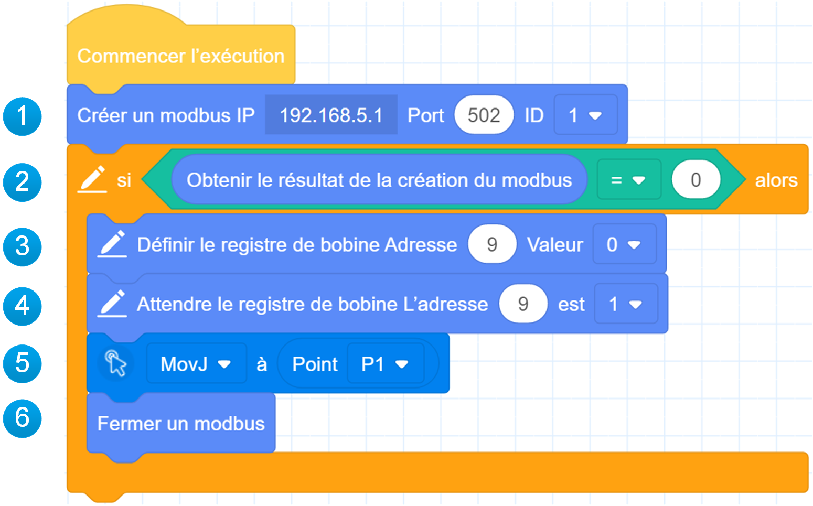
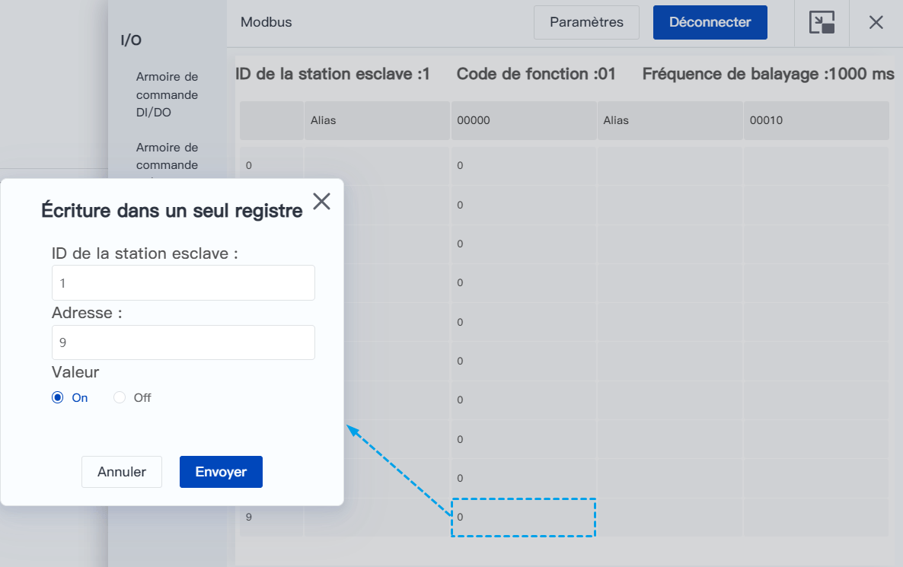

# Lecture et écriture des données des registres Modbus

### Notice

Afin de découvrir comment lire et écrire des données Modbus par le biais de la programmation graphique, supposons tout d'abord que nous souhaitons mettre en œuvre le scénario suivant :

Le robot crée un maître Modbus, se connecte à un esclave externe et lit l'adresse d'un registre de bobine spécifié. Si la valeur de cette adresse est 1, le robot se déplace vers le point P1.

### Programmation

Pour mettre en œuvre le scénario ci-dessus, nous devons écrire le programme comme indiqué ci-dessous.

1. Créez le maître avec l'adresse IP comme adresse esclave et laissez le port et l'ID à leurs valeurs par défaut. Ici, la station esclave fournie avec le robot est utilisée pour une vérification rapide, l'adresse IP est donc l'adresse du robot (192.168.5.1 par défaut, modifiable). 
2. Déterminer si la création de la station maître est réussie ou non, la création d'une station réussie avant que les étapes suivantes soient exécutées, sinon le programme se termine directement. 
3. Si la valeur du registre 9 de la bobine du robot a été modifiée, cela peut affecter la logique du programme suivant, vous devez donc d'abord régler la valeur du registre 0 de la bobine sur 0. 
4. Attendez que la valeur du registre de bobine 9 passe à 1. 
5. Contrôlez le mouvement du robot jusqu'au point P1, qui est un point de stockage défini par l'utilisateur. 
6. Fermer un modbus 
Si vous souhaitez connecter un esclave tiers, modifiez l'IP et le port dans le bloc de construction du maître en fonction de l'adresse de l'esclave tiers. Pour la plage de valeurs et la définition de l'adresse du registre lors de la lecture et de l'écriture des registres, reportez-vous aux instructions de définition de l'adresse du registre Modbus de l'esclave correspondant.

### Exécuter

Si vous devez exécuter le programme rapidement, vous pouvez utiliser l'outil de [surveillance Modbus](../monitoring/modbus.md) pour modifier les valeurs des registres de la bobine.

1. Ouvrez la page **Moniteur > Modbus** et cliquez sur **Connexions** dans le coin supérieur droit.

2. Les paramètres de connexion par défaut sont indiqués ci-dessous, il n'est pas nécessaire de les modifier, il suffit de cliquer sur **Connecter**.
  
   
   
    

3. Une fois que le maître Modbus a été créé avec succès, double-cliquez (côté PC) ou cliquez (côté mobile) sur la cellule avec la valeur correspondante du registre de bobine 9 pour faire apparaître la fenêtre **Write Single Coil (Écrire une bobine unique)**.
4. Modifiez la **valeur** de la bobine pour qu'elle soit **activée** et cliquez sur **Envoyer**.
  
   

   
    

5. Observez si le robot se déplace vers P1.
