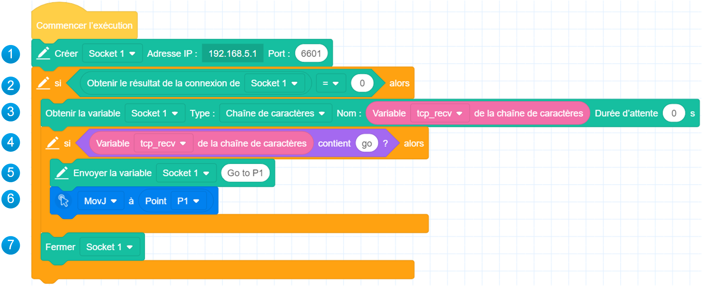
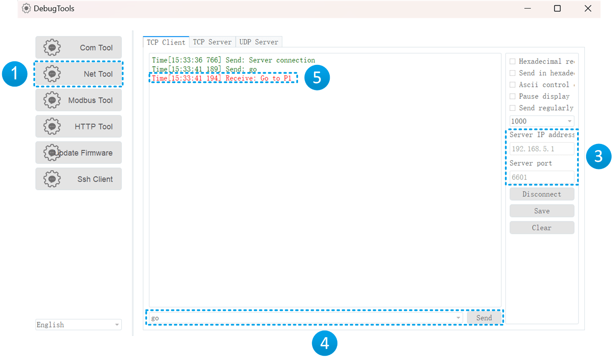

# Transmettre des données via la communication TCP

### Notice

Afin de découvrir le fonctionnement de la communication TCP par le biais de la programmation graphique, supposons que nous souhaitions mettre en œuvre le scénario suivant :

Le robot crée un serveur TCP, attend que le client se connecte et envoie une commande "go", puis renvoie un message "Go to P1" et commence à se déplacer vers le point P1.

### Programmation

Pour mettre en œuvre le scénario ci-dessus, nous devons écrire le programme comme indiqué ci-dessous.

1. Créez un serveur TCP (Socket 1) avec l'adresse IP du robot et un port personnalisé. 
2. Déterminer si la création du serveur est réussie ou non, les étapes suivantes ne seront exécutées que si la création est réussie, sinon le programme se terminera directement. 

3. Attendez que le client se connecte et envoie une chaîne, enregistrez la chaîne reçue dans la variable tcp_recv. La variable chaîne doit être créée par l'utilisateur.
  
    

4. Déterminez si la chaîne reçue contient "go", si c'est le cas, exécutez les étapes 5 et 6, sinon, exécutez directement l'étape 7. 

5. Envoyez la chaîne "Go to P1" au client. 

6. Contrôlez le mouvement du robot jusqu'au point P1, qui est un point de stockage défini par l'utilisateur. 

7. Désactiver le TCP.

### Exécuter

Si vous avez besoin d'exécuter le programme rapidement, vous pouvez utiliser l'outil de débogage fourni avec DobotStudio Pro en tant que client TCP.

1. Ouvrez **Paramètres > Outils de débogage** et accédez à la page **Net Tool > TCP Client** . 
2. Déplacez le robot vers un point autre que P1 (pour faciliter l'observation ultérieure de l'exécution de la commande de mouvement par le robot), puis enregistrez et exécutez le programme. 
3. Lorsque le journal d'exécution indique que le serveur TCP a été créé avec succès, modifiez l'adresse IP et le port du serveur dans l'outil de débogage et cliquez sur Connecter. 
4. Une fois la connexion établie, saisissez "go" en bas de l'outil de débogage et cliquez sur Envoyer. 
5. Observez si l'outil de débogage reçoit le message "Go to P1" et si le robot se déplace vers P1. 

La figure suivante montre l'interface de l'outil de débogage, et les numéros de série dans la figure correspondent aux étapes ci-dessus.

