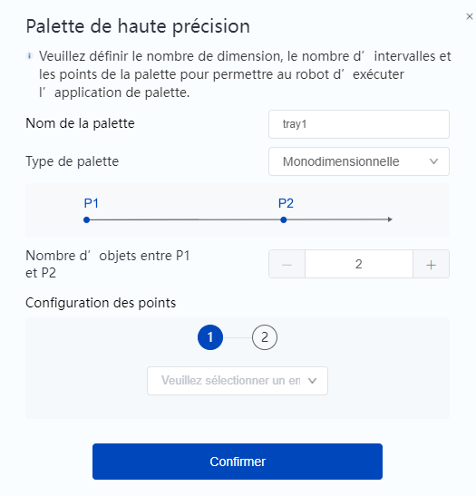
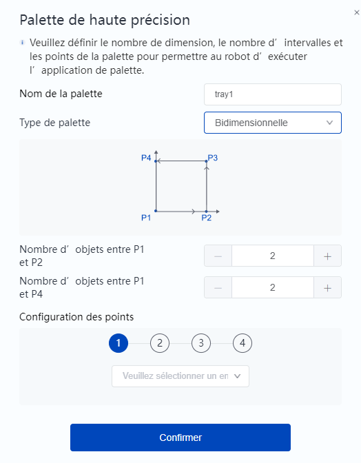
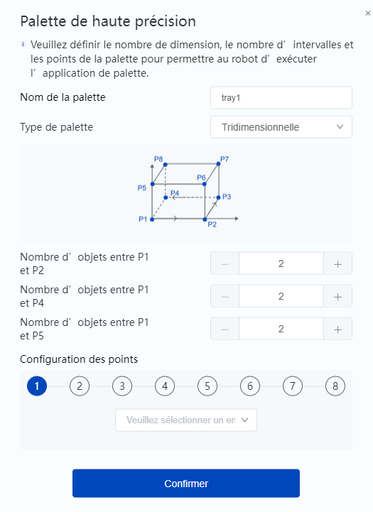
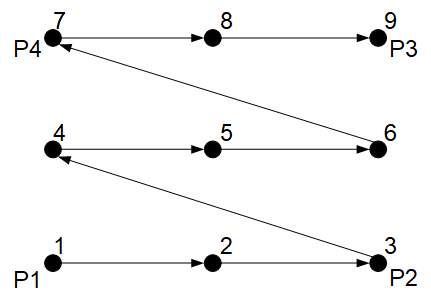

# Blocs de palettes

Les palettes sont des dispositifs de support de charge qui contiennent des lots de matériaux dans un arrangement régulier, souvent utilisés dans les processus de chargement et de déchargement automatisés. Une palette contient généralement un ensemble d'encoches, chacune d'entre elles pouvant contenir un seul matériau. La commande pallet permet de créer un ensemble complet de points de palettes en enseignant un petit nombre de points, et d'obtenir les points spécifiques de la palette créée afin d'automatiser rapidement le chargement et le déchargement des robots.

<h3 class="lua-cmd" id="createtray" >Créer une palette</h3>

**Description:** Crée des palettes, prenant en charge la création de palettes 1D, 2D et 3D. Il est possible de créer jusqu'à 20 palettes. Lors de la création de palettes portant le même nom, les palettes existantes sont écrasées et le nombre de palettes n'est pas augmenté.

**Paramètres :**

Renseignez le nom de la palette sur le bloc, puis cliquez sur le bloc pour faire apparaître la fenêtre de réglage afin de configurer les paramètres de la palette.

Tout d'abord, choisissez la dimension de la palette. Différentes dimensions de palettes nécessitent la configuration de différents paramètres.

- Palette 1D
  
  
  
  Un plateau unidimensionnel est un ensemble de points répartis de manière équidistante sur une ligne droite.
  
  - Indiquez d'abord le nombre d'objets P1~P2, c'est-à-dire le nombre total de points du plateau unidimensionnel.
  - Configurez ensuite séparément les points P1 et P2, qui ne peuvent être sélectionnés que dans la liste des points stockés.

- Palette 2D
  
  
  
  Une palette 2D est un ensemble de points répartis en réseau sur un plan.
  
  - Renseignez le nombre d'objets P1~P2 (lignes) et P1~P4 (colonnes) respectivement, et le produit des deux est le nombre total de points du plateau 2D.
  - Configurez ensuite les points P1 à P4 respectivement, en ne prenant en charge que la sélection à partir de la liste des points stockés.

- Palette 3D
  
  
  
  Une palette à trois bits est un ensemble de points répartis en trois dimensions dans l'espace, qui peut être considéré comme plusieurs palettes 2D disposées verticalement.
  
  - Remplissez le nombre d'objets P1~P2 (lignes), P1~P4 (colonnes) et P1 à P5 (couches) respectivement, et le produit des trois est le nombre total de points du plateau tridimensionnel.
  - Configurez ensuite les points P1 à P8 respectivement, en ne prenant en charge que la sélection à partir de la liste des points stockés. 

<b>Attention : </b>
Si vous utilisez un outil de terminal, assurez-vous de sélectionner le système de coordonnées d' outils correspondant lors de l' enseignement des points. 

<h3 class="lua-cmd" id="traypointcount" >Obtenir le nombre total de points de la palette</h3>

**Description:** Obtenir le nombre total de points de la palette créée.

**Paramètre:** Sélectionnez le nom de la palette créée.

**Retour:** Le nombre total de points de la palette spécifiée.

<h3 class="lua-cmd" id="gettraypoint">Obtenir les points de palette</h3>

**Description:** Obtient les points de la palette spécifiée avec le numéro de série spécifié. Le numéro de série des points est lié à l'ordre des points transmis lors de la création du plateau

- Plateau unidimensionnel : le numéro de série du point P1 est 1, le numéro de série du point P2 est le même que le nombre de points, etc.

- Plateau bidimensionnel : la figure suivante illustre la relation entre le point d'enseignement et le numéro de série du point pour un plateau 3x3 à titre d'exemple.
  
  

- Plateau tridimensionnel : par référence au plateau bidimensionnel, la deuxième couche du premier point du numéro de série de la première couche du dernier point du numéro de série plus un, etc.

**Paramètres :**

- Sélectionner le nom de la palette créée.
- Saisir le numéro de série du point à acquérir.

**Retour:** Les coordonnées du point correspondant au numéro de série sont renvoyées.