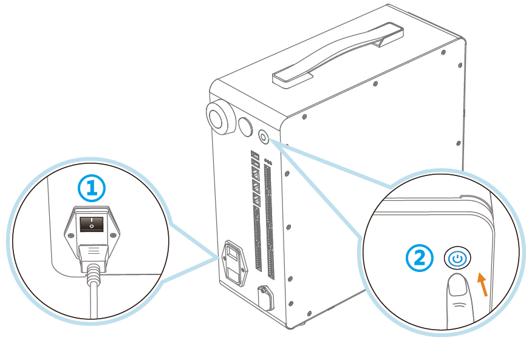
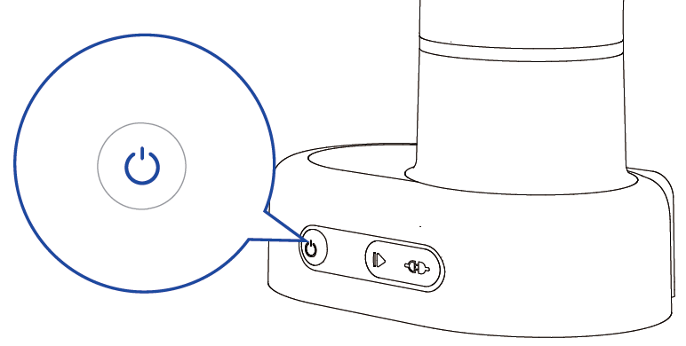
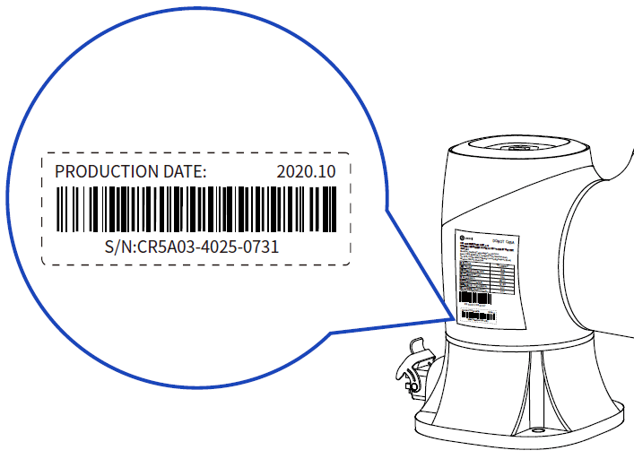
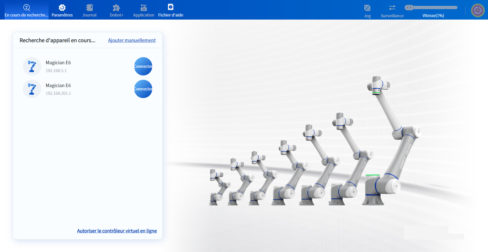
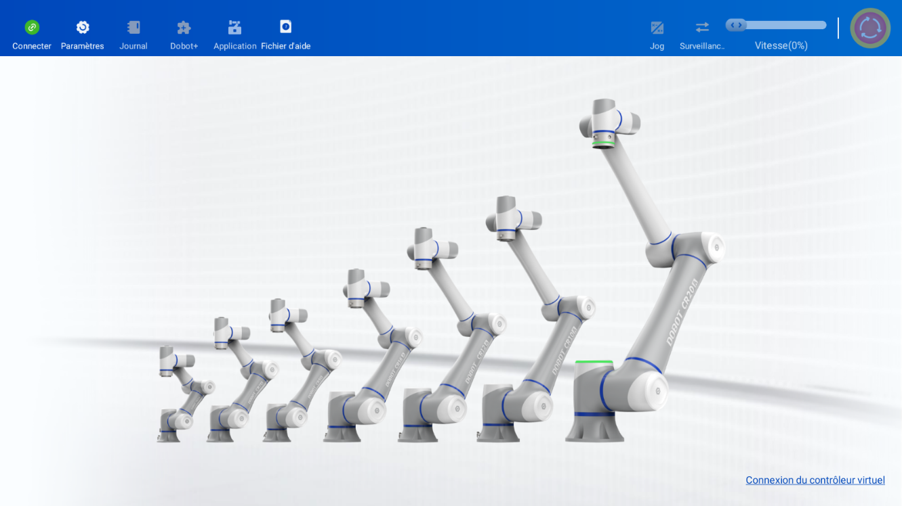
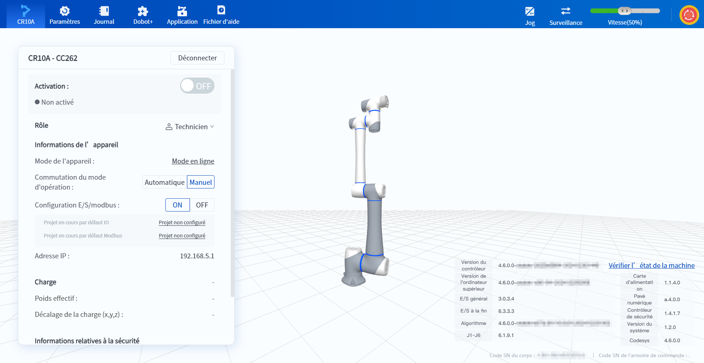
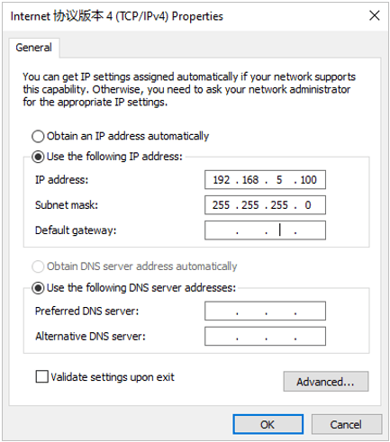
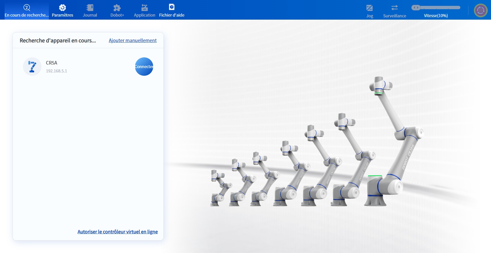
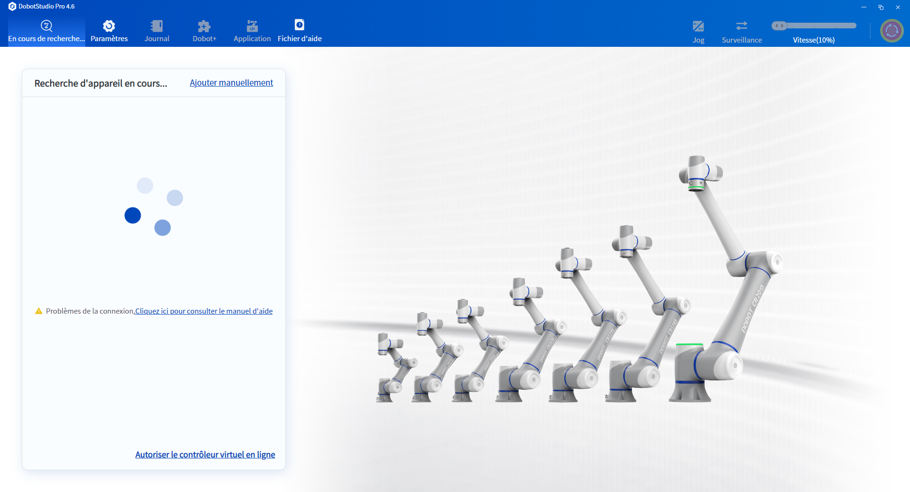
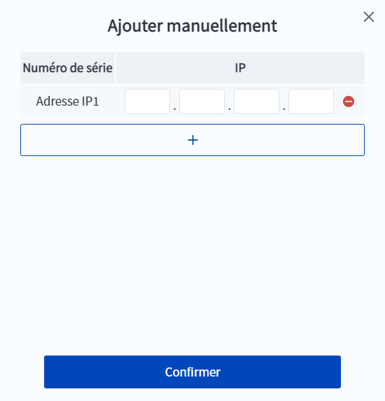

# 2 Mise en marche et connexion

<h2 id="poweron" class="m2">2.1 Mise en marche</h2>

### Série CRA

Après avoir terminé l'installation et le câblage de l'armoire de commande et mis en marche l'alimentation électrique externe, appuyez sur l'interrupteur situé sur la partie supérieure du connecteur d'alimentation sur "**|**", puis appuyez brièvement sur le bouton rond situé sur la partie supérieure de l'armoire de commande, et attendez que la lumière bleue de la lampe témoin s'allume pour indiquer que l'armoire de commande a été activée.

<b> Description: </b>
Lors du démarrage de l’armoire de commande, la LED orange du port LAN2 clignote, indiquant que le routeur WiFi intégré au contrôleur est en cours d’initialisation. A ce moment-là, les connexions LAN, WiFi et le démonstrateur ne peuvent pas se connecter au robot. Pendant tout le processus d’initialisation, la vitesse de clignotement de la LED va devenir de plus en plus rapide et s’éteindra finalement, indiquant que l’initialisation est terminée. A ce moment-là, l’utilisateur peut essayer de se connecter au robot. 

### Magician E6

Après avoir terminé l'installation et le câblage du robot et mis sous tension l'alimentation externe, appuyez brièvement sur le bouton rond situé à la base du robot et attendez que le voyant lumineux du robot devienne bleu pour indiquer que le robot a été activé.

<h2 id="wifi" class="m2">2.2 Connexion sans fil</h2>

<b> Description : </b>
Si vous souhaitez vous connecter au robot Magician E6 sans fil, veuillez acheter un module WiFi compatible et le connecter à l’interface USB sur la base du robot. 

 

Recherchez et connectez-vous au WiFi du robot sur votre PC ou votre tablette. Le SSID par défaut du WiFi est "Dobot model number - running number", où le running number est constitué des deux nombres à 4 chiffres reliés par "-" dans le numéro S/N du robot. Le code S/N est affiché sur la plaque signalétique de la base du bras du robot, par exemple, le CR5A dans l'image suivante, le SSID par défaut est "DobotCR5A-4025-0731", les autres modèles sont similaires) ; le mot de passe WiFi initial est : 1234567890. Le SSID et le mot de passe du WiFi peuvent être modifiés dans les [paramètres de communication](setting/commu_setting.md).

Lorsque le WiFi est connecté, l'IP du robot est 192.168.201.1.

**PC**

Après avoir ouvert DobotStudio Pro, le logiciel recherche automatiquement les robots connectables et affiche les résultats de la recherche sur l'interface. En raison de l'architecture réseau interne de l'armoire de commande, DobotStudio Pro peut rechercher plusieurs IP différentes du robot, quelle que soit l'IP par laquelle vous pouvez vous connecter au robot normalement, il est recommandé d'utiliser 192.168.201.1 pour se connecter.
Cliquez sur le bouton  à droite du robot que vous souhaitez connecter.

**Terminal mobile**

 

Cliquez sur le bouton  en haut à gauche de l'interface pour vous connecter au robot.

 

<b> Description : </b>
Lorsque le logiciel se connecte au robot, il vérifie si les versions du logiciel et du contrôleur sont compatibles : <ul><li>Si les deux premiers chiffres du numéro de version correspondent, la connexion au robot se fait normalement. </li><li>Si les deux premiers chiffres du numéro de version ne correspondent pas, le logiciel affiche une fenêtre d’avertissement indiquant une incompatibilité de version et se déconnecte automatiquement. </li></ul>

 

Lorsque le robot est connecté avec succès, l'interface du logiciel s'actualise et affiche des informations sur le robot connecté et son modèle 3D. Cliquez sur le bouton **Déconnecter** à droite du nom du robot pour vous déconnecter du robot actuel.

<h2 id="lan" class="m2">2.3 Connexion filaire</h2>

**Seul le PC prend en charge la connexion câblée.**

Connectez une extrémité du câble au port LAN du contrôleur et l'autre extrémité au PC, puis modifiez l'adresse IP du PC pour qu'il se trouve dans le même segment de réseau que l'adresse IP du contrôleur. L'adresse IP par défaut du port réseau LAN1 est 192.168.5.1 et l'adresse IP par défaut du port réseau LAN2 est 192.168.200.1. L'adresse IP du port réseau LAN1 peut être modifiée dans les [paramètres de communication](setting/commu_setting.md), et l'adresse IP du port réseau LAN2 ne peut pas être modifiée.

Les méthodes de modification de l'adresse IP du PC dans les différentes versions de Windows sont légèrement différentes, cet article prend Windows 10 comme exemple.

1. Recherchez "Réseau" dans la barre des tâches et sélectionnez **Afficher les connexions réseau**.

2. Cliquez avec le bouton droit de la souris sur l'icône de la connexion réseau actuelle (par exemple **Ethernet**) et sélectionnez **Propriétés**, puis recherchez et double-cliquez sur le **protocole Internet version 4 (TCP/IPv4)** dans la fenêtre contextuelle.

3. Dans l'écran **Propriétés du protocole Internet version 4 (TCP/IPv4)**, sélectionnez **Utiliser l'adresse IP suivante** pour modifier l'adresse IP, le masque de sous-réseau et la passerelle par défaut du PC. L'adresse IP du PC peut être modifiée en toute adresse IP inoccupée dans le même segment de réseau que le contrôleur, et son masque de sous-réseau et sa passerelle par défaut sont les mêmes que ceux du contrôleur. Par exemple, régler l'adresse IP du PC sur 192.168.5.100 et le masque de sous-réseau sur 255.255.255.0.
  
   

   
    

4. Cliquez sur le bouton  à droite du robot que vous souhaitez connecter.
  
   

   
      
<b> Description : </b>
Lorsque le logiciel se connecte au robot, il vérifie si les versions du logiciel et du contrôleur sont compatibles : <ul><li>Si les deux premiers chiffres du numéro de version correspondent, la connexion au robot se fait normalement. </li><li>Si les deux premiers chiffres du numéro de version ne correspondent pas, le logiciel affiche une fenêtre d’avertissement indiquant une incompatibilité de version et se déconnecte automatiquement. </li></ul>

5. Lorsque le robot est connecté avec succès, l'interface du logiciel est actualisée pour afficher les informations et le modèle 3D du robot connecté. Cliquez sur le bouton **Déconnecter** à droite du nom du robot pour vous déconnecter du robot actuel.
  
   

   
   
<b> Description : </b>
Si vous avez besoin d’utiliser un ordinateur pour se connecter simultanément à plusieurs robots, vous pouvez connecter les robots et l’ordinateur au même réseau local, puis ouvrir plusieurs fenêtres de DobotStudio Pro sur l’ordinateur et connecter chacune d’elles à un robot différent. 

<h2 id="manually_add" class="m2">2.4 Ajouter manuellement</h2>

Si le robot n'est pas recherché, vous pouvez ajouter manuellement l'IP du robot pour le rechercher.

 

Après avoir ouvert DobotStudio Pro, cliquez sur **Ajouter manuellement**. Dans la page contextuelle, cliquez sur **+** Ajouter l'IP du robot.

 

Vous pouvez ajouter manuellement jusqu'à 5 IP de robot à la fois. Une fois l'adresse IP saisie, cliquez sur **OK** pour donner la priorité à la recherche des robots ajoutés manuellement.
