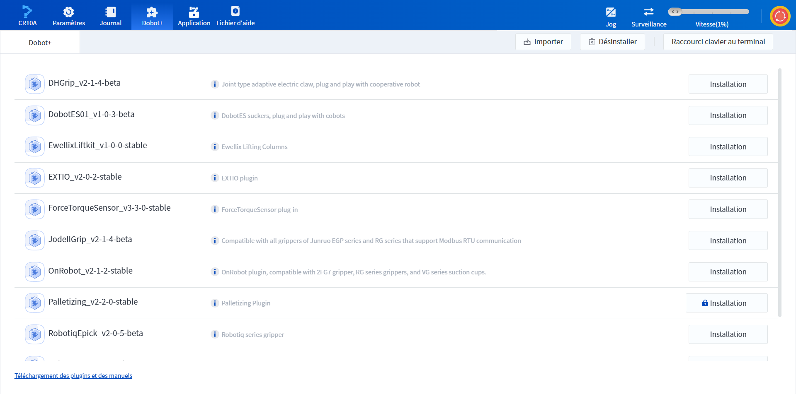
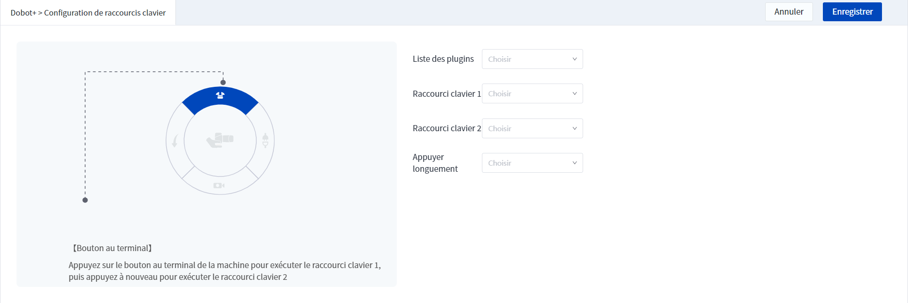
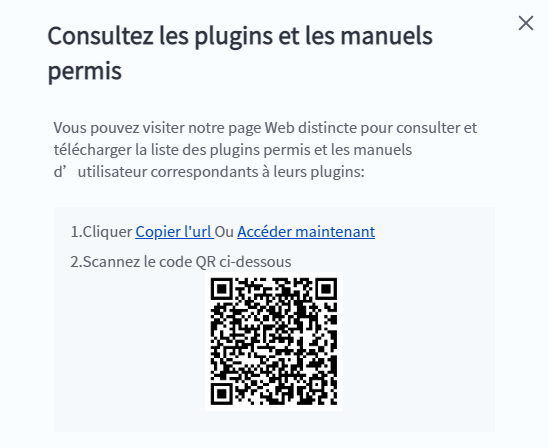

# 7 Dobot+

La page Dobot+ permet aux utilisateurs de configurer et d'utiliser rapidement les éco-accessoires Dobot, éliminant ainsi le besoin de développement secondaire.

 

 

Cliquez sur le bouton **Installation** à droite du plugin pour installer le plugin, ou cliquez sur le bouton **Importer** dans la barre de titre supérieure pour télécharger le plugin. Après avoir sélectionné un plugin, cliquez sur le bouton **Désinstaller** dans la barre de titre pour désinstaller le plugin sélectionné.

Une fois l'installation du plug-in terminée, le bouton **Installation** se transforme en bouton **Ouvrir**, cliquez pour ouvrir le plug-in dans un nouvel onglet, vous pouvez ouvrir plusieurs plug-ins en même temps. Les différents plugins sont utilisés de différentes manières, qui ne sont pas décrites en détail dans cet article.

Après l'ajout d'un plug-in, la **Programmation des blocs** et la **Programmation de scripts** ajouteront également des blocs/fonctions liés au plug-in pour contrôler les éco-accessoires dans le temps d'exécution du projet.

Le bouton de fin du robot peut être configuré pour exécuter une fonction de raccourci en cliquant sur le **Raccourci clavier au terminal** dans le coin supérieur droit de la page Dobot+.

 

Sélectionnez d'abord la **Liste des plugins**, puis sélectionnez le **Raccourci clavier 1**, le **Raccourci clavier 2** et **Appuyez longuement** sur la fonction correspondante du plugin. Appuyez sur le bouton au terminal de la machine pour exécuter le **Raccourci clavier 1**, puis appuyez à nouveau pour exécuter le **Raccourci clavier 2**.

Cliquez sur **Téléchargement des plugins et des manuels** dans le coin inférieur gauche de la page Dobot+ pour faire apparaître la boîte de dialogue suivante : vous pouvez afficher et télécharger la liste des plug-ins pris en charge par VC et le manuel d'utilisation du plug-in correspondant par le biais de la page web ou du code QR.

 

