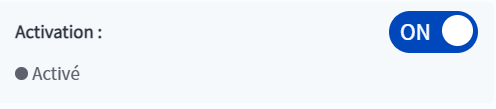
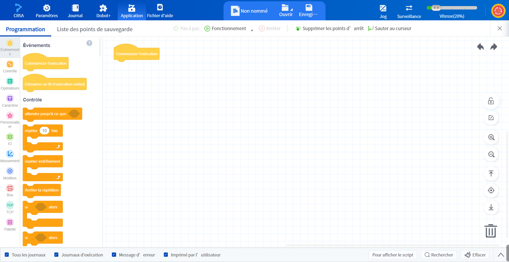
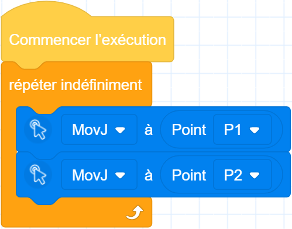

# 4 Démarrage rapide

Ce chapitre explique comment créer un projet de bloc dans lequel un robot se déplace de façon circulaire entre deux points, afin d'aider l'utilisateur à découvrir rapidement les fonctionnalités du robot Dobot.

Ce chapitre ne décrit que les étapes les plus simples pour atteindre l'objectif ; veuillez vous reporter aux chapitres suivants de ce manuel pour obtenir une description détaillée de chaque fonction.

### Actionnement du robot

1. Après avoir connecté le robot, cliquez sur le commutateur **Activation** dans le panneau d'information de l'interface principale.
  
    

    
     

2. Réglage de l'**activation de la charge**. Si aucun outil n'est installé à l'extrémité du robot, cliquez directement sur le bouton d'**activation OK**. Si l'outil est déjà installé à l'extrémité du robot, reportez-vous à la page [Activation](operation/enable.md) pour définir les paramètres de charge.
  
    

    
     

3. Lorsque l'activation supérieure est réussie, le bouton d'activation est **ON**.
  
    

### Création d'un projet de bloc

1. Ouvrez l'écran **Application** **> Programmation des blocs**.
  
   

2. Ouvrez la **Liste des points de sauvegarde**.
  
   

3. Appuyez sur les boutons de commande (par exemple **J1+ et J1-**) du panneau de **Jog** et maintenez-les enfoncés pour déplacer le bras du robot jusqu'à la position souhaitée, puis cliquez sur le bouton **Add Point**  dans le coin supérieur droit de la **liste des points de sauvegarde** Ajouter un point  pour enregistrer le point P1.

4. De même, enregistrez le point P2.

5. De retour à la page de **programmation**, faites glisser le bloc **Exécution répétée** du groupe de blocs **Contrôle** dans la zone de blocs de gauche vers le bas du bloc **Démarrage** dans le canevas.

6. Faites glisser un bloc **Mouvement** vers **point** du groupe Blocs de **mouvement vers** le bloc **Exécution répétée**, cliquez sur la liste déroulante Points et sélectionnez P1.

7. Faites glisser un autre bloc **Mouvement vers point** sous le bloc **Mouvement vers point** précédent, cliquez sur la liste déroulante Points et sélectionnez P2.
  
   

### Sauvegarde et exécution

<b> Attention : </b>
 Avant d’exécuter le robot, assurez-vous qu'il n'y a personne ni aucun obstacle dans la zone de travail du robot. 

 

Cliquez sur  Enregistrer en **haut**   de la page de programmation, entrez un nom de projet (par exemple, "test") et enregistrez le projet en cours, puis cliquez sur   **Exécuter**. Le robot se déplace d'abord jusqu'au point P1, puis commence à effectuer des cycles entre les points P1 et P2.