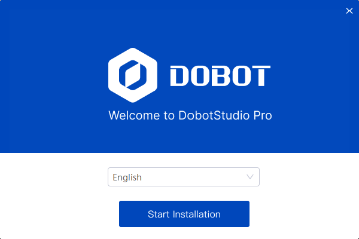
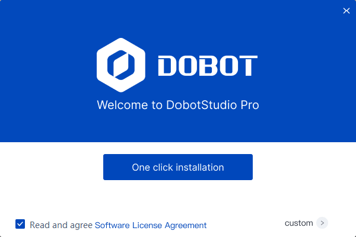
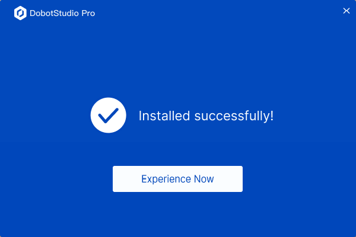

# 1 À partir d’ici

<h2 id="overview" class="m2">1.1. Généralités</h2>

Bienvenue dans DobotStudio Pro. DobotStudio Pro est le logiciel de commande développé par Dobot pour les robots Dobot. Il est doté de fonctions simples et faciles à utiliser, d'une grande praticabilité et d'une interface simple et facile à comprendre, ce qui peut aider les utilisateurs à maîtriser rapidement l'utilisation des robots Dobot.
Ce manuel présente principalement l'utilisation de DobotStudio Pro pour contrôler les robots de la série CRA.

DobotStudio Pro peut être utilisé sur PC, tablettes Android et les enseignants auto-développés par Dobot, parmi lesquels la version enseignant a certaines caractéristiques uniques (par exemple, des commutateurs à trois positions) qui doivent être combinées avec le matériel des enseignants, qui ne sont pas présentés dans ce document, veuillez vous référer au manuel d'utilisation des enseignants de robots collaboratifs Dobot.

<h2 id="spec" class="m2">1.2 Configuration requise</h2>

**La configuration requise pour le DobotStudio Pro est indiquée ci-dessous :**

**PC**

<table>
<thead>
<tr>
<th>Option de configuration</th>
<th>Configuration minimale</th>
<th>Configuration recommandée</th>
</tr>
</thead>
<tbody><tr>
<td style="text-align:center">Processeur</td>
<td colspan=2>Processeur Intel ou AMD 64 bits, SSE 4.2 ou version ultérieure, fréquence d'horloge de 2,9 GHz ou supérieure</td>
</tr>
<tr>
<td style="text-align:center">Système d’exploitation</td>
<td colspan=2><ul><li>Windows 10 (64 bits) version 1809 ou ultérieure</li><li>Windows 11</li></ul></td>
</tr>
<tr>
<td style="text-align:center">Mémoire (RAM)</td>
<td>8 GB</td>
<td>16 Go ou plus</td>
</tr>
<tr>
<td style="text-align:center">Carte graphique</td>
<td><ul><li>Compatible DirectX12</li><li>2 Go de mémoire vidéo</li></ul></td>
<td><ul><li>Compatible DirectX12</li><li>4 Go de mémoire vidéo, pour une résolution 4K ou supérieure</li></ul></td>
</tr>
<tr>
<td style="text-align:center">Résolution d'affichage</td>
<td>1440 x 900, zoom à 100%</td>
<td>1920 x 1080 ou résolution supérieure</td>
</tr>
<tr>
<td style="text-align:center">Espace disque</td>
<td>4 Go d'espace disponible</td>
<td><ul><li>4 Go d'espace disponible</li><li>SSD intégré</li></ul></td>
</tr>
</tbody></table>

<b> Description : </b>
<ul><li>Un processeur, une mémoire ou une carte graphique inférieurs aux configurations minimales peuvent entraîner des ralentissements ou des blocages du logiciel. </li><li>Une résolution d'affichage inférieure aux configurations minimales peut entraîner un affichage incomplet de l'interface. </li><li>L'installation du logiciel peut nécessiter un espace disque supplémentaire. </li><li>Un système d'exploitation inférieur aux configurations minimales peut entraîner une incompatibilité du logiciel, nécessitant une évaluation supplémentaire. </li></ul>

 

**Terminal mobile**

Les clients peuvent demander une tablette optionnelle à Dobot, ou s'ils doivent en acheter une eux-mêmes, les exigences de configuration sont les suivantes :

<table>
<thead style="text-align:center">
<tr>
<th>Option de configuration</th>
<th>Configuration recommandée</th>
</tr>
</thead>
<tbody style="text-align:center">
<tr>
<td>Processeur</td>
<td>4 cœurs</td>
</tr>
<tr>
<td>Système d’exploitation</td>
<td>Android 10 ou ultérieure</td>
</tr>
<tr>
<td>Mémoire vive</td>
<td>2 GB</td>
</tr>
<tr>
<td>Espace de stockage</td>
<td>32 GB</td>
</tr>
<tr>
<td>Écran</td>
<td>8 pouces</td>
</tr>
</tbody></table>

<h2 id="install" class="m2">1.3 Installer le logiciel</h2>

**PC**

Veuillez télécharger le dernier paquet d'installation de DobotStudio Pro depuis le [site officiel](https://www.dobot.cn/service/download-center) et l'installer comme suit :

1. Double-cliquez sur le paquet pour l'ouvrir, sélectionnez la langue d'installation et cliquez sur **Start Installation**.
  
    

  

2. Cliquez sur **One click installation** dans l'interface d'installation, ou définissez le chemin d'installation dans les options **custom** et démarrez l'installation.
  
    

  

3. Une fois le logiciel installé avec succès, cliquez sur **Experience Now** dans l'interface d'invite pour ouvrir directement le logiciel.
  
    

 

**Terminal mobile**

- Android : Veuillez télécharger la dernière version du paquet d'installation de DobotStudio Pro à partir du [site officiel](https://www.dobot.cn/service/download-center) et l'installer. 

<h2 id="use" class="m2">1.4 Comment utiliser ce manuel</h2>

<table>
  <colgroup>
    <col style="width: 25%">
    <col style="width: 45%">
    <col style="width: 30%">
  </colgroup>
<thead>
<tr>
<th>Étape</th>
<th>Description</th>
<th>Chapitre de référence</th>
</tr>
</thead>
<tbody><tr>
<td style="text-align:center">Connecter le robot</td>
<td>DobotStudio Pro prend en charge la connexion au robot via une liaison filaire ou sans fil. La plupart des fonctionnalités nécessitent que le robot soit connecté pour être utilisées. Lorsque le robot n'est pas connecté, vous pouvez uniquement configurer la langue d'affichage ou téléverser les journaux de plantage de l'application mobile dans les paramètres système. </td>
<td><a href="connect.md">Mise en marche et connexion</a></td>
</tr>
<tr>
<td style="text-align:center">Connaître le logiciel</td>
<td>Découvrez rapidement les principales interfaces et fonctionnalités de DobotStudio Pro. </td>
<td><a href="interface/interface_overview.md">Aperçu de l’interface</a></td>
</tr>
<tr>
<td style="text-align:center">Paramètres de montage/tension</td>
<td>Si le robot n’est pas installé sur un sol horizontal, vous devez d’abord définir l’angle d’installation. Si vous utilisez une entrée de courant continu (DC), vous devez également configurer la plage de voltage. </td>
<td>
  <ul>
    <li><a href="setting/installation.md">Paramètres de montage</a></li>
    <li><a href="setting/volt.md">Tension d'alimentation</a></li>
  </ul></td>
</tr>
<tr>
<td style="text-align:center">Découvrir rapidement les fonctionnalités du robot</td>
<td>Écrire et exécuter un programme qui fait bouger le robot en boucle entre deux points. </td>
<td><a href="first_demo.md">Démarrage rapide</a></td>
</tr>
<tr>
<td style="text-align:center">Paramètres de sécurité</td>
<td>Avant d’utiliser formellement le robot, veuillez configurer les paramètres de sécurité du robot en fonction des résultats de l’évaluation des risques. </td>
<td>
  <ul>
    <li><a href="monitoring/io_monitor_safe_io.md">E/S de sécurité</a></li>
    <li><a href="setting/safety_setting.md">Paramètres de sécurité</a></li>
  </ul>
</td>
</tr>
<tr>
<td style="text-align:center">Connaître les opérations de base du robot</td>
<td>Apprenez les opérations de base du robot, y compris la connexion utilisateur, le jog et la gestion des alarmes. </td>
<td><a href="operation/oper_categ.md">Opérations de base du robot</a></td>
</tr>
<tr>
<td style="text-align:center" rowspan="3">Programmation</td>
<td>L’utilisateur peut contrôler le robot pour qu’il fonctionne automatiquement en écrivant un programme. Tout d’abord, veuillez choisir la méthode de programmation appropriée et apprendre à utiliser l’interface de programmation. </td>
<td><a href="programming/programming.md">Application</a></td>
</tr>
<tr>
<td>Comprendre les instructions de programmation spécifiques, y compris leurs fonctions et leur utilisation. </td>
<td>
  <ul>
    <li><a href="blockly/blockly_manual.md">Annexe B Description des blocs de la programmation des blocs</a></li>
    <li><a href="script/script_manual.md">Annexe C Description des fonctions de programmation de script</a></li>
    <li><a href="python/python_manual.md">Annexe E Description de la fonction de programmation Python</a></li>
  </ul>
</td>
</tr>
<tr>
<td>L’utilisateur peut consulter et modifier l’état en temps réel d’E/S et effectuer le débogage des fonctionnalités liées aux E/S. </td>
<td>
  <ul>
    <li><a href="monitoring/io_monitor_ctrl_dio.md">Armoire de commande DI/DO</a></li>
    <li><a href="monitoring/io_monitor_ctrl_aio.md">Armoire de commande AI/AO</a></li>
    <li><a href="monitoring/io_monitor_term_io.md">E/S du terminal</a></li>
  </ul>
</td>
</tr>
<tr>
<td style="text-align:center">Utiliser les éco-accessoires</td>
<td>Les plugins Dobot+ permettent aux utilisateurs de configurer et d'utiliser rapidement les éco-accessoires Dobot, éliminant ainsi le besoin de développement secondaire. Pour les éco-accessoires déjà compatibles avec Dobot, veuillez consulter le <a href="https://dobot.cn/ecosystem">site officiel de Dobot</a>. </td>
<td><a href="dobot_plus.md">Dobot+</a></td>
</tr>
<tr>
<td style="text-align:center">Paramètres logiciels et du robot</td>
<td>Modifier les paramètres logiciels et ceux relatifs au robot. Les paramètres relatifs au robot sont sauvegardés sur le contrôleur, et différents robots doivent être configurés séparément. </td>
<td><a href="setting/setting.md">Paramètres</a></td>
</tr>
<tr>
<td style="text-align:center" rowspan="2">Contrôle à distance du robot</td>
<td>L’utilisateur peut contrôler le robot à distance via les E/S de l’armoire de commande, y compris pour gérer l’exécution des projets et obtenir l’état du robot. </td>
<td><a href="monitoring/io_monitor_ctrl_dio.md">Armoire de commande DI/DO</a></td>
</tr>
<tr>
<td>L’utilisateur peut contrôler le robot à distance via Modbus (Modbus-TCP ou RTU-over-TCP), y compris pour gérer l’exécution des projets et obtenir l’état du robot ainsi que les données de retour en temps réel. </td>
<td>
  <ul>
    <li><a href="monitoring/modbus.md">Modbus</a></li>
    <li><a href="modbus_define.md">Annexe A La définition du registre Modbus</a></li>
  </ul>
</td>
</tr>
<tr>
<td style="text-align:center">Consulter/Exporter le jounal</td>
<td>Les journaux peuvent aider à diagnostiquer les problèmes et, le cas échéant, vous pouvez exporter les journaux et les transmettre à l’équipe technique pour analyse. </td>
<td><a href="log.md">Journal</a></td>
</tr>
<tr>
<td style="text-align:center">Mise à niveau du firmware</td>
<td>Mettre à niveau le micrologiciel du robot vers la dernière version ou de revenir en arrière en un seul clic. </td>
<td><a href="setting/fw_update.md"> Mise à niveau du firmware</a></td>
</tr>
</tbody></table>
