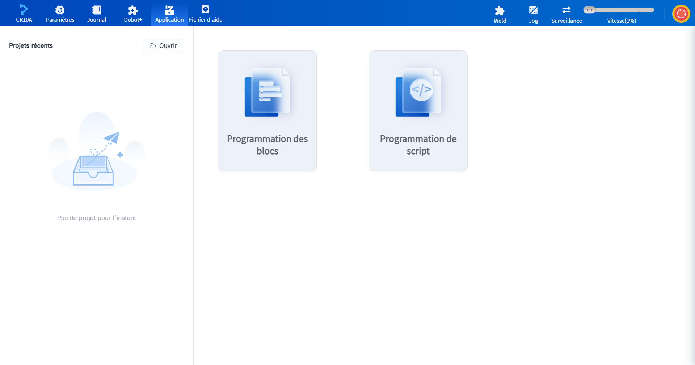
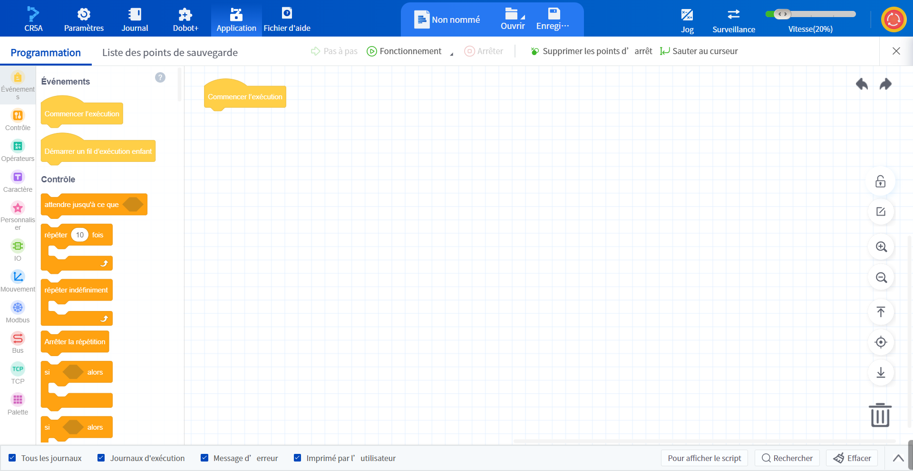
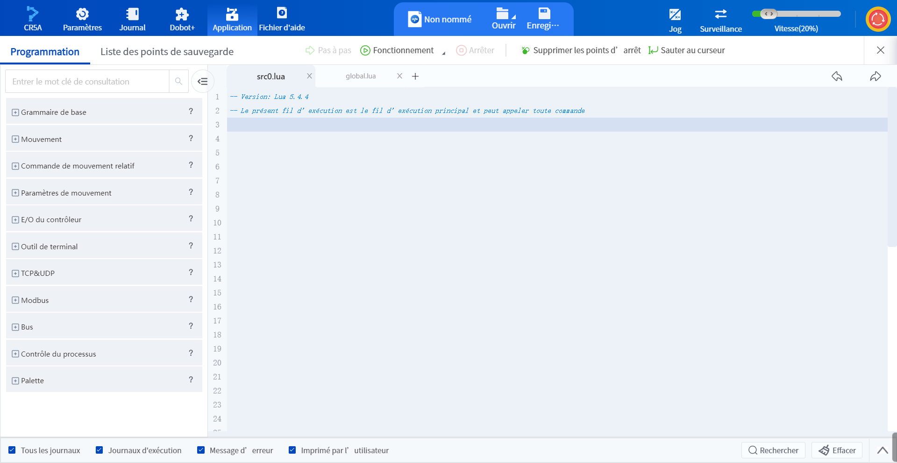
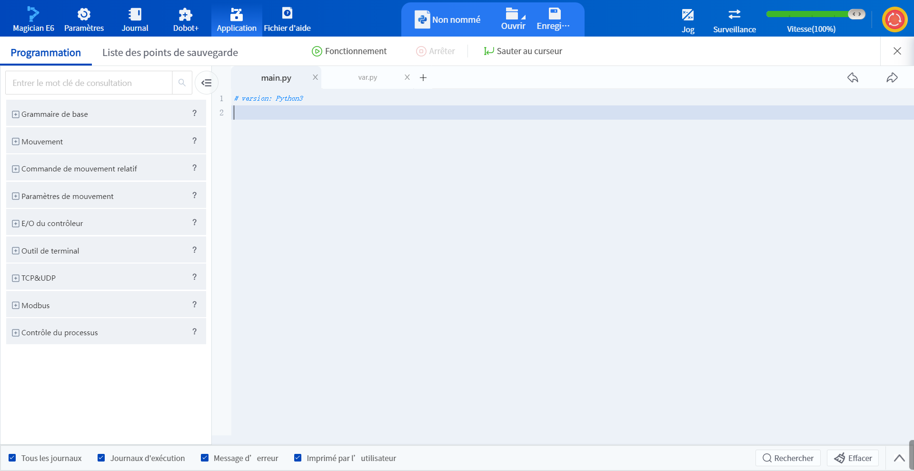

# 3.5 Interface d'application

L'interface d'application permet aux utilisateurs de créer et d'exécuter leurs propres projets pour automatiser le robot.

### Programmation des blocs

La programmation par blocs est une méthode de programmation graphique, les utilisateurs peuvent faire glisser les blocs sur le côté gauche de la page de programmation vers le côté droit du canevas pour la programmation, voir [Programmation des blocs](../programming/blockly.md) pour plus de détails.

 

### Programmation de script

La programmation par script est une méthode de programmation basée sur le langage de programmation Lua. Les utilisateurs peuvent trouver les commandes à utiliser sur le côté gauche de la page de programmation, configurer les paramètres et les ajouter à la zone de programmation de droite, ou écrire le programme directement dans la zone de programmation de droite, voir [Programmation de script](../programming/script.md) pour plus de détails.

### Programmation Python

La programmation Python est une méthode de programmation basée sur le langage de programmation Python, qui **n'est disponible que lors de la connexion du robot Magician E6 à un PC**, et qui est utilisée pour l'enseignement et la recherche. L'interface de fonctionnement est fondamentalement la même que la programmation par script et ne prend pas en charge le débogage. Voir [Programmation Python](../programming/python.md) pour plus de détails.

