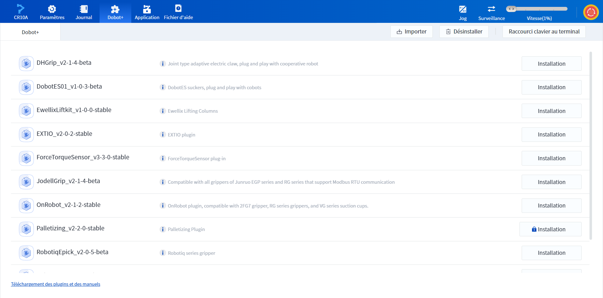

# 3.4 Page Dobot+

La page Dobot+ est utilisée pour gérer et utiliser le plug-in Dobot+, voir la description de la fonction [Dobot+](../dobot_plus.md) pour plus de détails.

Le plug-in Dobot+ est un plug-in spécial développé pour les éco-accessoires, qui permet aux utilisateurs de configurer et d'utiliser les éco-accessoires tels que les mâchoires directement sans développement secondaire.

