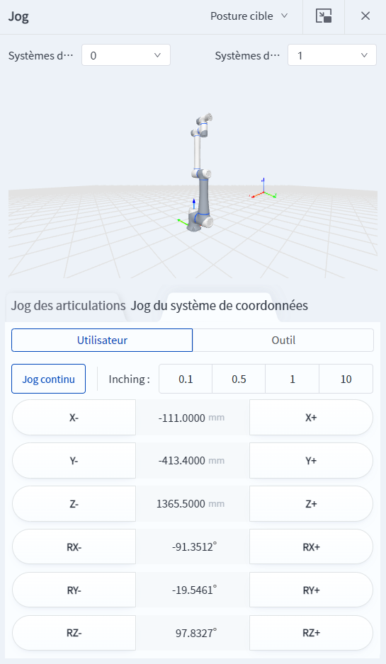

# 3.6 Panneau de jog

Le panneau de jog et de clic est utilisé pour contrôler le déplacement du robot par pointage ou par inching. Il prend en charge le jog des articulations et le jog du système de coordonnées, veuillez vous référer à la description de la fonction de [jog](../operation/jog_oper.md) pour plus de détails.

Cliquez sur  dans le coin supérieur droit du panneau pour transformer le panneau en une fenêtre séparée qui peut être déplacée librement ; lorsque la fenêtre séparée est fermée et que la page de jog est rouverte, la page de jog redevient le panneau intégré.

