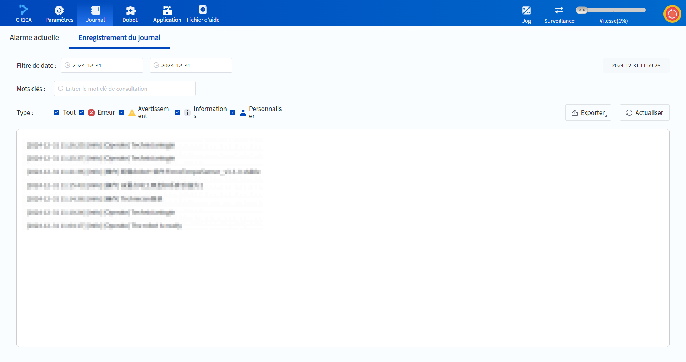

# 3.3 Page de journal

La page de journal comprend deux sous-pages, **Alarmes actuelle**s et **Enregistrement du journal**.

- La page **Alarmes actuelle** permet de visualiser et d'effacer les alarmes, voir [Gestion des alarmes](../operation/clear_alarm.md) pour plus de détails.

- La page **Enregistrement du journal** permet de visualiser et d'exporter les journaux, voir [Journal](../log.md) pour plus de détails.

