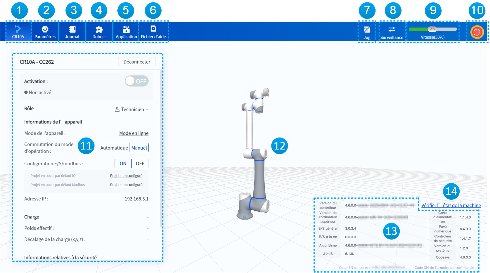
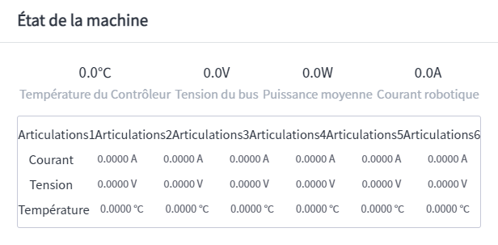
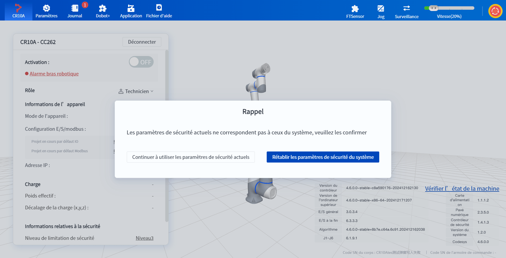

# 3.1 Interface principale

Une fois le logiciel connecté au robot, l'interface principale s'affiche comme indiqué ci-dessous.

 

<table>
  <colgroup>
    <col style="width: 10%">
    <col style="width: 90%">
  </colgroup>
<thead>
<tr>
<th>Numéro de série</th>
<th>Description</th>
</tr>
</thead>
<tbody><tr>
<td style="text-align:center">1</td>
<td>Cliquez pour ouvrir l'interface principale (interface actuelle), la couleur de l'icône du bras robotique est synchronisée avec l'indicateur lumineux sur le robot, changeant en fonction de l'état du robot. Pour la définition des couleurs des indicateurs lumineux, veuillez consulter le manuel d'utilisation du matériel correspondant au robot. </td>
</tr>
<tr>
<td style="text-align:center">2</td>
<td>Cliquez pour ouvrir <a href="setting.md">la page de paramètres</a>, ce qui permet de définir les paramètres relatifs à l’installation, au mouvement et à la sécurité du robot. </td>
</tr>
<tr>
<td style="text-align:center">3</td>
<td>Cliquez pour ouvrir <a href="log.md">la page de journal</a>, ce qui permet de visualiser l’alarme et le journal. </td>
</tr>
<tr>
<td style="text-align:center">4</td>
<td>Cliquez pour ouvrir <a href="dobotplus.md">la page de Dobot+</a>, ce qui permet d’installer et d’activer les plugins Dobot+. </td>
</tr>
<tr>
<td style="text-align:center">5</td>
<td>Cliquez pour ouvrir <a href="application.md">la page d’application</a>, ce qui permet de programmer via la méthode des blocs ou du script.</td>
</tr>
<tr>
<td style="text-align:center">6</td>
<td>Cliquez pour ouvrir le document d’aide, qui prend en charge l’affichage dans l’interface logicielle, l’affichage dans une fenêtre distincte et l’ouverture dans un navigateur. </td>
</tr>
<tr>
<td style="text-align:center">7</td>
<td>Cliquez pour ouvrir <a href="jog.md">le panneau de jog</a>, ce qui permet de manipuler le jog ou l’inching du robot. </td>
</tr>
<tr>
<td style="text-align:center">8</td>
<td>Cliquez pour ouvrir <a href="monitor.md">le panneau de surveillance</a>, ce qui permet de surveiller l’E/S et les variables globales du robot. </td>
</tr>
<tr>
<td style="text-align:center">9</td>
<td>Utilisé pour afficher et définir le taux global, contrôlant la vitesse de mouvement du bras robotique. </td>
</tr>
<tr>
<td style="text-align:center">10</td>
<td>Bouton d'arrêt d'urgence, à presser en cas de situation imprévue pendant le fonctionnement du bras pour arrêter celui-ci immédiatement. </td>
</tr>
<tr>
<td style="text-align:center">11</td>
<td>Ce panneau permet d'activer le robot, de changer de rôle d’utilisateur, de configurer les informations de l'appareil, d'afficher les informations de charge et les informations de sécurité (comme les informations de somme de contrôle de sécurité). </td>
</tr>
<tr>
<td style="text-align:center">12</td>
<td>Modèle 3D du robot, dont la posture est synchronisée avec celle du robot réel. </td>
</tr>
<tr>
<td style="text-align:center">13</td>
<td>Informations sur le code SN du robot et sur les versions du firmware et du logiciel.  Lorsque vous contactez le support technique pour signaler un problème, veuillez envoyer une capture d'écran de cette section au support technique pour qu'il puisse cibler le problème.  Pour mettre à jour la version du firmware, veuillez utiliser en priorité l'outil de maintenance du robot ; ou effectuez la mise à jour par le biais de la <a href="../setting/fw_update.md">mise à jour du firmware.</a> </td>
</tr>
<tr>
<td style="text-align:center">14</td>
<td>Cliquer pour afficher l'état actuel du robot par exemple la tension, le courant et la température, etc.  </td>
</tr>
</tbody></table>

 

## Somme de contrôle de sécurité
La **somme de contrôle de sécurité** est le résultat du calcul des paramètres de sécurité à l'aide d'un algorithme de somme de contrôle donné. Si les paramètres de sécurité ont changé, la somme de contrôle de sécurité changera.

DobotStudio Pro affichera un message d'erreur ; l'utilisateur doit résoudre la différence de somme de contrôle de sécurité avant de pouvoir continuer à utiliser le robot.

 

- Cliquez sur **Toujours utiliser les paramètres de sécurité actuels** pour générer un nouveau somme de contrôle de sécurité avec les paramètres de sécurité actuels du système. **Réglage réussi des paramètres de sécurité actuels**
- Cliquez sur **Restaurer les paramètres de sécurité** pour revenir aux derniers paramètres de sécurité correctement configurés, avec la somme de contrôle de sécurité inchangée. **Restauration des paramètres de sécurité du système par défaut réussie**

Les paramètres de sécurité qui affectent la somme de contrôle de sécurité sont répertoriés ci-dessous :

<table>
<thead style="text-align:center">
<tr>
<th>Interface DobotStudio Pro</th>
<th>Paramètres</th>
</tr>
</thead>
<tbody style="text-align:center"><tr>
<td>E/S de sécurité</td>
<td>Tous les paramètres de l’interface E/S de sécurité</td>
</tr>
<tr>
<td>Fonctions avancées</td>
<td>Contrainte de moment</td>
</tr>
<tr>
<td>Point d'origine de sécurité</td>
<td>Coordonnées articulaires</td>
</tr>
<tr>
<td>Zone de sécurité</td>
<td>Tous les paramètres de l’interface de zone de sécurité</td>
</tr>
<tr>
<td>Mur de sécurité</td>
<td>Tous les paramètres de l’interface de mur de sécurité</td>
</tr>
<tr>
<td>Détection de collision（Magician E6）</td>
<td>Tous les paramètres de l’interface de détection de collision</td>
</tr>
<tr>
<td>Paramètres de montage</td>
<td>Angle d’inclinaison/rotation</td>
</tr>
<tr>
<td>Paramètres de mouvement</td>
<td>Vitesse de reproduction</td>
</tr>
<tr>
<td>Réglages du mode</td>
<td>Mode manuel/automatique</td>
</tr>
<tr>
<td>Limite de sécurité</td>
<td>Tous les paramètres de l’interface de limite de sécurité</td>
</tr>
</tbody></table>
