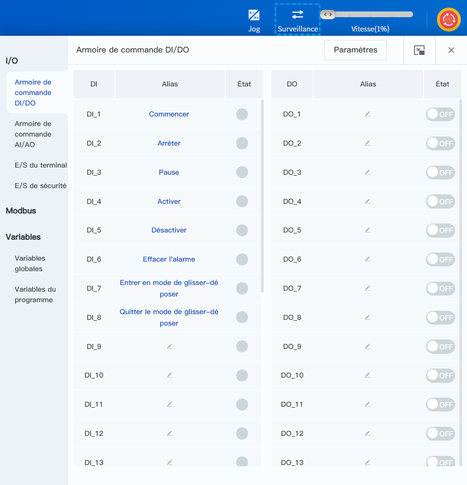

# 3.7 Panneau de surveillance

Le panneau de surveillance vous permet de surveiller et de définir l'état et la fonction de chaque OI du robot, ainsi que de gérer et de visualiser les variables globales. Pour plus de détails, reportez-vous aux instructions de chaque [page de surveillance](../monitoring/io_monitor_ctrl_dio.md).

Cliquez sur  dans le coin supérieur droit du panneau pour transformer le panneau en une fenêtre séparée qui peut être déplacée librement ; après avoir fermé la fenêtre séparée et rouvert la page de surveillance, la page de surveillance redeviendra le panneau intégré.

