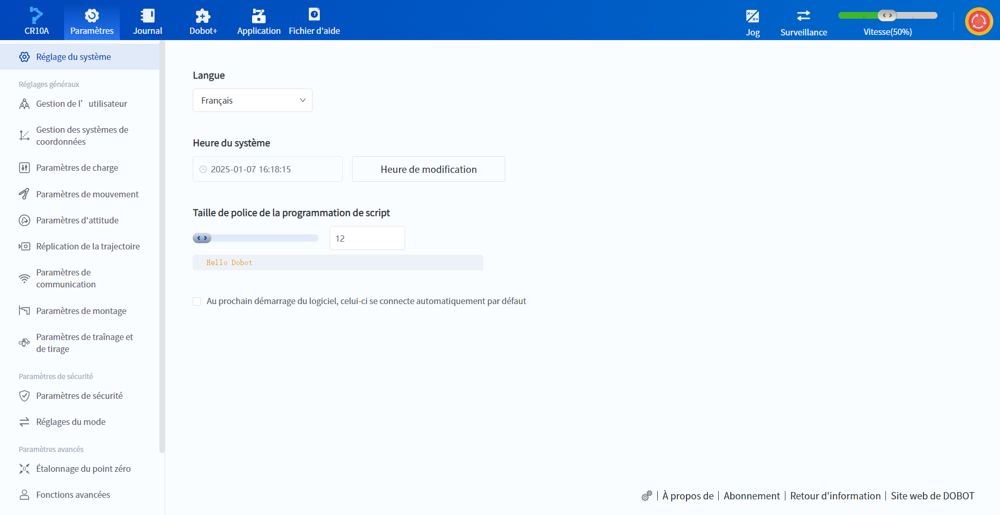

# 3.2 Page des paramètres

La page des paramètres permet à l'utilisateur de modifier les paramètres du logiciel et du robot, tels que la langue d'affichage, le système de coordonnées de l'utilisateur/outil, les paramètres de sécurité, etc. Voir l’instruction de chaque [page des paramètres](../setting/system.md) pour plus de détailles.

