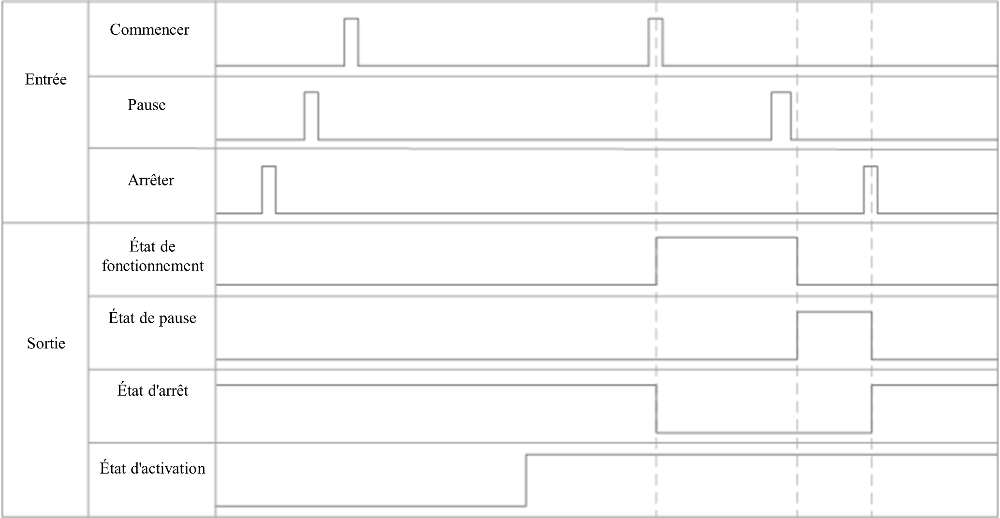
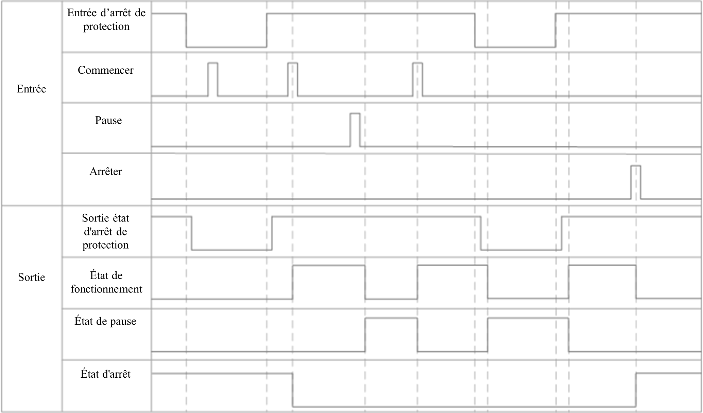

# Annexe D Diagramme de synchronisation des signaux de commande à distance

Un diagramme de temps typique pour l'utilisation de signaux à distance pour contrôler le bras robotique afin d'exécuter le projet est illustré ci-dessous.

Les signaux liés à la commande technique ne prennent pas effet lorsque le bras robotique n'est pas activé.

 

Si l'entrée d'arrêt de garde est configurée et que l'entrée de réinitialisation d'arrêt de garde (IO de sécurité) n'est pas configurée, le schéma temporel type est le suivant.

Les signaux de commande d'ingénierie ne prennent pas effet lorsque l'état d'arrêt de garde est en vigueur ; le déclenchement de l'état d'arrêt de garde lorsque le bras robotique exécute l'ingénierie déclenchera la pause d'ingénierie, et l'ingénierie continuera à s'exécuter après la réinitialisation.

