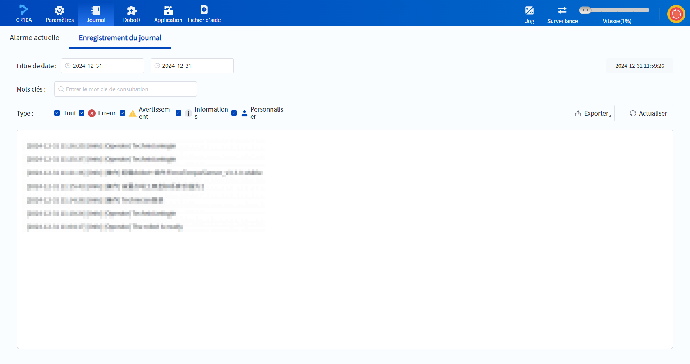
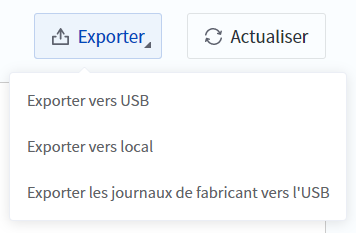

# 9 Journal

 

La page Journal affiche les journaux en cours d'exécution du robot et prend en charge le filtrage par date, mot-clé et type de journal.

La signification des types de journaux est la suivante :

- Journal d'erreurs : messages d'alarme liés à l'exécution d'une action incorrecte par le logiciel ou à l'état d'alarme du robot. 
- Journal d'avertissement : messages d'avertissement relatifs à des actions anormales effectuées par le logiciel ou à des états anormaux du robot. L'état anormal n'affecte pas l'exécution des actions suivantes. 
- Journal d’informations : informations enregistrées lorsque l'état du robot change. 
- Journal personnaliser : Informations consignées par les commandes `Log(value)` de l'utilisateur.

### Exportation du journal

**Exporter vers USB** : Les journaux qui répondent aux critères de filtrage sont exportés vers le périphérique de stockage connecté au port USB de l'armoire de commande.

**Exporter vers local** : exporte les journaux qui répondent aux critères de filtrage vers l'ordinateur localement.

**Exporter les journaux de fabricant vers l’USB** : exporte tous les journaux du contrôleur via USB.

 

<b> Description : </b>
<ul><li>Si un dispositif de stockage connecté via USB comporte plusieurs partitions, les journaux seront exportés sur la première partition. Certains dispositifs de stockage (par exemple, des clés USB utilisées comme disques de démarrage) ont une première partition cachée, ce qui peut empêcher la visualisation des journaux exportés dans Windows. </li><li>Après une réussite de l’exportation des journaux du fabricant, ils sont sauvegardés dans un dossier nommé logs sur la racine de la clé USB. Lors d’une nouvelle exportation des journaux du fabricant, le nouveau dossier logs remplacera le dossier existant. </li><li>Il est recommandé de ne pas retirer la clé USB pendant l’exportation des journaux, car cela pourrait endommager le fichier du disque de la clé USB. </li></ul>

 

Dans certains cas (par exemple, lorsque le bras robotique fonctionne automatiquement et que le logiciel de commande est connecté au bras robotique), les journaux ne sont pas actualisés automatiquement ; vous devez donc cliquer manuellement sur  **Actualiser** pour obtenir les derniers journaux.
