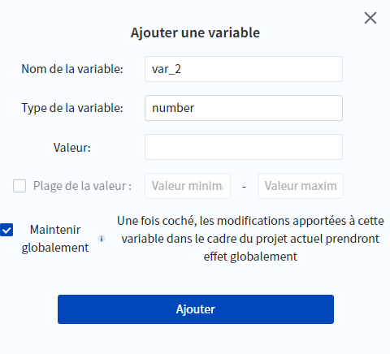
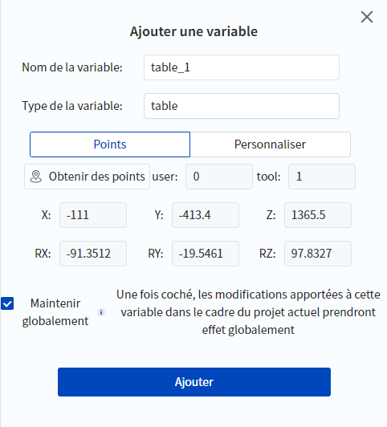
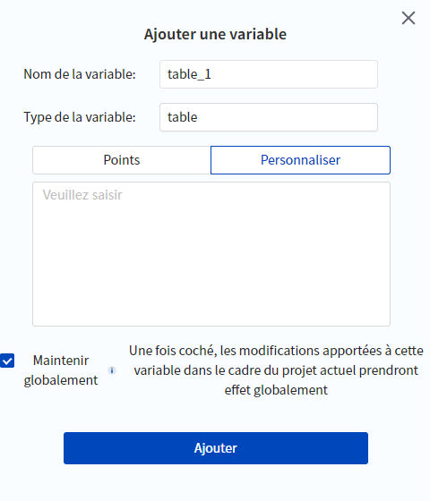

# Variables globales

Cette page permet de définir des variables globales. Les variables globales sont enregistrées de manière persistante dans le contrôleur (elles peuvent être conservées même après une coupure de courant) et peuvent être appelées par plusieurs projets.

Après avoir défini une variable globale, vous pouvez utiliser l'appel de bloc lié à la variable globale dans la **Programmation des blocs**, et vous pouvez l'appeler directement par le nom de la variable dans la **Programmation de script**.

<div align=center></div>

<br/>

Cliquez sur le bouton **Ajouter** pour ajouter une nouvelle variable globale, cliquez sur le bouton **Modifier** pour modifier les propriétés de la variable sélectionnée et cliquez sur le bouton **Supprimer** pour supprimer la variable sélectionnée.

<div align=center></div>

<br/>

Les types de variables globales suivants sont pris en charge :

- number : valeur numérique. Les valeurs dépassant la plage ne peuvent pas être enregistrées ; si une variable numérique se voit attribuer une valeur dépassant la plage dans le projet, le robot signale une erreur et s'arrête. Seul l'administrateur peut modifier la plage de valeurs (cette permission ne peut pas être attribuée).

- bool : booléen (vrai/faux).

- string : chaîne de caractères. Les chaînes de caractères saisies dans cette page n'ont pas besoin d'être entre guillemets, mais elles doivent l'être lorsque l'on modifie la valeur d'une variable globale de type string dans le projet.

- table : tableau (contient des tableaux). Prend en charge le format point ou le format personnalisé.
  
  - Lorsque le format est défini sur le **Points**, déplacez le robot jusqu'au point que vous souhaitez enregistrer et cliquez pour **Obtenir le point**.
    
    <div align=center></div><br/>
  
  - Lorsque le format est **Personnaliser**, vous devez saisir la valeur de la variable. Le format des valeurs de variables saisies et affichées dans l'écran Variables globales doit respecter les restrictions du format de données JSON, qui diffère du format de données utilisé dans l'ingénierie, comme suit :
    
    - Pour les tableaux, vous devez utiliser [] au lieu de {} dans l'écran des variables globales. Par exemple, un tableau au format {1,2,3} dans le projet est saisi et affiché dans l'écran des variables globales au format [1,2,3].<br />
    - Pour le tableau au format {clé=valeur}, vous devez le changer en format {"clé":valeur} dans l'interface des variables globales, par exemple : pour le tableau au format {a=1, b="test"} dans le projet, l'interface des variables globales le saisit et l'affiche au format {"a":1, "b" : "test"}.
    
    <div align=center></div>


<br/>

Cliquez sur **Ajouter** pour ajouter une variable globale lorsque les réglages sont terminés.

**Maintenir globalement**

- Si la case est cochée, toute modification apportée à cette variable peut être enregistrée, et la sortie du script ou le redémarrage après une coupure de courant enregistrera la valeur modifiée.<br />
- Si la case n'est pas cochée, toute modification apportée à la variable n'est valable que lorsque le script est en cours d'exécution, et la valeur sera rétablie à sa valeur initiale lorsque le script sera quitté. Il est impossible de voir la valeur en temps réel de la variable dans la liste de contrôle des variables globales lorsque le script est en cours d'exécution, vous ne pouvez la voir qu'à travers les [variables du programme](program_var.md).

### Limite d’utilisation :

- Les variables globales ne prennent en charge que le chinois et l'anglais.

- Lorsque vous utilisez des **Variables globales de type table**, évitez les situations suivantes, sinon le robot signalera une erreur et arrêtera le projet. Le table_1 et le table_2 ci-dessous sont des variables globales de type table ajoutées.
  
  - **Valeurs des variables imbriquées**
    
    ```lua
    -- Utilisation correcte : les membres de la table sont assignés à des constantes ou à d'autres variables
    table_1[1] = {1,2,3}
    table_1[2] = table_2
    -- Utilisation incorrecte : les membres de la table sont assignés à la table elle-même
    table_1[1] = table_1 -- Une erreur s’affichera lorsque les membres de table_1 sont assignés à table_1 elle-même
    ```