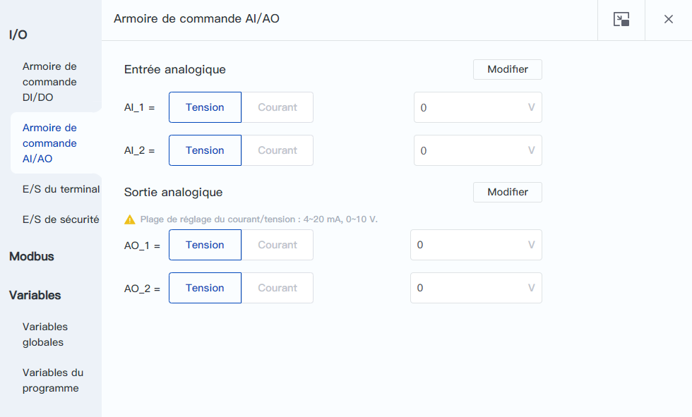

# 8.2 Armoire de commande AI/AO

Cette page permet de surveiller et de régler l'état et le mode de l'AI et de l'AO de l'armoire de commande.

<b> Description : </b>
Pas de cette page lors de la connexion au robot Magician E6. 

 

 

L'entrée/sortie analogique est utilisée pour afficher la valeur réelle de l'interface AI de l'armoire de commande, elle prend en charge deux modes de détection, la tension et le courant, et peut être commutée après avoir cliqué sur le bouton **Modifier**, et l'AO peut modifier la valeur de sortie manuellement, et il est nécessaire de cliquer sur le bouton **Confirmer la modification** pour prendre effet après le réglage.
