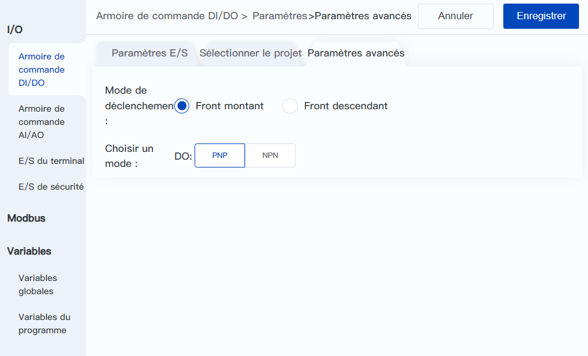

# 8.1 Armoire de commande DI/DO

<h2 id="monitor" class="m3">8.1.1 Surveillance DI/DO</h2>

Cette page permet de contrôler et de régler l'état et la fonction des DI et DO de l'armoire de commande.

 

La partie centrale de la page permet de visualiser et de définir les alias et l'état des DI/DO.

Les DI/DO de l'armoire de commande sont par défaut des **IO général** et peuvent être configurées comme des **IO système**.

- Les utilisateurs peuvent noter la fonction de **IO général** par l'intermédiaire de l'**alias**, qui est facile à visualiser lors de la programmation ultérieure et d'autres opérations ; après modification, il s'affiche sous la forme d'un texte noir souligné et peut être modifié à nouveau en cliquant  sur le texte.
- **IO système** se réfère à la DI/DO avec des fonctions spécifiques configurées dans la page de **Paramètres E/S** suivante, **l'alias** est affiché en texte bleu sans soulignement et ne peut pas être modifié.

L'indicateur circulaire à droite de DI indique l'état actuel de la DI correspondante, le gris signifiant OFF et le vert signifiant ON.

L'interrupteur sur le côté droit de DO indique l'état actuel du DO correspondant, et en cliquant sur l'interrupteur, on peut activer/désactiver le contrôle de l'état du DO correspondant. L'**IO système** ne peut pas commuter l'état manuellement.

Cliquez sur le bouton **Paramètres** en haut de la page pour accéder à la page Setup afin de configurer l'E/S du système, le mode et le type de déclenchement de l'E/S, etc.

<h2 id="setting" class="m3">8.1.2 Configuration des E/S</h2>

 

<b>Passage à la DI virtuelle</b>

Cliquez sur l'icône  , sur le côté droit de la DI, qui devient , et vous pouvez changer la DI correspondante en DI virtuelle après l'avoir enregistrée. Lorsque l'interface est configurée comme interface virtuelle, l'indicateur de la page de surveillance devient le même que celui de l'interface DO, et il suffit de cliquer pour activer/désactiver l'interface virtuelle. En commutant l'interface virtuelle, les utilisateurs peuvent simuler l'entrée de dispositifs DI externes et déboguer les fonctions DI, par exemple, pour répondre aux conditions de jugement liées à l'interface DI dans le fonctionnement du projet, afin que le projet puisse continuer à fonctionner.

<b> Description : </b>
Après la configuration de DI virtuel, elle reste effective en continu. Lorsque le projet est en cours d'exécution, la lecture des DI correspondantes via des instructions lira les valeurs virtuelles et ne pourra pas obtenir les valeurs réelles des DI. Si vous souhaitez éviter cette situation, veuillez passer les DI aux DI réelles avant d'exécuter le projet. 

 

<b>IO système</b>

La fonction de commande à distance de DI/DO peut être configurée dans la boîte déroulante de la colonne de configuration de la fonction, et la description de la fonction correspondante est la suivante.

<table width="100%">
  <colgroup>
    <col style="width: 30%">
    <col style="width: 70%">
  </colgroup>
  <tr>
	<th>Fonction DI</th>
    <th>Description</th>
  </tr>
  <tr>
    <td style="text-align:center">Commencer</td>
    <td>Lorsque le robot est à l'arrêt, l’exécution du projet spécifié commence, voir les détails dans <a href="#select">Sélectionner le projet</a>ci-dessous；  Lorsque le robot est en pause, reprenez l'exécution du projet (ou d'une autre forme de file d'attente d'instructions). </td>
  </tr>
  <tr>
    <td style="text-align:center">Arrêter</td>
    <td>Arrêtez l'exécution du projet (ou d'une autre forme de file d'attente d'instructions). </td>
  </tr>
  <tr>
    <td style="text-align:center">Pause</td>
    <td>Mettez en pause l'exécution du projet (ou d'une autre forme de file d'attente d'instructions). </td>
  </tr>
  <tr>
    <td style="text-align:center">Activer</td>
    <td>Lorsque le robot est alimenté, activez la commande d'enable du robot. </td>
  </tr>
  <tr>
    <td style="text-align:center">Désactiver</td>
    <td>Lorsque le robot est en mode enable, désactivez la commande d'enable du robot. </td>
  </tr>
  <tr>
    <td style="text-align:center">Effacer l'alarme</td>
    <td>Effacer l’alarme actuelle du robot. </td>
  </tr>
  <tr>
    <td style="text-align:center">Entrer en mode de glisser-déposer</td>
    <td>Lorsque le robot est en mode enable, contrôlez le robot pour qu'il passe en mode de glisser-déposer. </td>
  </tr>
  <tr>
    <td style="text-align:center">Quitter le mode glisser-déposer</td>
    <td>Lorsque le robot est en mode de glisser-déposer, contrôlez le robot quitter le mode glisser-déposer. </td>
  </tr>
</table>
 
<table width="100%">
  <colgroup>
    <col style="width: 30%">
    <col style="width: 70%">
  </colgroup>
  <tr>
    <th>Fonction DO</th>
    <th>Description</th>
  </tr>
  <tr>
    <td style="text-align:center">État de fonctionnement</td>
    <td>Lorsque le robot exécute un projet, une file d'attente de commandes en mode TCP ou une répétition de trajectoire, la sortie est 1 ; sinon, la sortie est 0. Cet état est utilisé pour indiquer si le robot exécute un programme, et est indépendant de l'état de mouvement du robot. </td>
  </tr>
  <tr>
    <td style="text-align:center">État d'arrêt</td>
    <td>Lorsque le robot s'arrête, la sortie est 1 ; sinon, la sortie est 0. </td>
  </tr>
  <tr>
    <td style="text-align:center">État de pause</td>
	<td>Lorsque le robot est en état de pause, la sortie est 1 ; sinon, la sortie est 0. </td>
  </tr>
  <tr>
    <td style="text-align:center">État du point d'origine de sécurité</td>
    <td>Lorsque le robot se trouve dans <a href="..\setting\home_point.html">le point d'origine de sécurité</a>, la sortie est 1 ; sinon, la sortie est 0. </td>
  </tr>
  <tr>
    <td style="text-align:center">État de pause de la peau de sécurité</td>
    <td>Lorsque le robot est en état de déclenchement de pause de la peau de sécurité, la sortie est 1 ; sinon, la sortie est 0. </td>
  </tr>
  <tr>
    <td style="text-align:center">État de repos</td>
    <td>Lorsque le robot est en état de repos (activé, en pause et sans alarme), la sortie est 1 ; sinon, la sortie est 0. L'état de repos signifie que le robot est prêt à accepter et exécuter des instructions à tout moment. </td>
  </tr>
  <tr>
    <td style="text-align:center">État de mise sous tension</td>
    <td>Lorsque le robot est sous tension, la sortie est 1 ; sinon, la sortie est 0. </td>
  </tr>
  <tr>
    <td style="text-align:center">État d'activation</td>
    <td>Lorsque le robot est activé, la sortie est 1 ; sinon, la sortie est 0. </td>
  </tr>
  <tr>
    <td style="text-align:center">État d'alarme</td>
    <td>Lorsque le robot a des alarmes non résolues, la sortie est 1 ; sinon, la sortie est 0. </td>
  </tr>
  <tr>
    <td style="text-align:center">État de collision</td>
    <td>Lorsque le robot détecte une collision, la sortie est 1 ; sinon, la sortie est 0. </td>
  </tr>
  <tr>
    <td style="text-align:center">État glisser-déposer</td>
    <td>Lorsque le robot est dans un état glisser-déposer, la sortie est 1 ; sinon, la sortie est 0. </td>
  </tr>
  <tr>
    <td style="text-align:center">En bas niveau lorsque non en cours d'exécution</td>
    <td>Lorsque le projet, la file d'attente des commandes en mode TCP ou la réplication de la trajectoire ne fonctionne pas, est en pause ou arrêté, la sortie est 0. Pendant le fonctionnement, l'état des E/S correspondantes peut être défini via des commandes. </td>
  </tr>
  <tr>
    <td style="text-align:center">En haut niveau lorsque non en cours d'exécution</td>
    <td>Lorsque le projet, la file d'attente des commandes en mode TCP ou la réplication de la trajectoire ne fonctionne pas, est en pause ou arrêté, la sortie est 1. Pendant le fonctionnement, l'état des E/S correspondantes peut être défini via des commandes. </td>
  </tr>
  <tr>
    <td style="text-align:center">En bas niveau en cas d'arrêt anormal</td>
      <td>Lorsque le robot s'arrête anormalement, la sortie est 0. Pendant le fonctionnement normal, l'état des E/S correspondantes peut être défini via des commandes.  Les situations suivantes peuvent entraîner un arrêt anormal : <ul><li>Arrêt par fonction de sécurité (par exemple, détection de collision, mur de sécurité, zone de sécurité, E/S de sécurité, etc.). </li><li>Alarme du robot. </li><li>Anomalie lors de l'exécution du projet. </li></ul></td>
  </tr>
</table>

Les trois états **bas lorsque le projet ne fonctionne pas**/**haut lorsque le projet ne fonctionne pas**/**bas lorsque le projet est anormalement arrêté** sont différents des autres états, et l'état spécifié ne sera émis que lorsque les conditions sont remplies, et l'état peut être librement modifié par des commandes pendant le projet ou le fonctionnement en mode TCP, ce qui aide les utilisateurs à utiliser un seul DO pour contrôler rapidement l'équipement externe et l'assistance du robot, et pour simplifier la logique de jugement.

<b> Description : </b>
<li><b>Non exécuté</b>signifie que le programme n’est pas activé. En état de non exécuté, l'état des E/S est verrouillé et ne peut pas être modifié. </li><li><b>Arrêt anormal</b>Il fait référence à l'arrêt de l'exécution du programme en raison d'erreurs de syntaxe, de l'arrêt dû à une collision, d'un arrêt d'urgence ou d'autres situations anormales. En cas d'arrêt anormal, l'état des E/S ne sera pas verrouillé. </li>

 

<b>Exemple : </b>
Prenons l’exemple de <b>En bas niveau lorsque non en cours d'exécution </b>pour expliquer comment utiliser ce type d’état : dans une application de collage, l’utilisateur contrôle le fonctionnement de la machine à coller via DO1 dans le projet. Lorsque DO1 est à 1, la machine à coller fonctionne, et lorsque DO1 est à 0, la machine à coller s’arrête. En définissant DO1 sur <b>En bas niveau lorsque non en cours d'exécution</b>, on peut automatiquement arrêter la machine à coller lorsque le projet n’est pas en cours de fonctionnement, est en pause ou est arrêté, sans affecter le contrôle de la machine à coller par les commandes pendant l’exécution du projet. 

La DI avec la fonction de **projet alternatif** ne peut pas être configurée dans cette page, vous devez d'abord libérer la DI dans la page de <a href="#select">sélectionner le projet</a>.

Après avoir modifié la configuration, cliquez sur le bouton **Enregistrer** dans le coin supérieur droit de la page pour terminer la configuration.

<b> Attention : </b>
<ul><li>Toutes les sources de déclenchement à distance sont simultanément actives. Pour la sécurité de l'équipement et de la production, veuillez vous assurer que le robot ne peut être démarré que par une seule source de contrôle (logiciel de contrôle/DI/Modbus). </li><li>L’efficacité du déclenchement par E/S est également affectée par le mode manuel/automatique et la configuration E/S/Modbus. Pour plus de détails, consultez les <a href="../operation/io_modbus.md">explications correspondantes concernant les fonctions spécifiques</a>. </li><li>Veuillez ne pas envoyer de signaux de contrôle avant que l'initialisation du robot ne soit terminée après le démarrage, car cela pourrait entraîner des mouvements anormaux du robot. </li></ul>

 

<b>Sélectionner le projet</b>

Lorsque vous sélectionnez **Exécuter le projet par défaut**, la DI dont la fonction est **Start** est déclenchée pour exécuter directement le projet sélectionné ici.

 

Un clic sur le bouton **Choix** fait apparaître la boîte de sélection du projet.

Un clic sur le bouton **Supprimer** efface le projet actuellement sélectionné.

Lorsque vous sélectionnez **Sélectionner le projet d’E/S de groupe** plusieurs projets peuvent être configurés au moyen d'un groupe d'E/S.

 

1. En cliquant sur le bouton **+** ou **-,** vous augmentez ou diminuez le nombre d'adresses attribuées au groupe d'E/S. Plus il y a d'adresses attribuées (jusqu'à 4), plus il est possible de configurer de projets.
  
   - 1 adresse : 2 projets peuvent être configurés
   - 2 adresses : 4 projets peuvent être configurés
   - 3 adresses : 8 projets peuvent être configurés
   - 4 adresses : 16 projets peuvent être configurés 
   
2. L'adresse attribuée peut être modifiée via la boîte déroulante. L'adresse attribuée au groupe d'E/S ne peut pas être dupliquée par les E/S déportées ou les E/S de sécurité (CCBOX).

3. Après avoir attribué l'adresse, vous pouvez définir le projet pour chaque valeur de groupe d'E/S, en fonction de la demande réelle ou en laissant le projet vide.
  
   Avant d'exécuter le projet, sélectionnez le projet correspondant en réglant la valeur d'E/S de groupe correspondante (verte pour ON, grise pour OFF). Si aucun projet n'est sélectionné pour le projet d'E/S de groupe correspondant, le robot n'exécutera pas le projet et le contrôleur générera une alarme lorsque l'E/S sera **déclenchée**.
   
    
<b>Exemple : </b>
En prenant l'exemple de la figure ci-dessus, où les adresses DI1 à DI4 sont allouées :
    <ul>
    <li>DI1 à DI4 étant à OFF, le premier projet est sélectionné ;</li>
    <li>DI1 et DI2 à ON, tandis que DI3 et DI4 à OFF, indiquent la sélection du troisième projet ;</li>
    <li>Tous les DI1 à DI4 à ON signifient la sélection du 16e projet. </li>
    </ul>
    

 

Après avoir modifié la configuration, cliquez sur le bouton **Enregistrer** pour terminer la configuration.

<b>Paramètres avancés</b>

 

**Mode de déclenchement**

Le front montant indique que la fonction configurée est déclenchée lorsque DI passe de OFF à ON, et le front descendant indique que la fonction configurée est déclenchée lorsque DI passe de ON à OFF.

**Choisir un mode**

Les **séries CRA** doivent sélectionner le mode de DO en fonction du mode de câblage du matériel, voir le manuel du matériel CRA correspondant pour plus de détails.

Après avoir modifié la configuration, cliquez sur le bouton **Enregistrer** pour terminer la configuration.

<b> Attention : </b>
Il est nécessaire de configurer simultanément les paramètres logiciels DobotStudio Pro et de terminer la connexion matérielle de la <b>série CRA</b> pour que le mode DO puisse être configuré avec succès. 

