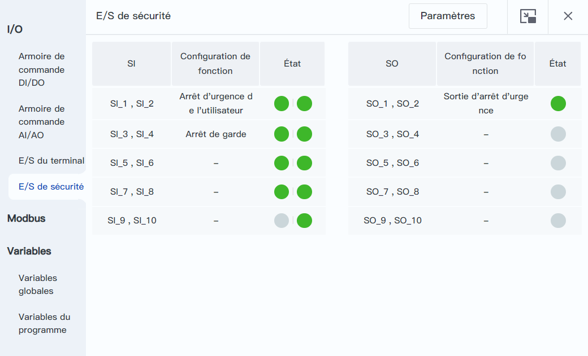
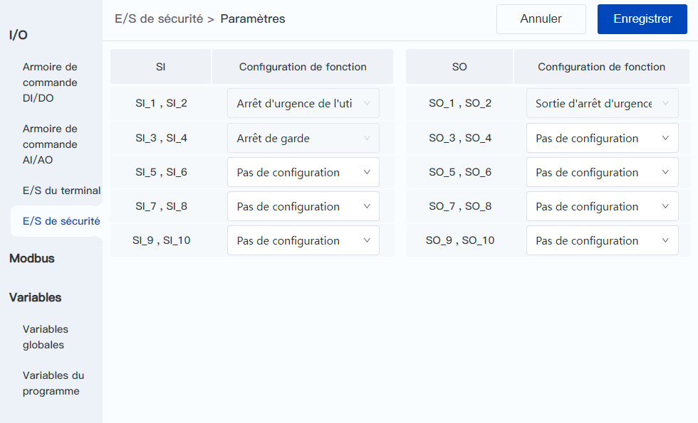

# 8.4 E/S de sécurité

Cette page permet de visualiser l'état des E/S de sécurité et de définir leurs fonctions.

 

Les indicateurs dans la colonne Status de l'E/S de sécurité indiquent l'état de l'E/S correspondante, le vert est haut et le gris est bas.
Les E/S de sécurité sont en configuration double. Les deux voyants d'état de la SI double indiquent l'état des deux circuits respectivement, et la logique de déclenchement varie selon la fonction de configuration ; les deux circuits de la SO double sont synchronisés, et un seul voyant d'état est utilisé pour indiquer l'état des deux circuits.

<b> Description : </b>
Les E/S de sécurité de Magician E6 partagent les mêmes bornes de connexion avec les <a href="io_monitor_ctrl_dio.md">Armoires de commande DI/DO</a>, et peuvent être configurés en mono-voie ou bi-voie en fonction des besoins réels. Les bornes configurées en E/S système ne peuvent plus être configurées en E/S de sécurité, et inversement. 

 

Cliquez sur le bouton **Set** pour modifier la configuration de la fonction de l'E/S de sécurité. Après la modification, cliquez sur le bouton **Save** pour terminer la configuration.

 

<b>Fonction SI configurable</b>

<table width="100%">
  <colgroup>
    <col style="width: 25%">
    <col style="width: 75%">
  </colgroup>
  <tr>
	<th>Fonction</th>
    <th>Description</th>
  </tr>
  <tr>
    <td style="text-align:center">Arrêt d'urgence de l'utilisateur</td>
    <td>L'entrée d'arrêt d'urgence de l’utilisateur est une interface d'arrêt d'urgence fournie pour l'utilisateur, permettant la connexion d'un dispositif d'arrêt d'urgence externe.  L'entrée d'arrêt d'urgence de l’utilisateur<b> est une entrée de signal normalement fermée à haut niveau par défaut, et le robot entre dans un état d'arrêt d'urgence lorsqu'une des voies est déclenchée à bas niveau.</b>。 Cette fonction déclenche par défaut une sortie d'état d'arrêt d'urgence, ce qui peut entraîner un verrouillage automatique de l'arrêt d'urgence dans certains scénarios d'application. Pour éviter cela, il est possible de modifier l'interface SI configurable dans le logiciel de contrôle en <b>entrée d'arrêt d'urgence de l’utilisateur (sans sortie d'état)</b> et d'utiliser l'interface correspondante comme entrée d'arrêt d'urgence de l’utilisateur.  Les entrées SI_1 et SI_2 sont configurées de manière fixe pour cette fonction. </td>
  </tr>
  <tr>
    <td style="text-align:center">Arrêt de protection</td>
     <td>L'entrée d'arrêt de protection est une interface destinée à la connexion de dispositifs de protection externes (par exemple, des portes de sécurité, des rideaux de lumière de sécurité, etc.).  L'entrée d'arrêt de protection<b> est par défaut une entrée de signal normalement fermée à haut niveau, et le robot entre dans un état d'arrêt de protection (état de pause) lorsqu'une des voies est déclenchée à bas niveau</b>. <ul><li>Lorsqu'une interface d'entrée de réinitialisation d'arrêt de protection est configurée, il est nécessaire de restaurer à la fois le signal d'entrée d'arrêt de protection et de déclencher l'entrée de réinitialisation d'arrêt de protection pour lever l'état d'arrêt de protection. Ensuite, après avoir confirmé la reprise du fonctionnement dans l'interface de contrôle, le robot reprend son fonctionnement.</li><li>Lorsqu'aucune interface d'entrée de réinitialisation d'arrêt de protection n'est configurée, il suffit de restaurer le signal d'entrée d'arrêt de protection pour lever l'état d'arrêt de protection, et le robot reprend son fonctionnement. </li></ul>Les entrées SI_3 et SI_4 sont configurées de manière fixe pour cette fonction. </td>
  </tr>
  <tr>
    <td style="text-align:center">Réinitialisation d'arrêt de protection</td>
    <td>L'entrée de réinitialisation d'arrêt de protection est une interface utilisée pour réinitialiser l'état d'arrêt de protection.  L'entrée de réinitialisation d'arrêt de protection<b> est par défaut une entrée de signal normalement ouverte à haut niveau, et la réinitialisation de l'état d'arrêt de protection est déclenchée lorsque les deux voies présentent simultanément une fronts montants</b>. </td>
  </tr>
  <tr>
    <td style="text-align:center">Mode de réduction</td>
    <td>L'entrée de mode de réduction est une interface permettant à l'utilisateur de contrôler le robot pour entrer dans le mode de réduction. Par défaut, il s'agit d'une entrée de signal normalement fermée à haut niveau, et toute entrée à bas niveau sur l'une des voies déclenche l'entrée dans l'état de mode de réduction du robot.</b> La restauration d'une entrée à haut niveau fait sortir le robot du mode de réduction et le ramène au mode normal. Lorsque le robot déclenche le mode de réduction, la <a href="../setting/speed_setting.md">vitesse de mouvement</a> et les <a href="../setting/safelimit.md">limites de sécurité</a> du CRA passent aux valeurs de paramétrage correspondant au mode de réduction ; la vitesse globale du Magician E6 est limitée à 10 % et ne peut pas être modifiée. Pour éviter les risques de sécurité dus à l'exploitation du robot à haute vitesse.  <b></td>
  </tr>
</table>

<b> Attention : </b>
Lors de l'utilisation réelle, veillez à ce que les variations du signal SI soient espacées d'au moins 150 ms ; sinon, les sauts de signal SI pourraient entraîner des anomalies dans l'état de fonctionnement du robot.  Par exemple, si l'entrée de réinitialisation de l'arrêt de protection n'est pas configurée, un changement brusque (intervalle de variation inférieur à 150 ms) du signal d'entrée d'arrêt de protection pourrait entraîner un arrêt du robot qui ne reprendra pas automatiquement son fonctionnement. Il serait nécessaire de résoudre ce problème en utilisant l'une des méthodes suivantes :<ul><li>En passant d'abord par le logiciel de contrôle pour mettre en pause l'exécution du projet, puis en reprenant l'exécution du projet. </li><li>En activant à nouveau le signal d'entrée d'arrêt de protection et en le maintenant pendant au moins 150 ms. </li></ul>

 

<b>Fonction SO configurable</b>

<table width="100%">
  <colgroup>
    <col style="width: 25%">
    <col style="width: 75%">
  </colgroup>
  <tr>
	<th>Fonction</th>
    <th>Description</th>
  </tr>
  <tr>
    <td style="text-align:center">Sortie d'arrêt d'urgence</td>
    <td>Lorsque le robot est en <b>état d'arrêt d'urgence, la tension de sortie est au niveau bas</b> ; sinon, la tension de sortie est au niveau haut.  Tout arrêt d'urgence déclenché par n'importe quelle source activera cette sortie.  Les entrées SO_1 et SO_2 sont configurées de manière fixe pour cette fonction. </td>
  </tr>
  <tr>
    <td style="text-align:center">Sortie en état non arrêté</td>
    <td>Lorsque le robot est en <b>mode d'exécution automatique et non en état d'arrêt, la tension de sortie est au niveau bas</b> ; sinon, la tension de sortie est au niveau haut.  Les critères de jugement de cet état sont basés sur le fait que le robot exécute un projet, et non sur le mouvement des articulations. Par exemple, pendant l'exécution d'un projet, le programme attend que la DI spécifiée devienne active, le bras n'est pas en mouvement, ce qui correspond à un état non arrêté, avec une sortie à niveau bas. Lorsque le projet est en pause, cela correspond à un état d'arrêt, avec une sortie à niveau haut. </td>
  </tr>
  <tr>
    <td style="text-align:center">Sortie en état de mode de réduction</td>
    <td>Lorsque le robot est en <b>mode de réduction, la tension de sortie est au niveau bas</b> ; dans les autres cas, la tension de sortie est au niveau haut. </td>
  </tr>
  <tr>
    <td style="text-align:center">Sortie en état de mouvement</td>
    <td>Si <b>l'un ou plusieurs joints du robot se déplacent à une vitesse supérieure à 1°/s (hors mode glisser-déposer), cela correspond à un état en mouvement, avec une tension de sortie au niveau bas</b>. Sinon, la tension de sortie est au niveau haut. </td>
  </tr>
  <tr>
    <td style="text-align:center">Sortie en état du point d'origine de sécurité</td>
    <td>Lorsque le robot est en <b>position du point d'origine de sécurité, la tension de sortie est au niveau haut</b> ; dans les autres cas, la tension de sortie est au niveau bas.  Le point d'origine de sécurité peut être modifiée dans les paramètres de sécurité. </td>
  </tr>
  <tr>
    <td style="text-align:center">Sortie en état d'arrêt de protection</td>
    <td>Lorsque le robot est en <b>état d'arrêt de protection, la tension de sortie est au niveau bas</b> ; dans les autres cas, la tension de sortie est au niveau haut. </td>
  </tr>
  <tr>
    <td style="text-align:center">Sortie en état d'arrêt d'urgence du système</td>
    <td>Lorsque le robot est en <b>état d'arrêt d'urgence du système, la tension de sortie est au niveau bas</b> ; dans les autres cas, la tension de sortie est au niveau haut.  L'arrêt d'urgence du système est déclenché par le bouton d'arrêt d'urgence ou par l'arrêt d'urgence logiciel. </td>
  </tr>
  <tr>
    <td style="text-align:center">Sortie en état d'arrêt d'urgence de l'utilisateur</td>
    <td>Lorsque le robot est en <b>état d'arrêt d'urgence de l'utilisateur, la tension de sortie est au niveau bas</b> ; dans les autres cas, la tension de sortie est au niveau haut.  L'arrêt d'urgence de l'utilisateur est déclenché par les E/S de sécurité. </td>
  </tr>
</table>
