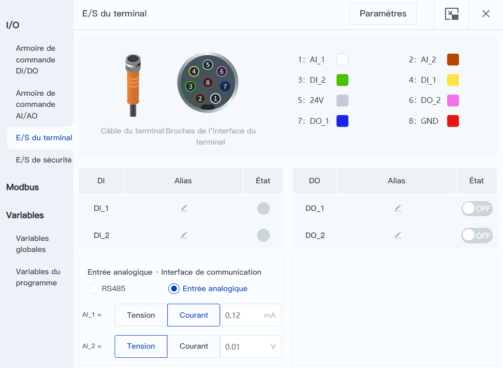
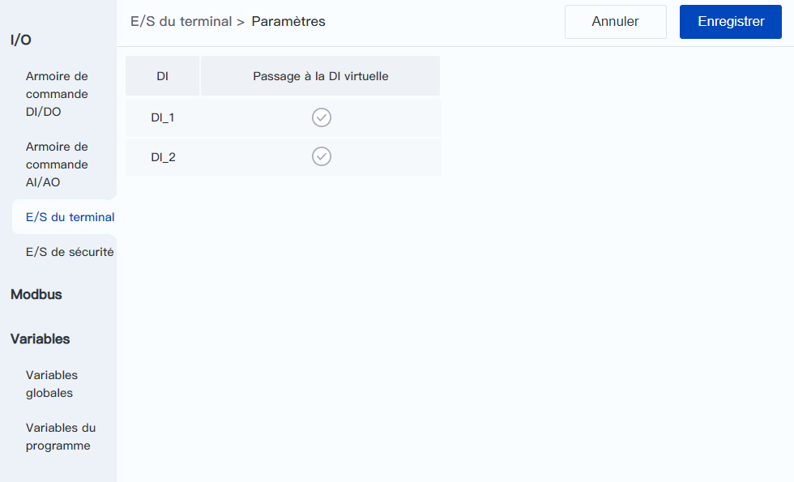

# 8.3 E/S du terminal

Cette page est utilisée pour surveiller l'état et le mode des entrées-sorties du robot.

<b> Description : </b>
La figure ci-dessous prend en exemple la série CRA avec un seul connecteur, pour les modèles avec plusieurs connecteurs (comme le CR20A), plusieurs onglets seront affichés.  À l'extrémité de Magician E6, il y a seulement 2 entrées numériques (DI) et 2 sorties numériques (DO), sans interface RS485 et AI. 

 

 

**DI/DO**

L'alias peut être modifié en cliquant sur  dans le texte ou dans la colonne Alias DI/DO. Les utilisateurs peuvent noter la fonction des entrées-sorties par le biais de l'alias, ce qui est pratique pour la programmation ultérieure et d'autres opérations.

L'indicateur circulaire sur le côté droit de DI indique l'état actuel de la DI correspondante, le gris signifiant OFF et le vert signifiant ON.

L'interrupteur sur le côté droit de DO indique l'état actuel du DO correspondant, et en cliquant sur l'interrupteur, il est possible d'activer/désactiver le contrôle de l'état du DO correspondant.

 

**Passage à la DI virtuelle**

Cliquez sur le bouton de **Paramètres** dans le coin supérieur droit pour définir l'interface de DI virtuelle. Lorsque la DI est définie comme DI virtuelle, l'indicateur se transforme en interrupteur, et un clic sur celui-ci permet d'activer/désactiver la DI virtuelle. En commutant l'interface virtuelle, les utilisateurs peuvent simuler l'entrée de dispositifs d'interface externes et déboguer les fonctions liées à l'interface, par exemple, pour répondre aux conditions de jugement liées à l'interface dans le fonctionnement du projet, de sorte que le projet continue à fonctionner.

 

<b> Description : </b>
Après la configuration de DI virtuel, elle reste effective en continu. Lorsque le projet est en cours d'exécution, la lecture des DI correspondantes via des instructions lira les valeurs virtuelles et ne pourra pas obtenir les valeurs réelles des DI. Si vous souhaitez éviter cette situation, veuillez passer les DI aux DI réelles avant d'exécuter le projet. 

 

**Mode de fonctionnement du terminal**

- Lorsque le mode de travail est **RS485**, les fonctions des broches d'E/S 1 et 2 sont 485A et 485B ; 
- Lorsque le mode de fonctionnement est l'**entrée analogique**, les fonctions des broches d'E/S 1 et 2 sont AI_1 et AI_2, et les valeurs d'entrée peuvent être contrôlées en temps réel dans cette interface. 

<b> Description : </b>
Lors de l'utilisation d'un outil de terminal avec RS485, le mode de fonctionnement doit être réglé sur <b>RS485</b>. 

