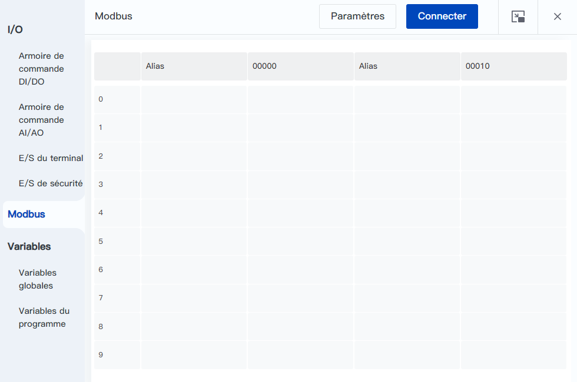
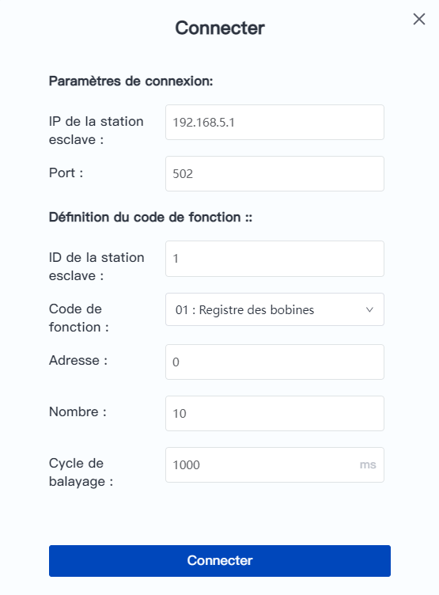
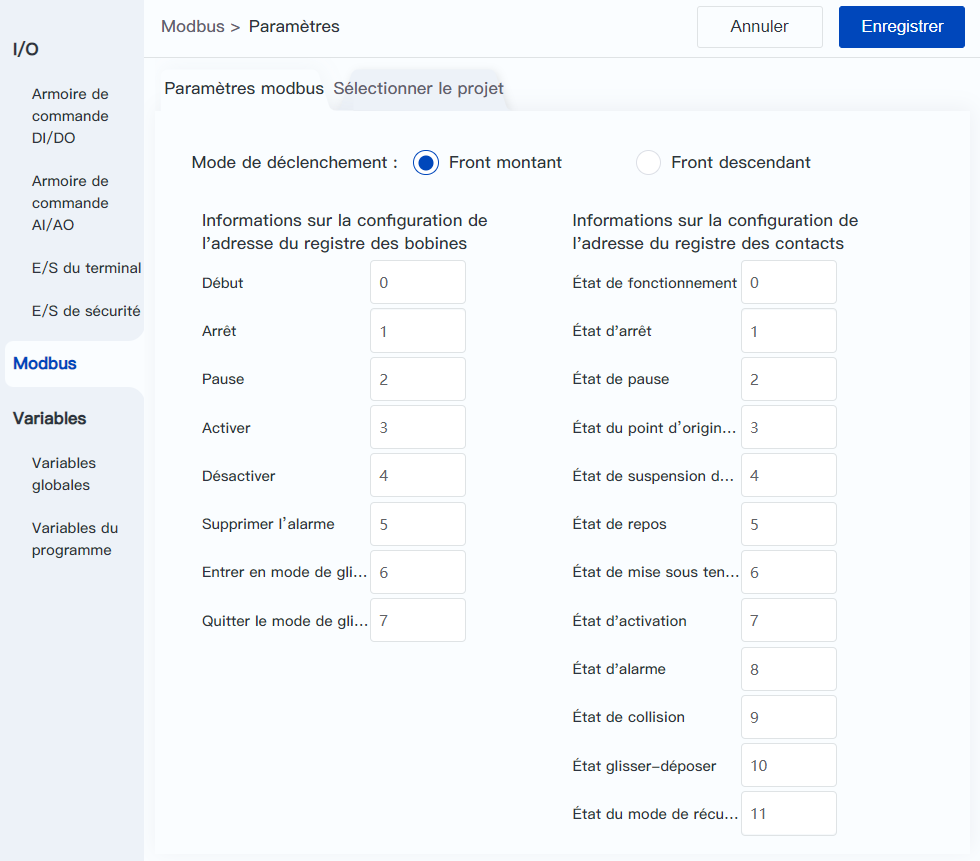
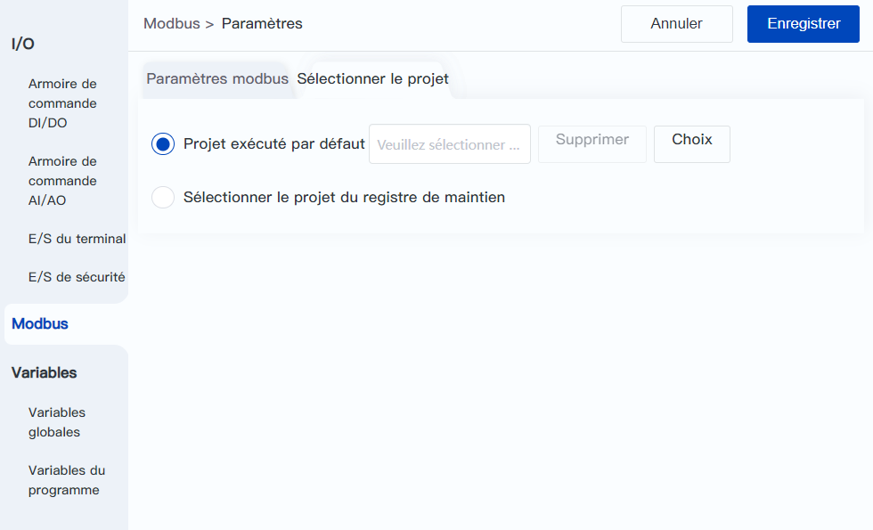
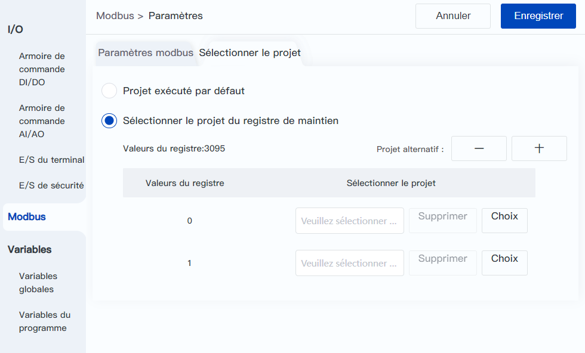

# 8.5 Modbus

<h2 id="monitor" class="m3">8.5.1 Surveillance Modbus</h2>

Cette page permet à l'ordinateur hôte, en tant que maître Modbus, de se connecter à l'esclave Modbus fourni avec le contrôleur du robot afin de visualiser et de modifier les valeurs des registres, et de configurer la fonction de contrôle Modbus à distance lorsque le contrôleur est utilisé en tant qu'esclave.

 

Cliquez sur **Connecter** en haut de la page pour définir l'esclave à connecter.

- **IP de la station esclave** : adresse du dispositif Modbus. Saisir l'adresse IP du régulateur lors de la connexion à l'esclave Modbus fourni avec le régulateur, par exemple 192.168.200.1.  
- **Port** : Numéro de port pour la communication Modbus. Saisir 502 lors de la connexion à l'esclave Modbus fourni avec l'armoire de commande.  
- **ID de la station esclave** : ID du dispositif esclave.  
- **Code de fonction** : permet de sélectionner le type de fonction de l'appareil esclave.  
- **Adresse/Nombre** : adresse et quantité du registre. Se reporter à l'[annexe A Définitions des registres Modbus](../modbus_define.md) lors de la connexion de l'esclave Modbus fourni avec l'armoire de commande.  
- **Cycle de balayage** : intervalle de temps pendant lequel le bras du robot balaye la station esclave.

 

Une fois la connexion réussie, le tableau au milieu de la page indique l'alias et la valeur de chaque adresse de l'esclave. Double-cliquez (côté PC) ou cliquez (côté mobile) sur la cellule de l'alias pour modifier l'alias. Si le type de registre est Coil Register ou Holding Register, double-cliquez (côté PC) ou cliquez (côté mobile) sur la cellule de Register Value pour modifier la valeur.

Cliquez sur le bouton **Paramètres** en haut de la page pour accéder à la page Setup afin de définir le mode de déclenchement du registre de bobine, d'afficher les informations de configuration de l'adresse correspondant à la fonction de commande à distance et de définir le projet à démarrer à distance.

<h2 id="setting" class="m3">8.5.2 Configuration Modbus</h2>

 

Le **Mode de déclenchement** est utilisé pour définir la manière dont la fonction du registre de bobine est déclenchée, le front montant indique que la fonction configurée est déclenchée lorsque le registre de bobine passe de 0 à 1, et le front descendant indique que la fonction configurée est déclenchée lorsque le registre de bobine passe de 1 à 0.

Les informations d'adresse du **Registre des bobines** et du **Registre des contacts** peuvent uniquement être visualisées et ne peuvent pas être modifiées, et les fonctions correspondantes sont décrites ci-dessous.

 

<table width="100%">
  <colgroup>
    <col style="width: 30%">
    <col style="width: 70%">
  </colgroup>
  <tr>
	<th>Fonction du registre de bobine</th>
    <th>Description</th>
  </tr>
  <tr>
    <td style="text-align:center">Commencer</td>
    <td>Lorsque le bras robotique est à l'arrêt, l’exécution du projet spécifié commence, voir les détails dans <a href="#select">Sélectionner le projet</a> ci-dessous；  Lorsque le bras robotique est en pause, reprenez l'exécution du projet (ou d'une autre forme de file d'attente d'instructions). </td>
  </tr>
  <tr>
    <td style="text-align:center">Arrêter</td>
    <td>Arrêtez l'exécution du projet (ou d'une autre forme de file d'attente d'instructions). </td>
  </tr>
  <tr>
    <td style="text-align:center">Pause</td>
    <td>Mettez en pause l'exécution du projet (ou d'une autre forme de file d'attente d'instructions). </td>
  </tr>
  <tr>
    <td style="text-align:center">Activer</td>
    <td>Lorsque le robot est alimenté, activez la commande d'enable du robot. </td>
  </tr>
  <tr>
    <td style="text-align:center">Désactiver</td>
    <td>Lorsque le robot est en mode enable, désactivez la commande d'enable du robot. </td>
  </tr>
  <tr>
    <td style="text-align:center">Effacer l'alarme</td>
    <td>Effacer l’alarme actuelle du robot. </td>
  </tr>
  <tr>
    <td style="text-align:center">Entrer en mode de glisser-déposer</td>
    <td>Lorsque le robot est en mode enable, contrôlez le robot pour qu'il passe en mode de glisser-déposer. </td>
  </tr>
  <tr>
    <td style="text-align:center">Quitter le mode glisser-déposer</td>
    <td>Lorsque le robot est en mode de glisser-déposer, contrôlez le robot quitter le mode glisser-déposer. </td>
  </tr>
</table>
 
<table width="100%">
  <colgroup>
    <col style="width: 30%">
    <col style="width: 70%">
  </colgroup>
  <tr>
    <th>Fonction du registre de contact</th>
    <th>Description</th>
  </tr>
  <tr>
    <td style="text-align:center">État de fonctionnement</td>
    <td>Lorsque le robot exécute un projet, une file d'attente de commandes en mode TCP ou une répétition de trajectoire, la sortie est 1 ; sinon, la sortie est 0. Cet état est utilisé pour indiquer si le robot exécute un programme, et est indépendant de l'état de mouvement du robot. </td>
  </tr>
  <tr>
    <td style="text-align:center">État d'arrêt</td>
    <td>Lorsque le robot s'arrête, la sortie est 1 ; sinon, la sortie est 0. </td>
  </tr>
  <tr>
    <td style="text-align:center">État de pause</td>
	<td>Lorsque le robot est en état de pause, la sortie est 1 ; sinon, la sortie est 0. </td>
  </tr>
  <tr>
    <td style="text-align:center">État du point d'origine de sécurité</td>
    <td>Lorsque le robot se trouve dans <a href="..\setting\home_point.md">le point d'origine de sécurité</a>, la sortie est 1 ; sinon, la sortie est 0</td>
  </tr>
  <tr>
    <td style="text-align:center">État de pause de la peau de sécurité</td>
    <td>Lorsque le robot est en état de déclenchement de pause de la peau de sécurité, la sortie est 1 ; sinon, la sortie est 0. </td>
  </tr>
  <tr>
    <td style="text-align:center">État de repos</td>
    <td>Lorsque le robot est en état de repos (activé, en pause et sans alarme), la sortie est 1 ; sinon, la sortie est 0. L'état de repos signifie que le robot est prêt à accepter et exécuter des instructions à tout moment. </td>
  </tr>
  <tr>
    <td style="text-align:center">État de mise sous tension</td>
    <td>Lorsque le robot commence à s'alimenter, la sortie est 1 (ce qui ne signifie pas que l'alimentation est terminée), sinon la sortie est 0. </td>
  </tr>
  <tr>
    <td style="text-align:center">État d'activation</td>
    <td>Lorsque le robot est activé, la sortie est 1 ; sinon, la sortie est 0. </td>
  </tr>
  <tr>
    <td style="text-align:center">État d'alarme</td>
    <td>Lorsque le robot a des alarmes non résolues, la sortie est 1 ; sinon, la sortie est 0. </td>
  </tr>
  <tr>
    <td style="text-align:center">État de collision</td>
    <td>Lorsque le robot détecte une collision, la sortie est 1 ; sinon, la sortie est 0. </td>
  </tr>
  <tr>
    <td style="text-align:center">État glisser-déposer</td>
    <td>Lorsque le robot est dans un état glisser-déposer, la sortie est 1 ; sinon, la sortie est 0. </td>
  </tr>
  <tr>
    <td style="text-align:center">État du mode de récupération</td>
    <td>Lorsque le robot en état du <a href="..\operation\recovery_mode.md">mode de récupération</a>, la sortie est 1 ; sinon, la sortie est 0. </td>
  </tr>
</table>
 

Après avoir modifié la configuration, cliquez sur le bouton **Enregistrer** pour terminer la configuration.

<b> Attention : </b>
<ul><li>Toutes les sources de déclenchement à distance sont simultanément actives. Pour la sécurité de l'équipement et de la production, veuillez vous assurer que le robot ne peut être démarré que par une seule source de contrôle (logiciel de contrôle/DI/Modbus). </li><li>Le signal de contrôle à distance Modbus peut être affecté par le réseau et peut donc avoir un certain retard. Veuillez juger de l'acceptabilité de ce retard en fonction des mesures sur site. </li><li>L’efficacité du déclenchement par Modbus est également affectée par le mode manuel/automatique et la configuration E/S/Modbus. Pour plus de détails, consultez les <a href="../operation/ma_mode.html">explications correspondantes concernant les fonctions spécifiques</a>. </li><li>Veuillez ne pas envoyer de signaux de contrôle avant que l'initialisation du robot ne soit terminée après le démarrage, car cela pourrait entraîner des mouvements anormaux du robot. </li></ul>

 

Lorsque vous sélectionnez **Projet exécuté par défaut**, la fonction est d'exécuter le projet sélectionné ici directement lorsque le registre de bobine de **démarrage** est déclenché.

 

Cliquer sur **Choix** fait apparaître la boîte de sélection du projet.

Un clic sur le bouton **Supprimer** efface le projet actuellement sélectionné.

Lorsque vous cliquez sur **Sélectionner le projet du registre de maintien**, vous pouvez configurer plusieurs projets.

 

Cliquez sur les boutons **+** ou **-** pour augmenter ou diminuer le nombre de projets à configurer (jusqu'à 256). Lorsque le registre de bobine de **Démarrage** est déclenché, le projet à démarrer est déterminé par la valeur de l'adresse (3095) spécifiée dans le registre Holding.

Après avoir modifié la configuration, cliquez sur le bouton **Enregistrer** pour terminer la configuration.