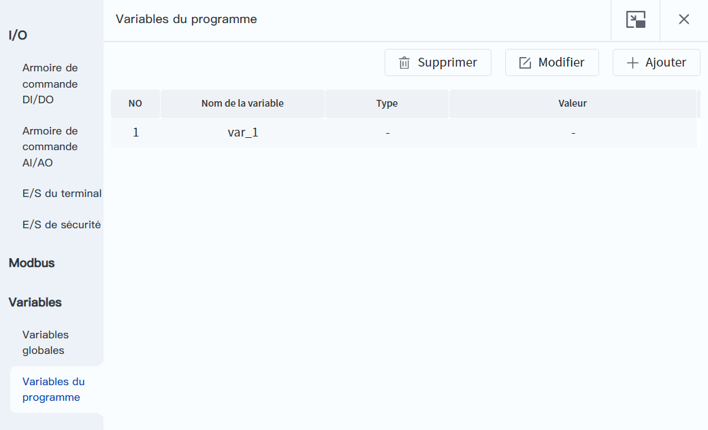
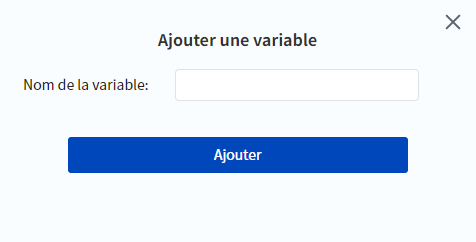
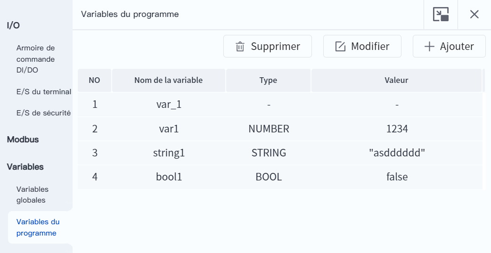

# 8.7 Variables du programme

Cette page permet de définir les variables à surveiller pendant l'exécution du projet. Vous pouvez surveiller le type et la valeur de la variable spécifiée par son nom, et vous avez la possibilité de modifier le nom de la variable surveillée.

 

Cliquez sur le bouton **Ajouter** pour Ajouter une nouvelle variable du programme, cliquez sur le bouton **Modifier** pour modifier les propriétés de la variable sélectionnée et cliquez sur le bouton **Supprimer** pour supprimer la variable sélectionnée.

 

Le nom de la variable permet de saisir la valeur de la clé de l'objet :

- Par exemple, si vous souhaitez contrôler les coordonnées de l'articulation du point P1, ajoutez la variable : P1.joint. 
- Par exemple, si vous souhaitez contrôler l'axe X du point P1, ajoutez la variable : P1.pose[1]. 

Lorsque l'ajout est terminé, la liste des variables affiche les variables ajoutées.

### Surveillance des variables du programme

La surveillance des variables du programme commence lorsque le script est en cours d'exécution et s'effectue toutes les 1s ; elle s'arrête lorsque le script est mis en pause/arrêté. S'il n'y a pas de valeur pour la variable de programme ajoutée lorsque le programme est en cours d'exécution, le type et la valeur affichent "-".

 

### Type des variables du programme

Les variables de programme sont classées en trois types en fonction de leur source : locale, ascendante et globale. Lorsque des variables portent le même nom, la première a la priorité la plus élevée, et c'est donc la source la plus prioritaire qui est affichée et modifiée.

Les types de variables natives de Lua qui sont prises en charge pour l'affichage à l'écran sont les suivants :

- nil : null (sans aucune valeur valide), par exemple l'impression d'une variable sans valeur assignée produira une valeur nil. 
- boolean : une valeur booléenne qui n'a que des valeurs true et false. Lua traite false et nil comme faux, tout le reste est vrai, et le nombre 0 est également vrai. 
- number : une valeur numérique, un nombre réel à virgule flottante de type double précision, supportant diverses opérations. 
- string : chaîne de caractères composée de chiffres, de lettres et de caractères de soulignement. 
- table : table (y compris les tableaux), le type table permet de développer son contenu et de modifier ses enfants.

### Limite d’utilisation

- Les variables de programme peuvent être ajoutées, supprimées ou modifiées lorsque le script est en cours d'exécution, en pause ou arrêté. 
- Le nombre maximal de variables de programme pouvant être ajoutées est de 20, et la longueur maximale des noms de variables est de 256 octets. 
- Les variables de programme ne prennent en charge que le chinois et l'anglais.