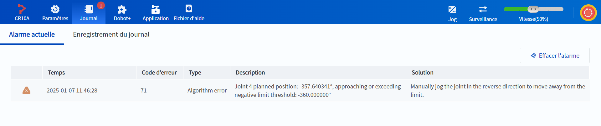
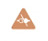
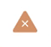
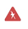
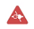
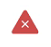

# 5.12 Gestion des alarmes

Les alarmes sont déclenchées lorsque le prélèvement ou le stockage de points est incorrect ou lorsque le robot est utilisé de manière incorrecte, par exemple, de sorte que le bras robotique est limité ou se trouve à un point impair. Si une alarme est déclenchée lorsque le bras du robot est en marche, un point rouge avec un numéro apparaît dans le coin supérieur droit de l'icône du journal, indiquant le nombre d'alarmes en cours.

 

Lorsqu'une alarme se déclenche sur le robot, l'icône de niveau d'alarme, l'heure d'occurrence de l'alarme, le code d'erreur, le type d'alarme, la description et la solution s'affichent sur la page Alarmes en cours ; reportez-vous à la description et à la solution pour résoudre le problème de l'alarme.

La signification des icônes de niveau d'alarme du robot est indiquée ci-dessous :

| Icône d'alarme de défaut| Niveau| Catégorie| Correspondance|
|:----------:|:----------:|:----------:|:----------:|
| | 0| Catégorie défauts| Signaler une erreur, suspendre le fonctionnement, désactiver et mettre hors tension|
| | 1| Type anormale| Signaler une erreur, suspendre le fonctionnement et mettre hors tension|
| | 5| Catégorie erreurs| Signaler une erreur et suspendre le fonctionnement|
| | 10| Catégorie défauts| Erreur, arrêt du fonctionnement, désactivation et mise hors tension.|
| | 11| Type anormalie| Rapport d'erreur, arrêt du fonctionnement et mise hors tension|
| | 15| Catégorie erreurs| Erreur et arrêt du fonctionnement|

Cliquez sur **Effacer l’alarme** pour effacer les alarmes actuelles. Certaines alarmes ne peuvent pas être effacées directement, reportez-vous à la section Résolution des alarmes pour plus de détails.