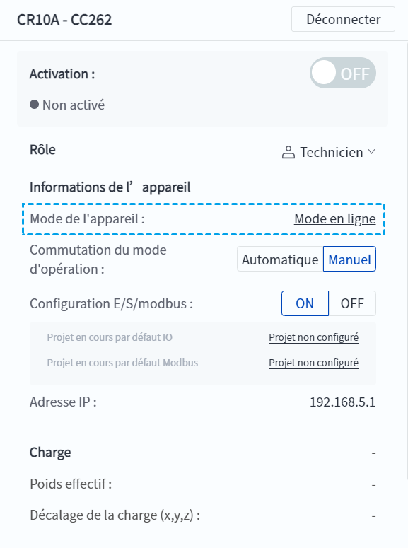

# 5.4.1 Mode de l'appareil

Mode de l'appareil indique le mode de contrôle actuel du robot :

- Le **Mode en ligne** est le mode de contrôle par défaut, dans lequel le robot peut être contrôlé à l'aide de DobotStudio Pro, et également à distance via I/O ou Modbus. 
- Le **Mode TCP** n'est utilisé que lorsque le client développe son propre logiciel de contrôle basé sur TCP. Le logiciel DobotStudio Pro ne pourra pas faire fonctionner le robot, à l'exception des arrêts d'urgence, et ne pourra que visualiser l'état du robot et les paramètres connexes. Si vous devez développer votre propre logiciel de commande, veuillez contacter le support technique pour obtenir le «&nbsp;Document d'interface de commande à distance TCP_IP (V4)&nbsp;». 

Les utilisateurs peuvent voir le mode actuel de l'appareil dans le panneau d'information de l'interface principale et cliquer sur le texte souligné pour changer le mode de l'appareil.

 

<b> Description : </b>
<ul>
    <li>Lorsque le robot est en mode <a href="ma_mode.md">manuel/automatique</a>, il n'est pas possible de changer le mode de l'appareil. Il est nécessaire de désactiver le mode manuel/automatique via <a href="../setting/oper_mode.md">Réglages du mode</a>. </li><li>Lorsque le robot est en état de fonctionnement ou en pause, il n'est pas possible de changer le mode de l'appareil. </li><li>Après avoir basculé la machine en mode TCP, si vous cliquez sur le bouton d'opération interdit, un message vous informera : <b>La machine est actuellement en mode TCP et ne peut pas être utilisée ! </b></li>
    </ul>

