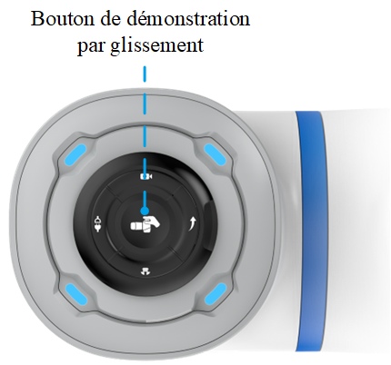
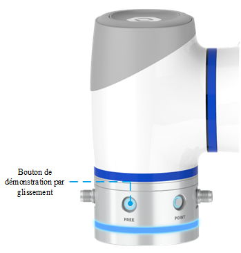
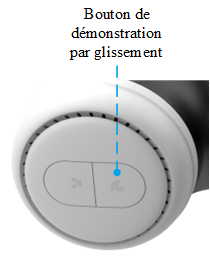

# 5.7 Glisser-déposer

Le robot peut être déplacé en mode de glisser-déposer en utilisant le bouton Glisser-Déposer situé à l'extrémité du robot. En mode de glisser-déposer, l'utilisateur peut faire glisser le bras à la main pour modifier l'attitude et enseigner la position du point.

La résistance de chaque articulation en mode de glisser-déposer peut être modifiée dans la page de [Paramètres de traînage et de tirage](../setting/drag.md).

<b> Description : </b>
<ul>Avant de déplacer le robot, assurez-vous que les <a href="../setting/load.md">paramètres de charge</a> et les <a href="../setting/installation.md">angles d'installation</a> sont correctement configurés.</ul>

 

- Les boutons d'apprentissage du déplacement des robots de la série CRA (sauf CR20A) sont situés comme indiqué ci-dessous.
  
  

  
  Si vous appuyez longuement (plus de 1,5 s) sur le bouton Drag and Drop lorsque le bras est activé (le voyant est vert), le robot passe en mode de glisser-déposer (le voyant est vert et clignote), puis l'utilisateur peut faire glisser le robot à la main pour modifier sa position.
  
  Une brève pression (moins de 1,5 s) sur le bouton Drag \& Drop en mode de glisser-déposer permet de quitter le mode de glisser-déposer.
  
- Le bouton Drag Teach du robot CR20A est situé sur le côté de l'extrémité du robot et est sérigraphié comme **FREE**, comme le montre la figure ci-dessous.

En appuyant sur le bouton et en le maintenant enfoncé lorsque le bras est activé (le voyant lumineux est vert), vous passez en mode de glisser-déposer (le voyant lumineux devient vert et clignote rapidement) ; l'utilisateur peut alors faire glisser le robot à la main pour modifier sa position.

Relâchez le bouton Drag and Drop pour quitter le mode de glisser-déposer.

- L'emplacement du bouton Drag \& Teach du robot Magician E6 est indiqué ci-dessous.
  
  

  
  Si vous appuyez longuement (plus de 1,5 s) sur le bouton Drag and Drop lorsque le bras est activé (le voyant est vert), le robot passe en mode de glisser-déposer (le voyant est vert et clignote), puis l'utilisateur peut faire glisser le robot à la main pour modifier sa position. Appuyez à nouveau sur la touche et maintenez-la enfoncée en mode de glisser-déposer pour passer en mode d'enregistrement des pistes.
  
  Appuyez brièvement (moins de 1,5 s) en mode de glisser-déposer et faites glisser le bouton d'apprentissage pour quitter le mode de glisser-déposer et le mode d'enregistrement des trajectoires.