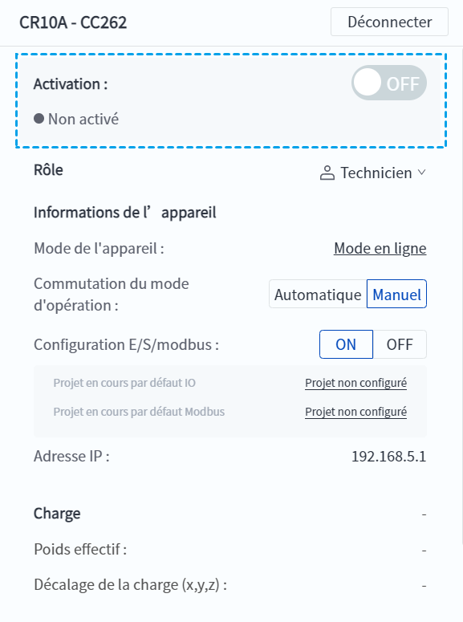
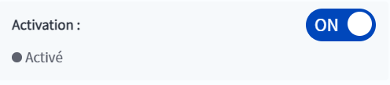
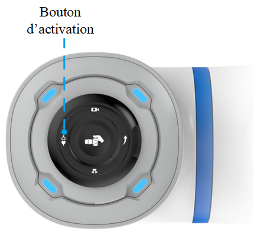
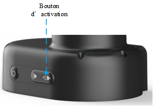

# 5.2 Activation

Lorsque le robot est mis sous tension, il est désactivé par défaut. À ce stade, vous pouvez configurer le robot et le programmer, mais vous ne pouvez pas contrôler le mouvement du robot ni exécuter des projets. Si vous devez contrôler le mouvement du robot ou exécuter le projet, vous devez activer le robot.

Les utilisateurs peuvent passer à l'état d'activation par le biais du commutateur d'activation dans l'interface principale du logiciel ou du bouton d'activation sur le robot.

### Activation du logiciel

L'interrupteur de validation du logiciel est situé sur le panneau d'information de l'interface principale.

 

Lorsque le bouton d’activation est **OFF**, le fait de cliquer dessus fait apparaître la fenêtre Réglage de l’activation de la charge.

 

Sélectionnez le groupe de paramètres de charge dans la liste déroulante. Les groupes de paramètres prédéfinis doivent être définis dans la page [Paramètres de charge](..\setting\load.md), puis sélectionnés ici. Sélectionnez "Custom" pour modifier manuellement les paramètres suivants :

- **Distance de décalage du centre dans la direction X/Y/Z** : distance de décalage du centre de masse de la charge d'extrémité dans chaque direction, voir le diagramme sur l'interface pour la direction de chaque axe. 
- **Poids de charge** : la somme du poids de l'embout et du poids de la pièce à usiner, qui ne peut pas dépasser la charge maximale autorisée par le robot. 

**Effectuer une détection des anomalies de charge** : Lorsque cette option est cochée, le robot se déplace sur une faible amplitude pour détecter si la différence entre les paramètres de charge définis par l'utilisateur et la charge réelle est trop importante ; si la différence est trop importante, l'activation de la montée échoue et vous devez réinitialiser les paramètres de charge ou décocher cette option.

<b> Attention : </b>
Il est recommandé de cocher <b>Effectuer une détection des anomalies de charge</b> lors de l'activation du robot pour assurer la sécurité du fonctionnement et la protection de l'équipement. 

 

Une fois l’activation réussie, le bouton d’activation passe à l’état **ON**. Un nouvel clic permet de désactiver l’activation.

### Activation du robot

**Position du bouton d’activation du robot**

- Le bouton d'activation des robots de la série CRA (sauf CR20A) est situé à l'extrémité du robot.
  
  
<b> Description : </b>
Le robot CR20A ne dispose pas de bouton d'activation ; l'activation se fait exclusivement via le logiciel. 

  
   
  
  

- Pour les robots Magician E6, le bouton de validation est situé à la base du robot.
  
  

**Opération du bouton d’activation du robot**

- Opération d’activation : lorsque le robot est sous tension et qu'il n'est pas en état de déverrouillage (le voyant bleu est toujours allumé), appuyez sur le bouton de déverrouillage et maintenez-le enfoncé pendant environ 1,5 seconde ; le voyant violet clignote, puis relâchez le bouton pour passer à l'état de déverrouillage (le voyant passe au vert).

- Opération de désactivation : dans l'état de validation, appuyez longuement sur le bouton de validation pendant environ 1,5 seconde, le voyant lumineux violet clignote, puis relâchez le bouton pour sortir de l'état de validation.
  
  
<b> Description : </b>
Après avoir activé le robot via les boutons du robot, il utilisera les paramètres de charge de la dernière activation. Si le robot est activé pour la première fois, les valeurs des paramètres de charge seront à zéro. 

