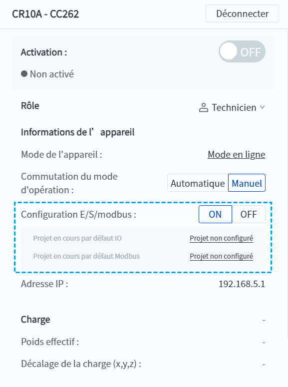

# 5.4.2 Configuration E/S/modbus

Le commutateur de configuration E/S/Modbus est utilisé pour contrôler si l'entrée E/S/Modbus distante est active ou non. Pour des raisons de sécurité, il est généralement recommandé que le robot soit contrôlé par une seule source d'entrée. Il est donc recommandé que l'interrupteur de configuration E/S/Modbus soit désactivé lorsque l'utilisateur contrôle le robot par l'intermédiaire de DobotStudio Pro.

Cliquez sur l'interrupteur de **configuration E/S/Modbus** sur le panneau d'informations de l'interface principale pour l'activer/désactiver.

 

<b> Attention : </b>
Configurez les paramètres liés au projet d'exécution des E/S et de Modbus via les <a href="../monitoring/io_monitor_ctrl_dio.md">Configuration des E/S</a> et les <a href="../monitoring/modbus.md">Configuration Modbus</a>. 

 

La plage exacte des entrées E/S/Modbus en vigueur est également affectée par le mode [Manuel/Automatique](ma_mode.md), comme indiqué dans le tableau ci-dessous.

| Mode d’opération| Configuration E/S/modbus ON| Configuration E/S/modbus OFF|
|:----------|:----------|:----------|
| Mode manuel/automatique non activé| Toutes les entrées E/S/Modbus actives| Invalide pour toutes les entrées E/S/Modbus|
| Mode automatique en cours| Les entrées E/S/Modbus disponibles en mode Auto sont valides.| Invalide pour toutes les entrées E/S/Modbus|
| Mode manuel en cours| Les entrées E/S/Modbus disponibles en mode manuel sont valides.| Invalide pour toutes les entrées E/S/Modbus|

 

**Contrôle E/S/Modbus à distance**

<table width="100%">
  <colgroup>
    <col style="width: 34%">
    <col style="width: 33%">
    <col style="width: 33%">
  </colgroup>
  <tr>
	<th>Fonction</th>
    <th>Mode manuel</th>
    <th>Mode automatique</th>
  </tr>
  <tr>
    <td>Commencer</td>
    <td>X</td>
    <td>√</td>
  </tr>
  <tr>
    <td>Arrêter</td>
    <td>X</td>
    <td>√</td>
  </tr>
  <tr>
    <td>Pause</td>
    <td>X</td>
    <td>√</td>
  </tr>
  <tr>
    <td>Activer</td>
    <td>√</td>
    <td>√</td>
  </tr>
  <tr>
    <td>Désactiver</td>
    <td>√</td>
    <td>√</td>
  </tr>
  <tr>
    <td>Effacer l'alarme</td>
    <td>√</td>
    <td>√</td>
  </tr>
  <tr>
    <td>Entrer en mode de glisser-déposer</td>
    <td>√</td>
    <td>X</td>
  </tr>
  <tr>
    <td>Quitter le mode glisser-déposer</td>
    <td>√</td>
    <td>X</td>
  </tr>
  <tr>
    <td>Sélectionner les projets alternatifs</td>
    <td>X</td>
    <td>√</td>
  </tr>
</table>

<b> Description : </b>
En mode manuel, une pause déclenchée par une collision ne permet pas d'entrer en mode glisser-déposer. 

 

**E/S de sécurité**

<table width="100%">
  <colgroup>
    <col style="width: 34%">
    <col style="width: 33%">
    <col style="width: 33%">
  </colgroup>
  <tr>
	<th>Fonction</th>
    <th>Mode manuel</th>
    <th>Mode automatique</th>
  </tr>
  <tr>
    <td>Arrêt d'urgence de l'utilisateur</td>
    <td>√</td>
    <td>√</td>
  </tr>
  <tr>
    <td>Arrêt de protection</td>
    <td>X</td>
    <td>√</td>
  </tr>
  <tr>
    <td>Réinitialisation de l'arrêt de protection</td>
    <td>X</td>
    <td>√</td>
  </tr>
  <tr>
    <td>Mode de réduction</td>
    <td>X</td>
    <td>√</td>
  </tr>
</table>

<b> Description : </b>
<ul>
    <li>Lorsque le mode manuel/automatique n'est pas activé, ou après une arrêt de protection déclenché en mode manuel, il est possible de jogging et de faire glisser le robot, mais il n'est pas autorisé d'exécuter des projets ni de reproduire des trajectoires. </li><li>Après déclenchement d'un arrêt de protection en mode automatique, aucune action n'est autorisée, y compris le jog et le glissement du robot, l'exécution de programmes et la réplication de la trajectoire. </li>
    </ul>

