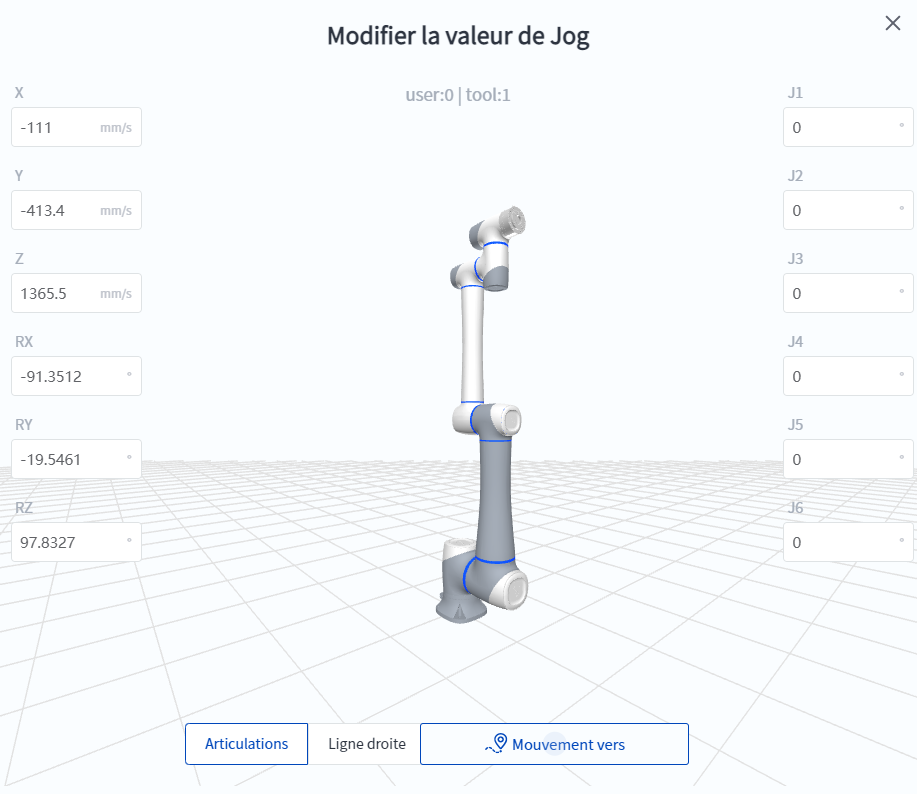

# 5.6 Jog

DobotStudio Pro permet à l'utilisateur de contrôler manuellement le mouvement du robot, généralement pour enseigner le jog.

Pour utiliser le jog, cliquez sur le bouton  de la barre d'outils supérieure pour ouvrir le panneau jog, qui prend en charge le jog continu ou l'incrémentation en fonction des angles d'articulation ou des systèmes de coordonnées cartésiennes.

<h2 id="joint_jog" class="m3">Jog des articulations</h2>

 

Le jog d'articulation fait référence au contrôle du mouvement de rotation d'une seule articulation du robot.

Pour effectuer un jog d'articulation, cliquez sur l'onglet de **Jog des articulations** dans la zone ① ci-dessus, puis contrôlez le mouvement des articulations individuelles à l'aide des boutons de mouvement dans la zone ③. Veuillez vous référer au diagramme à droite de la figure ci-dessus pour connaître la position et le sens de rotation de chaque axe d'articulation.

Les options de la zone ② permettent de définir le mode d'action des boutons de mouvement :

- Tapotement continu : appuyez sur le bouton de mouvement et maintenez-le enfoncé pour que le robot se déplace en continu, puis relâchez le bouton pour arrêter le déplacement du robot. 
- Inching : Chaque fois que vous cliquez sur le bouton de mouvement, le robot se déplace d'une distance spécifiée en pouces (unité : °), et une pression prolongée sur le bouton ne déclenche qu'une seule fois un mouvement d'inching. 

Lors de l'apprentissage de points, vous pouvez désormais déplacer le robot jusqu'à un point proche du point cible par un tapotement continu, puis procéder à des ajustements précis en effectuant un mouvement d'incrémentation.

<h2 id="tcp_jog" class="m3">Jog du système de coordonnées</h2>

 

Le jog du système de coordonnées consiste à contrôler le TCP du robot (point central de l'outil, l'origine du système de coordonnées de l'outil actuel) pour effectuer une translation et une rotation le long du système de coordonnées spécifié.

Pour effectuer le jog du système de coordonnées, cliquez sur l'onglet **jog du système de coordonnées** dans la zone ② ci-dessus, puis contrôlez le mouvement du TCP à l'aide des boutons de mouvement dans la zone ⑤. Le diagramme à droite de la figure ci-dessus montre la définition de chaque axe et son sens de rotation en utilisant le système de coordonnées 0 de l'utilisateur comme exemple.

Les options de la zone ④ permettent de définir le mode d'action du bouton de mouvement :

- Jog continu : Appuyez longuement sur le bouton de mouvement pour faire bouger le robot en continu, et relâchez le bouton pour arrêter le mouvement du robot. 
- Inching : chaque fois que vous cliquez sur le bouton de mouvement, le robot se déplace d'une distance donnée (X/Y/Z en mm, RX/RY/RZ en °), et une pression prolongée sur le bouton ne déclenche qu'une seule fois un mouvement d'inching. 

Lors de l'apprentissage d'un point, vous pouvez désormais déplacer le robot jusqu'à un point proche de la cible par un tapotement continu, puis effectuer des ajustements précis par incrémentation.

**Changement du système de coordonnées de référence**

L'utilisateur peut modifier le système de coordonnées de l'utilisateur et le système de coordonnées de l'outil du robot dans la zone ①. Vous pouvez gérer le système de coordonnées actuel du robot dans **Configuration** > [**Gestion du système de coordonnées**](..\setting\coord_setting.md).

La zone ③ est utilisée pour définir le système de coordonnées de référence lorsque le robot pointe :

- Utilisateur : Lors du jog, le TCP du robot se déplace le long du système de coordonnées de l'utilisateur actuel, par exemple X+ signifie que le TCP du robot se déplace le long de la direction positive de l'axe X du système de coordonnées de l'utilisateur actuel. 
- Outil : Lorsque vous appuyez sur la touche, le robot TCP se déplace le long du système de coordonnées de l'outil actuel, par exemple X+ indique que le robot TCP se déplace dans la direction positive le long de l'axe X du système de coordonnées de l'outil actuel. 

Le système de coordonnées actuellement en vigueur est affiché sur le modèle 3D du robot.

<h2 id="edit_jog" class="m3">Modifier la valeur de Jog</h2>

Dans la zone de commande de mouvement du jog d'articulation ou du jog de système de coordonnées, double-cliquez sur une valeur pour afficher la boîte de dialogue **Modifier la valeur de jog**.

 

Saisissez directement l'angle de l'articulation ou la valeur du système de coordonnées pour la position cible, et le contour bleu indique le modèle de la position cible. Appuyez longuement sur **Mouvement vers** pour déplacer le robot vers la position cible.

<h2 id="target_pose" class="m3">Posture cible</h2>

La Posture cible permet au robot de se déplacer rapidement vers une position spécifique.

**Point d'origine de sécurité**

 

Cliquez sur **Posture cible > Point d'origine de sécurité**, la fenêtre contextuelle suivante s'affiche ; maintenez le bouton **Mouvement vers la position cible** pour déplacer le robot vers le [Point d'origine de sécurité](..\setting\home_point.md), et relâchez le bouton pour arrêter le mouvement du robot.

**Alignement de l'axe Z**

Cliquez sur **Posture cible > Alignement de l'axe Z**, la fenêtre contextuelle suivante s'affiche ; en appuyant longuement sur le bouton **Mouvement vers la position cible**, le robot aligne automatiquement l'axe Z du système de coordonnées de l'outil actuel sur l'axe Z du système de coordonnées de l'utilisateur actuel à l'angle de rotation d'attitude minimum.

**Posture empaquetée**

Cliquez sur **Posture cible > Posture empaquetée**, la fenêtre contextuelle suivante s'affiche ; appuyez longuement sur le bouton **Mouvement vers la position cible** pour déplacer le robot vers [Posture empaquetée](../setting/pose.md), relâchez le bouton et le robot s'arrêtera de bouger.

**Personnaliser**

Cliquez sur **Posture cible > Personnaliser**, l'interface de fonctionnement est décrite dans [Modifier la valeur de jog](jog_oper.md#edit_jog).