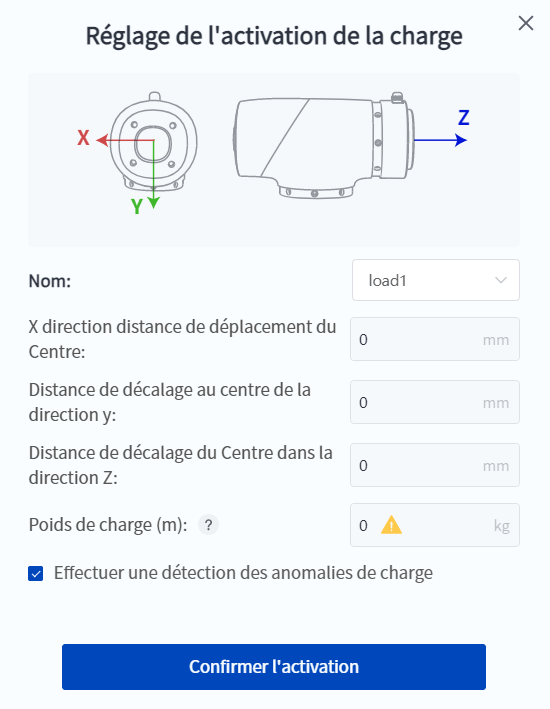

# 5.10 Paramètres de charge

Le paramètre de charge est le centre de masse et le paramètre de poids de la charge finale (y compris les fixations) du bras du robot, qui doit être défini en fonction de la charge réelle. S'il est défini de manière incorrecte, il entraînera une dégradation des performances du bras du robot et pourra générer des problèmes tels qu'un déclenchement erroné de la détection de collision et une traction incontrôlée.

Les utilisateurs peuvent définir les paramètres de charge utilisés par le robot de la manière suivante :

- Lors de l'activation du robot via le logiciel, vous devez définir les paramètres de charge dans la fenêtre contextuelle, voir les instructions de l'opération [d'activation](enable.md) pour plus de détails.
  
  <div align=center></div>


<br/>

- Lors de la programmation, l'instruction de bloc ou de script correspondante peut être appelée pour définir les paramètres de charge lorsque le projet est en cours d'exécution, voir le document de description de l'instruction en annexe pour plus de détails. Les paramètres de charge définis par cette méthode ne prennent effet que pendant le fonctionnement du projet.
  
  **Bloc** :
  
  
  
  **Script** :
  
  ```lua
  SetPayload(payload, {x, y, z}) -- Personnaliser les paramètres de charge
  SetPayload(name) -- Utiliser le groupe de paramètres de charge prédéfinis
  ```
  Les groupes de paramètres de charge prédéfinis sont gérés dans la page [Paramètres de charge](../setting/load.md).