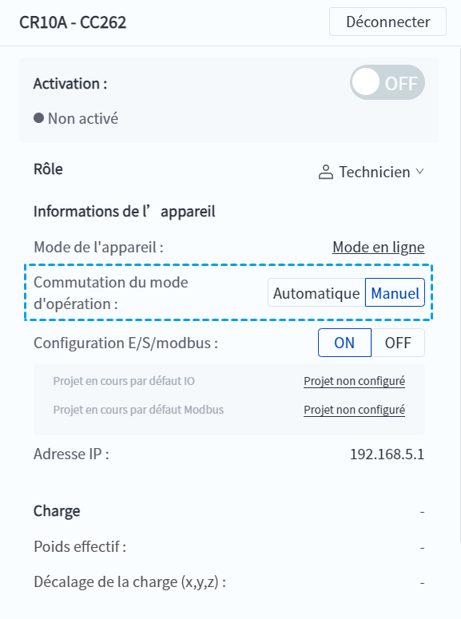

# 5.5 Mode automatique/manuel

DobotStudio Pro permet d'améliorer la sécurité dans les applications sur le terrain en définissant différents modes de fonctionnement, qui peuvent être activés dans les [Paramètres de mode](../setting/oper_mode.md).

<b> Description : </b>
Le robot CR20 est livré par défaut en <b>mode manuel</b>, tandis que les autres modèles sont livrés avec le mode manuel/automatique non activé. 

 

- **Mode manuel** : Ce mode est généralement utilisé pour la programmation et le débogage du robot. 
- **Mode automatique** : ce mode est généralement utilisé pour faire fonctionner le robot automatiquement une fois qu'il est en ligne. 
Lorsque la fonction de **commutation du mode d’opération** est activée dans les [paramètres de mode](../setting/oper_mode.md), le **commutateur de mode manuel/automatique** apparaît sur le panneau d'information de l'interface principale et le mode par défaut est **manuel**.

Si vous avez défini un mot de passe pour le mode automatique, vous devez saisir le mot de passe avant de passer au mode **automatique**.

Lorsque le robot est en marche, il est impossible de basculer entre les modes manuel et automatique ; lorsque le robot est en pause ou en arrêt, il peut basculer entre les modes manuel et automatique.

 

Reportez-vous à **Commutateur de [configuration E/S/Modbus](io_modbus.md)** pour connaître les opérations autorisées en mode manuel/automatique.
