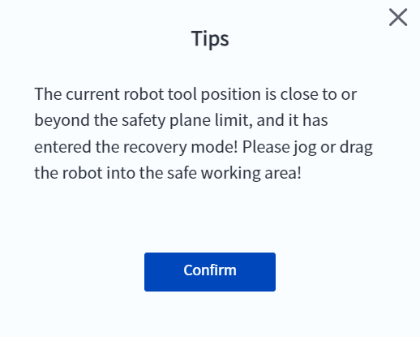
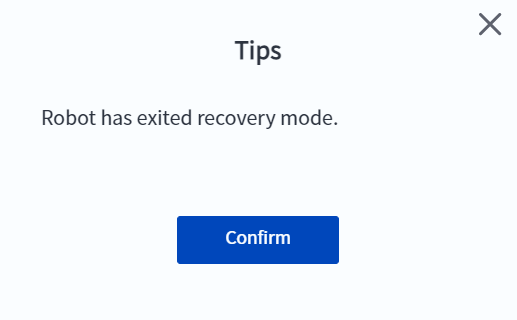

# 5.3 Mode de récupération

Lorsque le robot est activé dans une zone non sécurisée, la fenêtre contextuelle ci-dessous apparaît et l'indicateur de fin de robot devient orange, ce qui indique que l'utilisateur est passé en mode de récupération.

 

En mode de récupération, l'utilisateur ne peut contrôler les mouvements du robot qu'en **jog** ou en faisant **glisser** le robot. Lorsque le robot entre dans la zone de sécurité, il quitte automatiquement le mode de récupération et une fenêtre contextuelle s'affiche.

