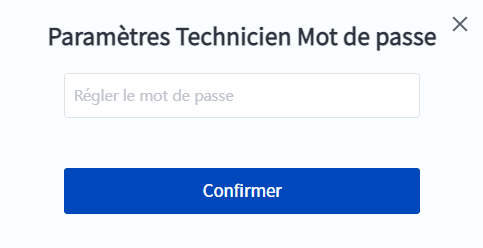
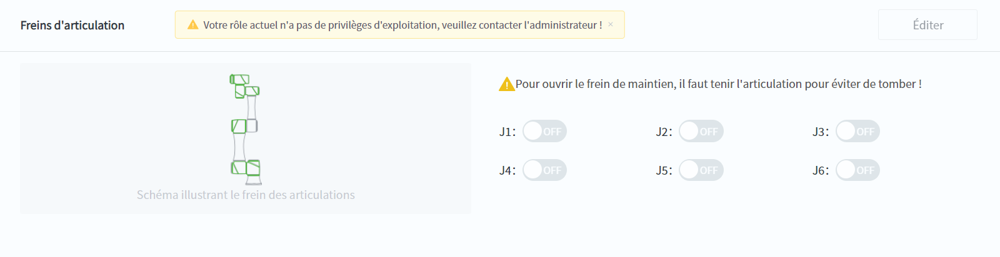
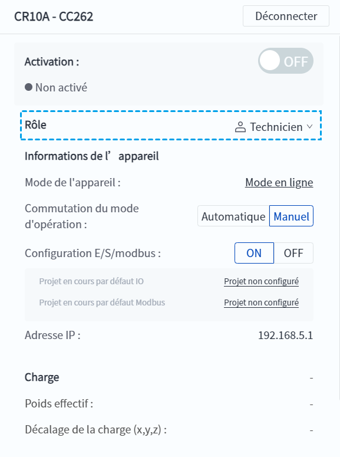

# 5.1 Connexion de l'utilisateur

Les utilisateurs peuvent attribuer différentes fonctions à différents utilisateurs du robot dans le but de gérer les droits d'exploitation.

Lorsque DobotStudio Pro se connecte au robot, il se connecte automatiquement à la fonction par défaut (qui peut être modifiée). Si la fonction par défaut n'a pas de mot de passe, l'utilisateur n'en a pas connaissance ; dans le cas contraire, une fenêtre de connexion s'affiche pour demander un mot de passe. Si vous souhaitez vous connecter à d'autres fonctions, vous pouvez également changer de fonction dans cette fenêtre.

 

DobotStudio Pro prend en charge quatre fonctions, chaque fonction ayant des privilèges d'exploitation différents (modifiables).

- Administrateur : dispose par défaut des privilèges d'exploitation pour toutes les fonctions. Valeur par défaut : 888888. 
- Technicien : fonction de connexion par défaut lorsque le robot est expédié de l'usine. Toutes les fonctions sont activées par défaut, à l'exception des paramètres avancés (paramètres d'installation et de sécurité). Pas de mot de passe par défaut. 
- Opérateur : Par défaut, seules les opérations de base du robot, telles que le jog et les cycles d'ingénierie, sont accessibles. Pas de mot de passe par défaut. 
- Fonctions personnalisées : fonctions avec des noms et des autorisations personnalisables créées par l'administrateur, non affichées si elles n'ont pas été créées. 

Les commandes de l'interface utilisateur (par exemple, le bouton **Modifier**) qui n'ont pas de privilèges d'exploitation pour la fonction actuellement connectée seront grisées et vous serez invité à indiquer qu'elles n'ont pas de privilèges d'exploitation lorsque vous cliquez dessus, comme le montre la figure suivante.

 

Si vous souhaitez passer à une fonction disposant de droits d'exploitation, revenez à l'interface principale et changez de fonction dans le panneau d'information. Vous devez saisir un mot de passe pour passer à une fonction avec mot de passe, mais vous pouvez passer directement à une fonction sans mot de passe.

 

Lorsque l'utilisateur se connecte en tant qu'administrateur, il peut définir la fonction de connexion par défaut, gérer les fonctions personnalisées et afficher/modifier les autorisations et les mots de passe de chaque fonction, etc. voir [Gestion de l'utilisateur](../setting/user_manage.md) pour plus de détails.
