# 6.2 Programmation des blocs

<h2 id="overview" class="m3">6.2.1 Généralités</h2>

Les utilisateurs font glisser les blocs de la barre latérale dans la zone de programmation en fonction de leur forme et les combinent pour les rendre programmables sans écrire de code.
**Projet** : la programmation des blocs peut être éditée et exécutée en tant que projet avec support de débogage. L'accès à la page de programmation par l'icône de la page d'accueil de l'application crée par défaut un nouveau projet sans nom, qui doit être nommé et sauvegardé après la programmation avant d'être débogué et exécuté. Le projet est enregistré dans le contrôleur du bras robotique et peut être importé et exporté.

Chaque projet prend en charge un fil d'exécution principal et jusqu'à quatre fils d'exécution secondaires.

- **Fil principal** : le fil principal démarre avec le bloc de **départ** comme bloc de départ. Tous les blocs peuvent être utilisés dans le fil principal. 
- **Sous-fil** : les sous-filières démarrent avec le bloc de **départ de la sous-filière** comme bloc de départ. Les sous-filières sont des fils parallèles qui s'exécutent en même temps que le fil principal et qui peuvent être utilisés pour configurer des entrées-sorties, des variables, etc. 

**Points de sauvegarde** : au cours du processus de programmation, l'utilisateur peut déplacer le robot à tout moment en le touchant ou en le faisant glisser, puis ouvrir la liste des points de sauvegarde pour enregistrer la position actuelle du robot en tant que point d'apprentissage. Les points d'apprentissage de la liste des points de sauvegarde sont liés au projet et peuvent être utilisés comme paramètres de la commande. Si vous souhaitez enregistrer des points d'apprentissage pouvant être appelés dans plusieurs projets, utilisez des [variables globales](../monitoring/global_var.md).

L'interface principale de la programmation par blocs est illustrée ci-dessous.

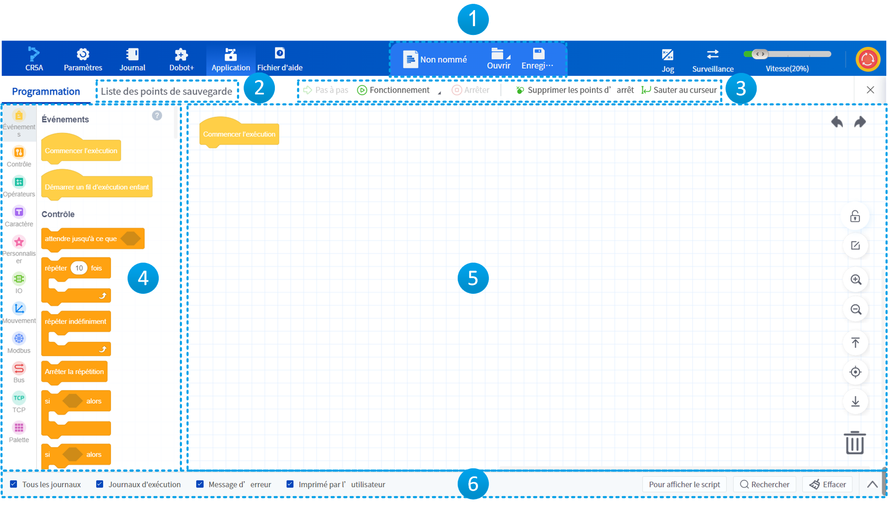

<table width="100%">
  <colgroup>
    <col style="width: 10%">
    <col style="width: 90%">
  </colgroup>
  <tr>
    <th>Numéro de série</th>
    <th>Description</th>
  </tr>
  <tr>
    <td style="text-align:center">1</td>
      <td>Pour afficher la désignation du projet et gérer les projets. </td>
  </tr>
  <tr>
    <td style="text-align:center">2</td>
    <td>Cliquez pour ouvrir l'interface des points de sauvegarde, utilisée pour gérer les points de sauvegarde dans les projets. </td>
  </tr>
  <tr>
    <td style="text-align:center">3</td>
    <td>Boutons relatifs au débogage et à l'exécution du projet. </td>
  </tr>
  <tr>
    <td style="text-align:center">4</td>
    <td>Fournit les blocs nécessaires pour la programmation, vous pouvez rechercher les blocs dont vous avez besoin par catégorie et couleur. Cliquez sur en haut à droite pour consulter les descriptions détaillées des blocs. </td>
  </tr>
  <tr>
    <td style="text-align:center">5</td>
    <td>L'espace de travail de programmation des blocs, c'est-à-dire la zone de rédaction du projet de blocs.  Un icône  apparaît à gauche des blocs modifiés mais non sauvegardés, indiquant à l'utilisateur que ces blocs ont été modifiés. </td>
  </tr>
  <tr>
    <td style="text-align:center">6</td>
      <td>Barre des journaux d'exécution, utilisée pour consulter les journaux d'exécution du projet. <ul><li>Cliquez sur l'icône  située à l'extrême droite pour déployer ou réduire la zone d'affichage des journaux ;</li><li>Les options à gauche permettent de filtrer les types de journaux affichés ;</li><li>Cliquez sur <b>Voir le script</b> pour consulter le script du programme des blocs actuel. </li><li>Cliquez sur  <b>Rechercher</b> pour trouver un caractère spécifié dans les journaux ;</li><li>Cliquez sur  <b>Effacer</b> pour vider la zone d'affichage des journaux. </li></td>
  </tr>
</table>

La signification des icônes sur le côté droit de la toile est la suivante.

<table>
<thead>
<tr>
<th>Icône</th>
<th>Description</th>
</tr>
</thead>
<tbody><tr>
<td style="text-align:center"></td>
<td>Pour annuler/refaire une opération de programmation. </td>
</tr>
<tr>
<td style="text-align:center"></td>
<td>Pour verrouiller/déverrouiller la zone de programmation. </td>
</tr>
<tr>
<td style="text-align:center">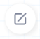</td>
<td>Pour entrer en mode d'édition, voir ci-dessous les instructions de programmation. </td>
</tr>
<tr>
<td style="text-align:center"></td>
<td>Utilisés respectivement pour zoomer/dézoomer dans la zone de programmation. </td>
</tr>
<tr>
<td style="text-align:center"></td>
<td>Utilisés respectivement pour revenir en haut/au centrer/en bas des blocs. </td>
</tr>
<tr>
<td style="text-align:center"></td>
<td>Faire glisser un bloc de la zone de programmation jusqu’ici pour le supprimer. L'utilisateur peut également choisir de supprimer un bloc en cliquant dessus avec le bouton droit de la souris. </td>
</tr>
</tbody></table>

<h2 id="project" class="m3">6.2.2 Gestion de projet</h2>

 
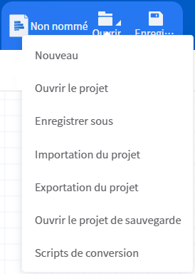

 

Lorsque l'interface de programmation par blocs est ouverte, une nouvelle page de projet vierge est affichée par défaut et le nom du projet est affiché comme étant **sans nom**.

Cliquez sur  pour ouvrir le menu Fichier pour créer, ouvrir, enregistrer, importer ou exporter un projet, ou convertir un projet à base de blocs en un projet à base de scripts. Une fois qu'un projet de bloc est converti en projet de script, il peut être ouvert et édité dans la [programmation de script](script.md).

<b> Description : </b>
Lors de la création d'un nouveau projet, vous pouvez choisir un projet vide ou sélectionner un modèle de programmation des blocs. 
 
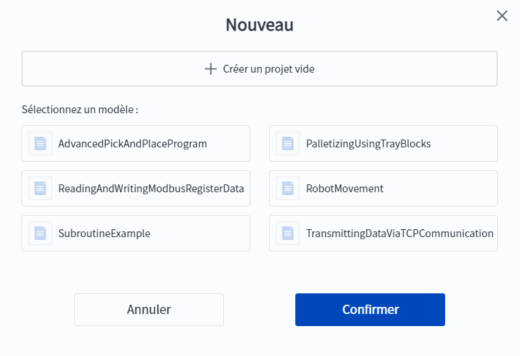

 

Cliquer sur  pour enregistrer le projet actuel. Saisir une désignation d'abord si le projet n'est pas encore nommé.

DobotStudio Pro sauvegarde automatiquement le projet dans les scénarios suivants :

- DobotStudio Pro vérifie toutes les dix minutes si le projet actuellement ouvert a été modifié ; si c'est le cas, il sauvegarde automatiquement le projet en cours sur le contrôleur. 
- Avant que le projet ne commence à s'exécuter, DobotStudio Pro vérifie si le projet actuellement ouvert a été modifié ; si c'est le cas, il sauvegarde automatiquement le projet actuel sur le contrôleur. 
- Lorsque DobotStudio Pro est déconnecté du contrôleur (déconnexion active ou déconnexion anormale), DobotStudio Pro vérifie s'il y a des modifications au projet actuellement ouvert ; si c'est le cas, il sauvegarde automatiquement le projet en cours sur le local (PC ou tablette). 

La sauvegarde sur le contrôleur et le projet local peuvent être ouverts via l'option **Ouvrir le projet de sauvegarde** du menu .

<h2 id="point" class="m3">6.2.3 Points de sauvegarde</h2>

L'utilisateur peut déplacer le robot jusqu'à la position souhaitée en le [jog](../operation/jog_oper.md) ou en le [faisant glisser](../operation/drag.md), puis enregistrer la position dans la liste des points de sauvegarde.

<b> Description : </b>
Lorsque la liste des points de sauvegarde est ouverte, appuyez sur le bouton <b>POINT</b> sur le côté de la rotule finale du CR20A pour ajouter un point d’enseignement. 

 

 
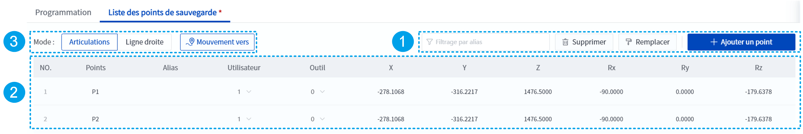

 

<table width="100%">
  <tr>
    <th>Numéro de série</th>
    <th>Description</th>
  </tr>
  <tr>
    <td style="text-align:center">1</td>
      <td><ul><li>Cliquez sur le bouton  <b>Point d’ajout</b> pour enregistrer la position actuelle du robot comme un nouveau point d’enseignement. </li><li>Après avoir sélectionné un point d’enseignement, cliquez sur le bouton  <b>Remplacer</b> pour remplacer ce point par la position actuelle du robot. </li><li>Après avoir sélectionné un point d’enseignement, cliquez sur le bouton  <b>Supprimer</b> pour effacer ce point. </li><li>Cliquez sur <b>Filtrage par alias</b> pour filtrer et afficher dans la liste les points correspondant aux critères spécifiés. </li></ul></td>
  </tr>
  <tr>
    <td style="text-align:center">2</td>
    <td>Liste des points de sauvegarde. Après avoir sélectionné un point d’enseignement, cliquez sur n'importe quelle valeur autre que <b>NO.</b> et <b>Point</b> pour modifier directement cette valeur. </td>
  </tr>
  <tr>
    <td style="text-align:center">3</td>
    <td>Contrôlez le robot pour qu'il se déplace vers le point sélectionné en utilisant le mode de mouvement spécifié. </td>
  </tr>
</table>

La position du point sélectionné dans la liste de sauvegarde sera affichée dans la zone de simulation du panneau de points sous la forme d'un contour bleu, comme le montre la figure ci-dessous.

 

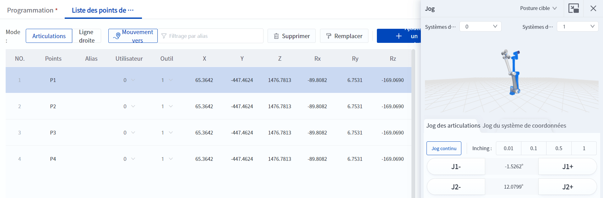

 

<h2 id="program" class="m3">6.2.4 Programmation</h2>

Avant de commencer la programmation, définissez la fonction que vous souhaitez réaliser. Cette section décrit comment écrire un projet de bloc en écrivant un programme pour contrôler le mouvement cyclique du robot entre deux points, à titre d'exemple.

<b> Attention : </b>
Avant de démarrer le débogage ou l'exécution du projet, assurez-vous qu'il n'y a personne ni aucun obstacle dans la zone de travail du robot. 

 

1. Faites glisser le bloc **Exécution répétée** du groupe de blocs **Contrôle** dans la zone de blocs de gauche vers le bas du bloc **Démarrage** dans le canevas.  
2. Faites glisser un bloc **Mouvement vers point** du groupe Blocs de **mouvement** vers le bloc **Exécution répétée**, cliquez sur la liste déroulante Points et sélectionnez P1.  
3. Faites glisser un autre bloc **Mouvement vers point** sous le bloc **Mouvement vers point** précédent, cliquez sur la liste déroulante Points et sélectionnez P2.  

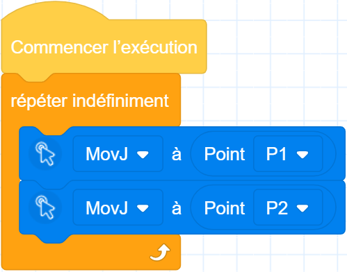

 

A ce stade, un programme simple de mouvement cyclique a été écrit.
Outre les opérations de programmation de base décrites ci-dessus, DobotStudio Pro prend en charge les opérations de programmation suivantes : 

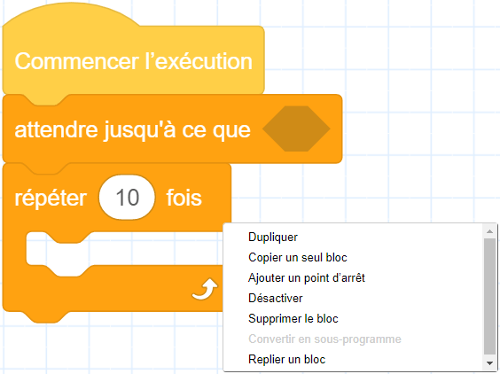

 

- **Copier** : cliquez avec le bouton droit de la souris sur un bloc qui a été placé dans le canevas (l'opération correspondante sur le côté mobile est un appui long, le même ci-dessous) pour ouvrir le menu, qui vous permet de copier le bloc sélectionné et tous les blocs connectés en dessous, ou de copier un seul bloc sélectionné (s'il y a d'autres blocs imbriqués dans le bloc sélectionné, ils seront copiés ensemble).
- **Ajouter/supprimer des points d'arrêt** : pour les blocs qui prennent en charge les points d'arrêt, cliquez avec le bouton droit de la souris et sélectionnez **Ajouter un point d'arrêt**, le marqueur de point d'arrêt  est représenté ci-dessous ; à ce stade, le bouton **Ajouter un point d'arrêt** devient **Supprimer un point d'arrêt**. Lorsque le programme atteint le bloc auquel des points d'arrêt ont été ajoutés, il marque une pause. À ce moment-là, le curseur reste sur le bloc du point d'arrêt et ce dernier n'est pas exécuté. Pour un bloc auquel un point d'arrêt a été ajouté, cliquez avec le bouton droit de la souris et sélectionnez **Supprimer le point d'arrêt** pour supprimer le point d'arrêt du bloc actuel.

 

  
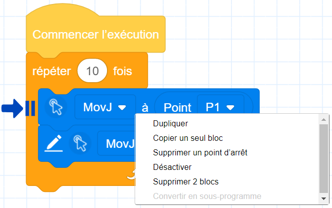

  
<b> Description : </b>
<ul><li>En mode pause du programme, vous pouvez ajouter ou supprimer des points d'arrêt. </li><li>Seuls les blocs sous <b>Démarrer l'exécution</b> et <b>sous-programme</b> dans la programmation des blocs prennent en charge l'ajout de points d'arrêt. </li><li>Si vous ajoutez un point d'arrêt à tout le sous-programme (sans ajouter de points d'arrêt aux blocs internes du sous-programme), le bloc du sous-programme s'affichera de la manière suivante :  
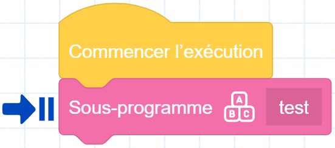
 </li><li>Si vous ajoutez également des points d'arrêt aux autres blocs internes du sous-programme, le bloc du sous-programme s'affichera de cette façon :  
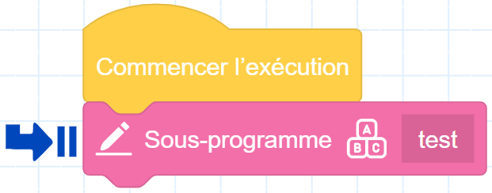
</li><li>Les blocs auxquels vous avez ajouté des points d'arrêt, s'ils sont repoussés vers la barre de menu ou en dehors de <b>Commencer l’exécution</b> et <b>Sous-programme</b>, la fonction de point d'arrêt est automatiquement désactivée. </li></ul>

   

- **Désactiver** : sélectionnez le bloc, faites un clic droit et sélectionnez **Désactiver**, le bloc actuel est désactivé et le bloc devient gris ; pendant ce temps, vous pouvez observer le script du bloc désactivé se transformer en contenu de commentaire grâce au bouton **Afficher le script**. Les blocs désactivés ne peuvent pas ajouter de points d'arrêt, et les blocs auxquels des points d'arrêt ont déjà été ajoutés les effacent lorsqu'ils sont désactivés.

- **Supprimer** : les utilisateurs peuvent supprimer des blocs de trois manières différentes.
  
  - Faites glisser le bloc vers le menu de gauche et relâchez-le.
  - Faites glisser le bloc vers l'icône de la corbeille en bas à droite de la page et relâchez-le.
  - Cliquer avec le bouton droit de la souris sur le bloc pour ouvrir le menu et sélectionner **Supprimer** (si d'autres blocs sont imbriqués dans le bloc sélectionné, ils seront supprimés ensemble).

- **Transformer en sous-programme** : cliquez avec le bouton droit de la souris sur un groupe de blocs qui ne sont pas connectés à **Start Run** ou **Subthread Start** pour ouvrir le menu et sélectionner **Change to Subroutine** pour convertir le groupe de blocs en un sous-programme. Après le passage à une sous-routine, l'utilisateur peut remplacer ce groupe de blocs par un seul bloc de sous-routine, ce qui facilite la réutilisation et améliore l'efficacité de la programmation. **Cette opération n'est pas valide dans l'interface d'édition des sous-programmes.**

- **Pliage/développement des blocs** : cliquez avec le bouton droit de la souris sur un bloc imbriqué pour plier ou développer le type de blocs imbriqués afin d'en faciliter la visualisation et l'édition. Le pliage d'un bloc efface les points d'arrêt et l'ajout de points d'arrêt à un bloc plié est désactivé.

Cliquez sur l'icône  située à droite du canevas pour passer à l'état d'édition.

Dans l'état d'édition, les utilisateurs peuvent sélectionner plusieurs blocs ou tous les blocs pour les copier, les désactiver, les décocher ou les supprimer.

Cliquer sur **Quitter l'édition** ou effectuer d'autres opérations dans la zone de programmation permet de quitter l'état d'édition. 

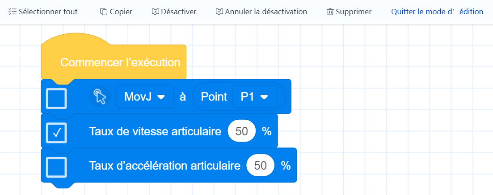

 

Pour plus d'informations sur les blocs, cliquez sur l'icône  dans le coin supérieur droit du menu des blocs, qui est le même que celui de [l'annexe B](../blockly/blockly_manual.md).
