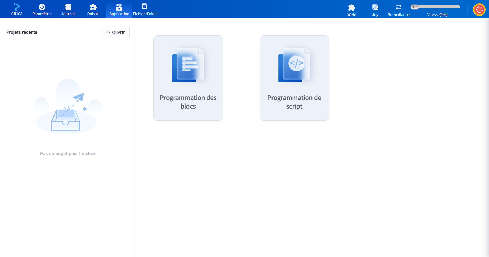
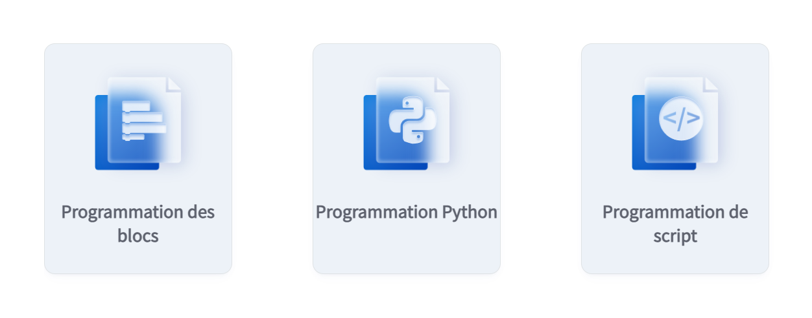

# 6.1 Sélection du type d'application

Les utilisateurs peuvent choisir la méthode appropriée pour créer des projets dans l'interface d' **Application** afin de contrôler le robot pour qu'il fonctionne automatiquement.

 

- **[Programmation des blocs](blockly.md)** : méthode de programmation graphique, simple et facile à démarrer.
- **[Programmation de script](script.md)** : méthode de programmation basée sur le langage de programmation Lua, adaptée aux utilisateurs ayant des bases en programmation.

- **[Programmation Python](python.md)** : basée sur le langage de programmation Python, disponible uniquement lors de la connexion du robot Magician E6 au PC, utilisée pour l'enseignement et la recherche.
  
  

 

Les projets récemment ouverts seront affichés sous **Projets récents**, cliquer sur le bouton **Ouvrir** un projet fera apparaître la boîte de sélection du projet, et les significations des icônes à gauche du nom du projet sont les suivantes.

-  : Programmation des blocs
-  : Programmation de script
-  : Programmation Python