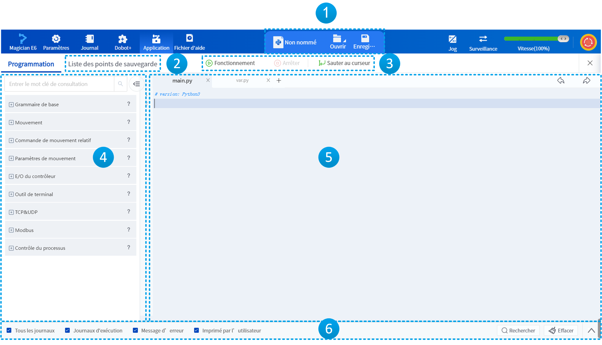
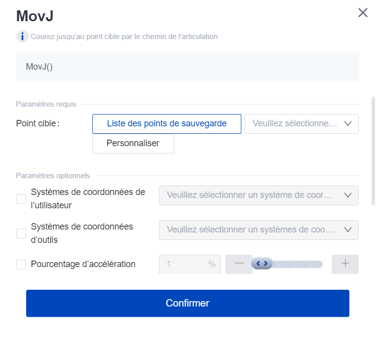

# 6.4 Programmation Python (Magician E6)

<h2 id="overview" class="m3">6.4.1 Généralités</h2>

**La programmation Python n'est prise en charge que lors de la connexion du robot Magician E6 à partir du PC.**
Le robot Dobot fournit de riches interfaces API Dobot, telles que des commandes de mouvement, des commandes TCP/UDP, etc., en langage Python, ce qui est pratique pour les utilisateurs lors du développement secondaire. DobotStudio Pro fournit un environnement de programmation Python, de sorte que les utilisateurs peuvent écrire leurs propres programmes Python pour contrôler le fonctionnement du robot.

**Projet** : la programmation Python est éditée et exécutée en tant que projet, ce qui facilite le débogage. L'accès à la page de programmation par l'icône de la page d'accueil de l'application crée par défaut un nouveau projet sans nom, qui doit être nommé et sauvegardé après la programmation avant d'être débogué et exécuté. Le projet est enregistré dans le contrôleur du bras robotique et prend en charge l'importation et l'exportation.

Un projet comprendra les fichiers Python suivants, qui sont affichés sous forme d'onglets :

- Le fichier **main.py** est le **thread principal** et peut appeler n'importe quelle instruction.<br/>
- Le fichier **var.py** est utilisé uniquement pour définir des variables.<br/>
- 0 à 4 **sous-filières** nommées **script1.py**~**script4.py**. Programmes parallèles exécutés avec le programme principal, pour lesquels vous pouvez définir les E/O et les variables, mais lesquels ne peuvent appeler aucune commande de mouvement.

<br/>

Après le démarrage du projet, le robot exécute les instructions du fil principal et des fils secondaires un par un, de haut en bas, et l'utilisateur n'a pas besoin de définir la fonction d'entrée (principale). Pour plus d'informations sur la syntaxe de base de Python, veuillez vous référer à l'[annexe E](..\python\Base.md).
**Points de sauvegarde** : au cours du processus de programmation, l'utilisateur peut déplacer le robot à tout moment en le touchant ou en le faisant glisser, puis ouvrir la liste des points de sauvegarde pour enregistrer la position actuelle du robot en tant que point d'apprentissage. Les points d'apprentissage de la liste des points de sauvegarde sont liés au projet et peuvent être utilisés comme paramètres de la commande. Si vous souhaitez enregistrer des points d'apprentissage pouvant être appelés dans plusieurs projets, utilisez des [variables globales](../monitoring/global_var.md).

L'interface principale de la Programmation Python est illustrée ci-dessous.

<div align=center></div>

<br/>

<table width="100%">
  <colgroup>
    <col style="width: 10%">
    <col style="width: 90%">
  </colgroup>
  <tr>
    <th>Numéro de série</th>
    <th>Description</th>
  </tr>
  <tr>
    <td style="text-align:center">1</td>
    <td>Pour afficher la désignation du projet et gérer les projets. </td>
  </tr>
  <tr>
    <td style="text-align:center">2</td>
    <td>Cliquez pour ouvrir l'interface des points de sauvegarde, utilisée pour gérer les points de sauvegarde dans les projets. </td>
  </tr>
  <tr>
    <td style="text-align:center">3</td>
    <td>Boutons relatifs à l'exécution du projet. </td>
  </tr>
  <tr>
    <td style="text-align:center">4</td>
    <td>Pour rechercher et utiliser les fonctions de programmation. Cliquez sur pour consulter le document de description de la fonction. </td>
  </tr>
  <tr>
    <td style="text-align:center">5</td>
    <td>Zone d'édition du programme, vous pouvez cliquer sur les onglets pour basculer entre les fichiers Python ou cliquer sur + pour ajouter un sous-filière. <br/>Cliquez suren haut à droite pour annuler/refaire une opération de programmation. </td>
  </tr>
  <tr>
    <td style="text-align:center">6</td>
    <td>Barre des journaux d'exécution, utilisée pour consulter les journaux d'exécution du projet. <ul><li>Cliquez sur l'icône la plus à droite pour développer ou réduire la zone d'affichage des journaux ; </li><li>Les options à gauche permettent de filtrer les types de journaux affichés ; </li><li>Cliquez sur  <b>Rechercher</b> pour trouver un caractère spécifié dans les journaux ;</li><li>Cliquez sur  <b>Effacer</b> pour vider la zone d'affichage des journaux. </li></td>
  </tr>
</table>

<h2 id="project" class="m3">6.4.2 Gestion de projet</h2>

Lorsque vous ouvrez l'interface de script, une nouvelle page de projet vierge est affichée par défaut, et le nom du projet **n'est pas nommé**.

Cliquer sur  pour ouvrir le menu Fichier pour créer, ouvrir, enregistrer, importer ou exporter un projet.

Cliquer sur  pour enregistrer le projet actuel. Saisir une désignation d'abord si le projet n'est pas encore nommé.

DobotStudio Pro sauvegarde automatiquement le projet dans les scénarios suivants :

- DobotStudio Pro vérifie toutes les dix minutes si le projet actuellement ouvert a été modifié ; si c'est le cas, il sauvegarde automatiquement le projet en cours sur le contrôleur.<br/>
- Avant que le projet ne commence à s'exécuter, DobotStudio Pro vérifie si le projet actuellement ouvert a été modifié ; si c'est le cas, il sauvegarde automatiquement le projet actuel sur le contrôleur.<br/>
- Lorsque DobotStudio Pro est déconnecté du contrôleur (déconnexion active ou déconnexion anormale), DobotStudio Pro vérifie s'il y a des modifications au projet actuellement ouvert ; si c'est le cas, il sauvegarde automatiquement le projet en cours sur le local (PC ou tablette).<br/>

La sauvegarde sur le contrôleur et le projet local peuvent être ouverts via l'option **Ouvrir le projet** de sauvegarde du menu .

<h2 id="point" class="m3">6.4.3 Points de sauvegarde</h2>

L'utilisateur peut déplacer le robot jusqu'à la position souhaitée en le [jog](../operation/jog_oper.md) ou en le [faisant glisser](../operation/drag.md), puis enregistrer la position dans la liste des points de sauvegarde.

<div class="info1"><b> Description : </b><div>Lorsque la liste des points de sauvegarde est ouverte, appuyez sur le bouton <b>POINT</b> sur le côté de la rotule finale du CR20A pour ajouter un point d’enseignement. </div></div>

<br/>

 <div align=center></div>

<br/>

<table width="100%">
  <tr>
    <th>Numéro de série</th>
    <th>Description</th>
  </tr>
  <tr>
    <td style="text-align:center">1</td>
      <td><ul><li>Cliquez sur le bouton  <b>Point d’ajout</b> pour enregistrer la position actuelle du robot comme un nouveau point d’enseignement. </li><li>Après avoir sélectionné un point d’enseignement, cliquez sur le bouton  <b>Remplacer</b> pour remplacer ce point par la position actuelle du robot. </li><li>Après avoir sélectionné un point d’enseignement, cliquez sur le bouton  <b>Supprimer</b> pour effacer ce point. </li><li>Cliquez sur <b>Filtrage par alias</b> pour filtrer et afficher dans la liste les points correspondant aux critères spécifiés. </li></ul></td>
  </tr>
  <tr>
    <td style="text-align:center">2</td>
    <td>Liste des points d’enseignement. Après avoir sélectionné un point d’enseignement, cliquez sur n'importe quelle valeur autre que <b>NO.</b> et <b>Point</b> pour modifier directement cette valeur. </td>
  </tr>
  <tr>
    <td style="text-align:center">3</td>
    <td>Contrôlez le robot pour qu'il se déplace vers le point sélectionné en utilisant le mode de mouvement spécifié. </td>
  </tr>
</table>

<br/>

La position du point sélectionné dans la liste de sauvegarde s'affiche sous la forme d'un contour bleu dans la zone de simulation du panneau de pointage et de clic, comme le montre la figure ci-dessous.

<div align=center></div>

<h2 id="program" class="m3">6.4.4 Programmation</h2>

L'utilisateur peut insérer des commandes de la manière centralisée suivante :

- Recherchez la fonction que vous souhaitez utiliser dans le menu Fonction à gauche et cliquez sur  sur le côté droit de celle-ci pour afficher la fenêtre de réglage des paramètres. Définir les paramètres dans la fenêtre et cliquer sur <b>Confirmer</b> pour ajouter une commande paramétrée à la position du curseur dans la zone de programmation.

<div align=center></div>

  <br />
  
- Recherchez la fonction que vous souhaitez utiliser dans le menu de gauche et double-cliquez dessus pour insérer rapidement l'instruction dans la zone de programmation avec le paramètre par défaut, puis modifiez la valeur du paramètre en fonction de vos besoins.
- Tapez le programme directement dans la zone de programmation de droite et prenez en charge l'autocomplétion des instructions à l'aide de la touche TAB du clavier.

Avant de commencer la programmation, définissez la fonction que vous souhaitez réaliser. Cette section décrit comment écrire un projet de script en donnant un exemple d'écriture d'un programme pour contrôler le robot afin qu'il se déplace cycliquement entre deux points.

1. Ajoutez le point de départ P1 et le point d'arrivée P2 du mouvement cyclique du robot dans l'ordre dans la page Enregistrer les points.

2. Ajoutez la fonction de boucle `while`.

3. Ajoutez une instruction de déplacement `MovJ` au code de la boucle avec le point cible P1.

4. Ajoutez une autre instruction de déplacement `MovJ` avec le point cible P2. Le code final est le suivant.

```python
while True:
    MovJ(P1)
    MovJ(P2)
```

A ce stade, un programme simple de mouvement cyclique a été écrit.

Si vous avez besoin d'écrire un sous-programme, vous pouvez cliquer sur <b>+</b> sur le côté droit de l'onglet en haut de la zone de programmation, puis passer à l'onglet Sub-Thread pour écrire le programme.

Pour plus d'informations sur les scripts, cliquez sur  dans le menu Fonctions, qui est le même que celui de [l'annexe E](..\python\python_manual.md).