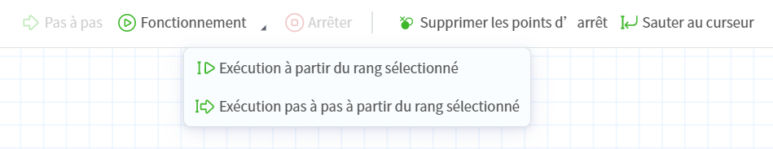
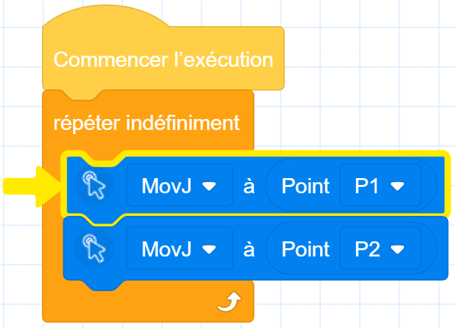

# 6.5 Débogage et exécution (programmation des blocs/scripts)

<b> Attention : </b>
Avant de démarrer le débogage ou l'exécution du projet, assurez-vous qu'il n'y a personne ni aucun obstacle dans la zone de travail du robot. 

 

Les fonctions relatives à l'exécution en une seule étape, à l'exécution à partir de la ligne sélectionnée, à l'exécution en une seule étape à partir de la ligne sélectionnée et à l'effacement des points d'arrêt ne sont disponibles que pour la programmation par blocs et la programmation par scripts.
Voici un exemple de programmation par blocs pour illustrer les fonctions des icônes de débogage et d'exécution :

 

<table width="100%">
  <colgroup>
    <col style="width: 30%">
    <col style="width: 70%">
  </colgroup>
  <tr>
    <th>Icône</th>
    <th>Description</th>
  </tr>
  <tr>
    <td style="text-align:center"> Pas à pas</td>
      <td>En état de pause, cliquez sur le bouton  <b>Pas à pas</b>, la ligne actuellement surlignée sera exécutée jusqu'à son terme, puis le curseur passera à la ligne suivante ou à une autre ligne (entrée de fonction, retour, goto, etc.) avant que le script ne s'arrête à nouveau, mettant fin à la commande d'exécution pas à pas. </td>
  </tr>
  <tr>
    <td style="text-align:center">Exécuter</td>
      <td>Ouvrez le projet, puis cliquez sur le bouton  <b>Exécuter</b> pour démarrer l'exécution du programme en un clic. À ce moment, l'utilisation du bouton <b>Pas à pas</b> et du bouton <b>Supprimer les points d’arrêt</b> est interdite, ainsi que l'ajout ou la suppression de points d'arrêt. </td>
  </tr>
  <tr>
    <td style="text-align:center"> Exécution à partir du rang sélectionné</td>
    <td><ul>
        <li>Démarrer l'exécution du programme à partir du rang sélectionné. </li><li>Lorsque le rang sélectionné ne peut pas être sautée (par exemple, une ligne vide, une ligne de commentaire ou une ligne sans instruction), le logiciel affichera une fenêtre contextuelle indiquant l'échec et n'exécutera pas le programme. </li>
        </ul></td>
  </tr>
  <tr>
    <td style="text-align:center"> Exécution pas à pas à partir du rang sélectionné</td></td>
    <td>Exécuter une instruction à partir du rang sélectionné, puis passer en état de pause une fois l'exécution terminée. </td>
  </tr>
  <tr>
    <td style="text-align:center"> Arrêter</td>
    <td>Cliquez pour arrêter l’exécution du projet. </td>
  </tr>
  <tr>
    <td style="text-align:center">Supprimer les points d’arrêt</td>
    <td><ul>
        <li>Effacer tous les points d'arrêt du projet actuel (les méthodes d'ajout de points d'arrêt sont décrites dans <a href="blockly.md">Programmation des blocs</a> et <a href="script.md">Programmation de script</a>). </li><li>Il est interdit d'utiliser le bouton <b>Supprimer les points d’arrêt</b> pendant l'exécution du programme. </li><li>Créer, ouvrir un projet ou enregistrer sous effaceront les points d'arrêt de la zone de travail. </li>
        </ul></td>
  </tr>
  <tr>
    <td style="text-align:center"> Sauter au curseur</td>
      <td>Lors du débogage ou de l'exécution, l'interface mettra en évidence l'instruction en cours d'exécution (comme illustré dans la figure ci-dessous pour la programmation des blocs). L'utilisateur peut cliquer sur le bouton  <b>Sauter au curseur</b> pour se positionner rapidement sur la ligne mise en évidence.  

  </tr>
</table>

 

<b> Description : </b>
<ul><li>Pour la programmation de script, seul src0.lua prend en charge <b>Exécution à partir du rang sélectionné</b> et <b>Exécution pas à pas à partir du rang sélectionné</b> ; le rang sélectionné correspond à la ligne où se trouve le curseur d'entrée, qui est mise en évidence en bleu dans le programme. </li><li>Pour la programmation des blocs, seuls les blocs sous <b>Commencer l’exécution</b> prennent en charge <b>Exécution à partir du rang sélectionné</b> et <b>Exécution pas à pas à partir du rang sélectionné</b> ; le rang sélectionné correspond au bloc sélectionné, qui devient plus épais et plus large (appui long de 300 ms sur mobile, appui long de 100 ms sur PC). </li></ul>

 

**Surveillance du programme**

Les utilisateurs peuvent surveiller le projet en cours d'exécution à l'aide de [variables de programme](../monitoring/program_var.md) ou en **passant au curseur**.
**Exécution avec des signaux externes (Programmation des blocs/Programmation de script)**

Les utilisateurs peuvent également exécuter le projet spécifié à l'aide d'un signal externe ([E/S](../monitoring/io_monitor_ctrl_dio.md) ou [Modbus](../monitoring/modbus.md)), si les utilisateurs modifient le projet, le logiciel ouvre une fenêtre pour inviter les utilisateurs à effectuer une sauvegarde, les utilisateurs reviennent à la page d'accueil du logiciel après avoir choisi de sauvegarder ou non ; si le projet que les utilisateurs modifient est le projet à exécuter, le robot exécute le projet sauvegardé la dernière fois ; si vous avez besoin d'exécuter le contenu de cette modification, veuillez ouvrir le fichier de sauvegarde après avoir interrompu le projet déclenché par le signal externe. Si vous souhaitez exécuter le contenu de cette édition, ouvrez le fichier de sauvegarde après avoir arrêté le projet déclenché par le signal externe, puis exécutez-le après avoir terminé l'édition et la sauvegarde.

Si le projet déclenché par un signal externe est ouvert ou reconnecté au robot, une fenêtre contextuelle indique que le projet est en cours d'exécution, et l'utilisateur peut choisir d'arrêter le projet ou d'entrer dans le projet en cours d'exécution pour vérifier et contrôler l'état d'exécution.