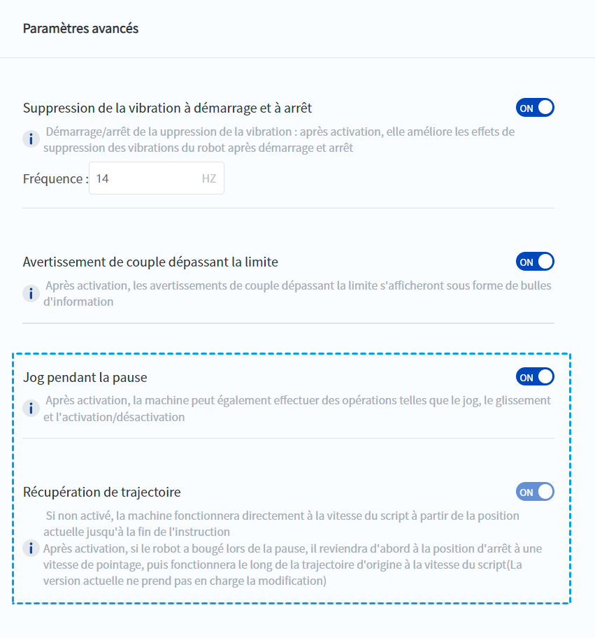
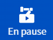
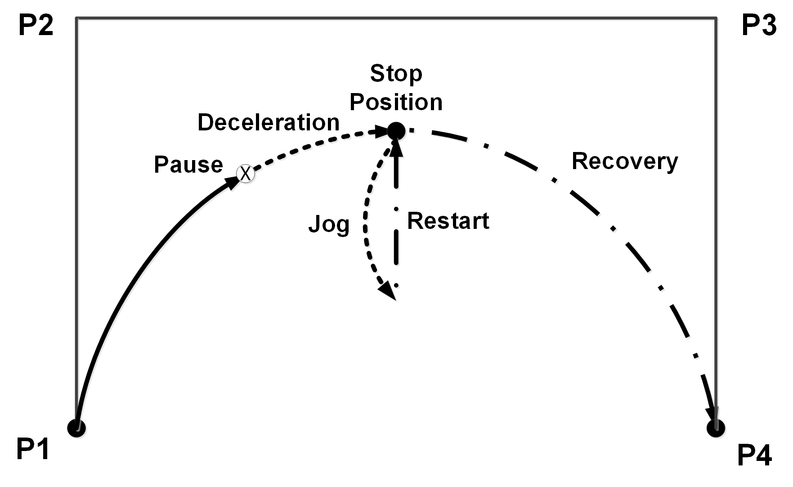
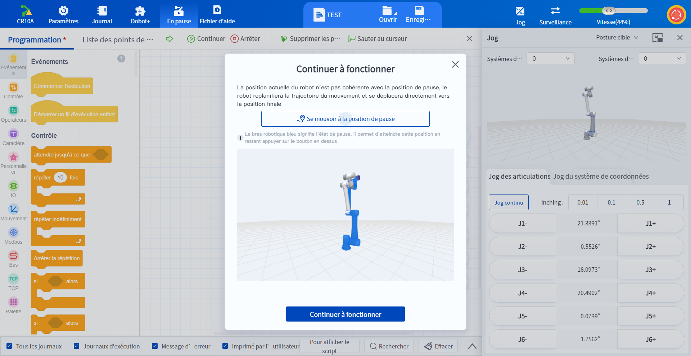
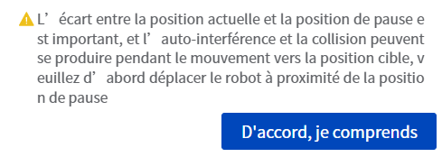

# 6.6 Réinitialiser le trajectoire

Lorsque le robot est en pause, la fonction de reprise de trajectoire peut automatiquement courir jusqu'au point de pause et continuer à fonctionner normalement selon le programme d'origine.

**La fonction de reprise de trajectoire est activée par défaut et ne peut pas être désactivée.**

 

Si le bouton de **prise en charge de l'état de pause** est également activé, après que le robot a déclenché un événement de pause, il est autorisé à effectuer des opérations telles que taper, faire glisser, passer en mode manuel, passer en mode automatique, activer le haut, activer le bas, etc. sur le robot.

<b> Attention : </b>
Lorsque le robot déclenche une alarme (y compris une alarme causée par une arrêt d'urgence), il entre dans un état de pause. 

 

<b> Description : </b>
Il est possible de déterminer si le programme est en pause ou arrêté en examinant le style de l'icône <b>Application</b> sur l'interface principale :<ul><li> indique qu'il s'agit d'un état de pause. </li> <li> indique qu’il s’agit d’un état d'arrêt. </li></ul>

 

 

**Réinitialiser le trajectoire**

Lorsque le robot est en état de pause, après avoir activé la fonction de récupération de la trajectoire, le robot se déplace d'abord lentement jusqu'à la position de pause à la vitesse de pointage, puis reprend la vitesse de défilement du script pour continuer à exécuter le programme, avec la trajectoire de défilement sans décalage. Comme indiquée dans la figure ci-dessous.

Lorsque le robot est en pause, cliquez sur le bouton **Continuer**  de la page de programmation, le système détermine automatiquement s'il existe un écart entre la position actuelle du robot et la position initiale du robot lorsqu'il entre en pause. S'il n'y a pas d'écart entre la position actuelle du robot et la position à laquelle il est entré en état de pause, le robot continuera à exécuter le programme selon la trajectoire d'origine.
S'il existe un écart entre la position actuelle du robot et la position à laquelle il est entré en état de pause, l'interface d'invite suivante s'affiche :

 

Cliquez sur **Continuer à fonctionner**, le robot continue à se déplacer en fonction de l'effet de l'ouverture de la récupération de la trajectoire.
L'écart entre la position actuelle et la position de pause est important, et l'auto-interférence et la collision peuvent se produire pendant le mouvement vers la position cible, veuillez d'abord déplacer le robot à proximité de la position de pause

 

À ce moment-là, un appui long sur **Se mouvoir à la position de pause** permet de déplacer le robot vers la position du point de pause.
