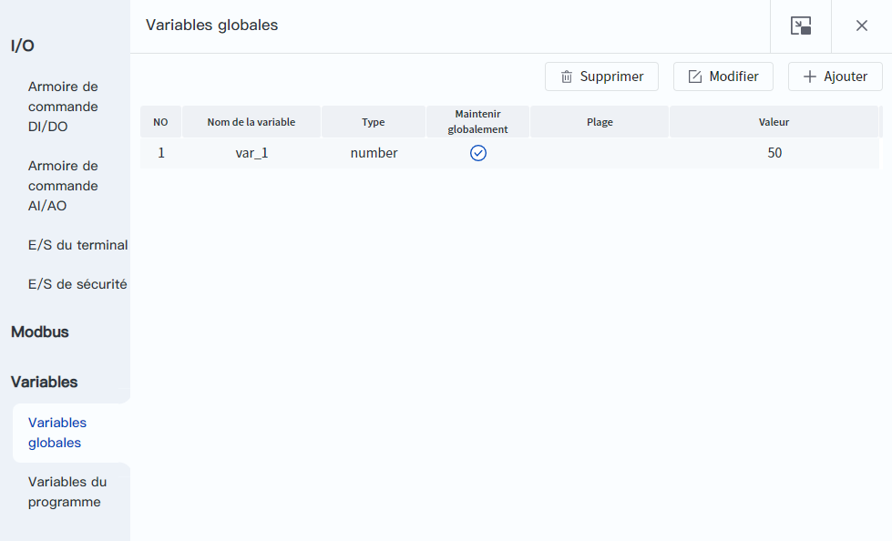
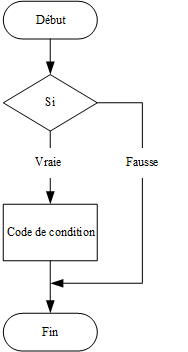
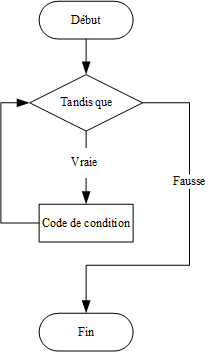
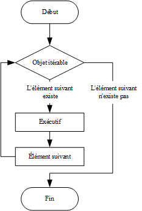

# Grammaire de base

<div class="info1"><b> Description : </b><div>Les lecteurs de ce manuel devraient déjà avoir des connaissances de base en programmation Python. Ce manuel présente une sélection de syntaxes de base de Python, afin de vous permettre de consulter rapidement les informations dont vous avez besoin. </div></div>

<br/>

**Le langage Python est sensible à la casse, et la casse de tous les identificateurs (noms de variables, noms de fonctions, etc.) dans un programme doit être cohérente avec les exemples fournis dans ce manuel.**

### Variables

Les variables sont utilisées pour stocker des valeurs, qui sont transmises en tant qu'arguments ou renvoyées en tant que résultats. En Python, les variables n'ont pas besoin d'être déclarées ; elles sont utilisées après leur affectation.

Le signe égal permet d'attribuer des valeurs aux variables, et le double signe égal permet de déterminer si les côtés gauche et droit d'une expression sont égaux.

En plus des règles de cadrage propres à Python, vous pouvez définir des variables globales au niveau du contrôleur qui peuvent être appelées directement à partir de différents projets au sein du même contrôleur via la page **Surveillance > Variables globales** de DobotStudio Pro.

<div align=center></div>

<br/>

L'exemple suivant est utilisé pour illustrer la fonctionnalité de délimitation et de maintien global des variables globales du contrôleur.

```python
'''
Fichier main.py du projet 1
Supposons que deux variables globales, g1 et g2, ont été ajoutées dans la page des variables globales.
g1 n'est pas en Maintenir globalement et a pour valeur 10.
g2 est en Maintenir globalement et a pour valeur 20.
'''

a = 1
print(a)        --> 1

print(g1)           --> 10
print(g2)           --> 20
g1=11  # Assigner une valeur à une variable globale qui n'est pas en Maintenir globalement
g2=22  # Assigner une valeur à une variable globale qui est en Maintenir globalement
print(g1)           --> 11
print(g2)           --> 22

'''
Fichier main.py du projet 2
Le projet 2 s'exécute après le projet 1.
'''

print(a)        # La variable n'existe pas
print(b)        # La variable n'existe pas
print(g1)       # 10 (les variables non en Maintenir globalement sont restaurées à leur valeur avant la modification dans le projet 1)
print(g2)       # 22 (les variables en Maintenir globalement deviennent la valeur après la modification dans le projet 1)
```

Python prend en charge une variété de types de données, y compris les nombres, les booléens, les chaînes, les listes et les dictionnaires, qui sont couramment utilisés dans la conception de l'API de Dobot.

**Chiffre**

Les nombres en Python prennent en charge int (entiers longs), float (flottants à double précision), bool (booléens) et complex (nombres complexes).

```python
var1 = 1
var2 = 10
```

**Booléen**

Les types booléens n'ont que deux valeurs optionnelles : True et False. En Python, True est égal au nombre 1 et False est égal au nombre 0 et peut être utilisé pour des opérations numériques. En outre, tous les nombres non nuls et les chaînes, listes, dictionnaires et autres types de données non vides sont considérés comme vrais ; seuls 0, les chaînes vides, les listes vides, les dictionnaires vides, etc. sont considérés comme faux.

```python
print(2 < 3)   # True
print(2 == 3)  # False

a = True
b = False
print(a and b)  # False
print(a or b)   # True
print(not a)    # False
```

**Chaîne de caractères**

En Python, les chaînes de caractères sont placées entre guillemets simples ou doubles et peuvent être concaténées à l'aide d'un signe plus.

```Python
str1 = 'Dobot'
str2 = " Robot"
print(str1 + str2)  # Dobot Robot
```

Les chaînes peuvent être indexées par des indices avec 0 comme valeur de départ et -1 comme position de départ à partir de la fin. Le format syntaxique pour l'interception des chaînes est le suivant:  `Variable [indice_début:indice_fin]`. Les chaînes ne peuvent pas être modifiées. Vous pouvez assigner une nouvelle chaîne à une variable, mais vous ne pouvez pas modifier un caractère d'une chaîne en l'indexant.

```python
str1 = 'Dobot'
print(str1[0])    # D
print(str1[-1])   # t
print(str1[0:2])  # Dob
```

**Liste des commandes**

Une liste est une liste d'éléments écrits entre crochets et séparés par des virgules. Les listes, comme les chaînes, peuvent être concaténées par un signe plus et indexées par des indices. Contrairement aux chaînes de caractères, les listes peuvent être modifiées et vous pouvez modifier un élément d'une liste individuellement en l'indexant.

```python
list1 = [1, 2, 3]
list2 = ["a", "b", "c"]
print(list1 + list2)     # [1, 2, 3, "a", "b", "c"]
print(list1[0])          # 1
list1[0] = "a"
print(list1)             # ["a", 2, 3]
del list[2]              # Supprimer le troisième élément de la liste
```

**Dictionnaires**

Un dictionnaire est une collection d'éléments "clé : valeur" écrits entre accolades et séparés par des virgules. Les dictionnaires sont indexés par clé, et les clés doivent donc être uniques. Les dictionnaires peuvent être ajoutés, supprimés ou modifiés par clé.

```python
dict1 = {"user" : 1, "tool" : 0, "a" : 20, "v" : 50, "cp" : 100}
print(dict1["user"])      # 1
dict1["tool"] = 1         # Modifier la valeur de tool dans le dictionnaire à 1
dict1["r"] = 5            # Si la clé n'existe pas dans le dictionnaire, une nouvelle paire clé-valeur sera ajoutée au dictionnaire.
del dict1["r"]            # Supprimer la paire clé-valeur spécifiée
```

### Contrôle des flux

**Directive de jugement conditionnel Si**

La directive si exécute différents blocs de code en fonction du résultat du jugement conditionnel.



La forme standard d'une instruction si en Python est la suivante, où elif et else ne sont pas nécessaires :

```python
if condition_1:
    statement_block_1
elif condition_2:
    statement_block_2
else:
    statement_block_3
```

- Si "condition_1" est Vraie, le bloc "statement_block_1" est exécuté.

- Si "condition_1" est Fausse, alors "condition_2" est jugée.

- Si "condition_2" est Vraie, le bloc "statement_block_2" est exécuté.

- Si "condition_2" est Fausse, le bloc "statement_block_3" est exécuté.

Les instructions si peuvent être imbriquées, comme le montre l'exemple ci-dessous.

```python
a = 100;
b = 200;
# Condition de vérification
if a == 100:
	# Exécuter l'instruction suivante si la condition si est vraie.
	if b == 200:
        # Exécuter ce bloc d'instructions si la condition si est vraie.
        print("la valeur de a est : ", a )  # Valeur de a : 100
		print("la valeur de a est : ", b )  # Valeur de b : 200
else:
    # Exécuter ce bloc d’instructions si la première condition si est fausse
    print("a n’est pas égal à 100")
```

**L'instruction de boucle tandis que**

L'instruction tandis que exécute en boucle des blocs de code en fonction de conditions.



La forme standard de l'instruction tandis que en Python est la suivante.

```python
while condition：
    statement_block
```

- Si la "condition" est vraie, le bloc "statement_block" est exécuté et la "condition" est réévaluée.
- Si la "condition" est Fausse, le bloc "statement_block" est ignoré et les instructions suivantes sont exécutées.

Exemple :

```python
a=10
while a < 20
	print("la valeur de a est :", a)  # Exécuté 10 fois, les valeurs de sortie vont de 10 à 19
	a = a+1
```

**L'instruction de boucle for**

La directive for peut itérer sur n'importe quel objet itérable, tel qu'une liste ou une chaîne de caractères, et boucler le bloc en fonction du nombre de fois qu'il est itéré.



La forme standard de l'instruction for en Python est la suivante.

```python
for variable in sequence:
    statement_block
```

sequence est un itérable et variable est une variable à parcourir sur l'itérable.

1. Le système affecte d'abord le premier élément de la séquence à la variable, puis exécute l'instruction "statement_block bloc_déclaration".
2. S'il existe un élément suivant dans la séquence, le système affecte l'élément suivant à la variable et exécute le "bloc_déclaration". Le "bloc_déclaration" est exécuté à nouveau.
3. Répétez l'opération jusqu'à ce que tous les éléments de la séquence aient été parcourus.

Exemple :

```python
joint = [j1,j2,j3,j4,j5,j6]
for angles in joint:
    print(angles)   # Exécuté 6 fois, sortir les valeurs de j1 à j6
```