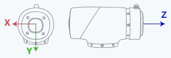
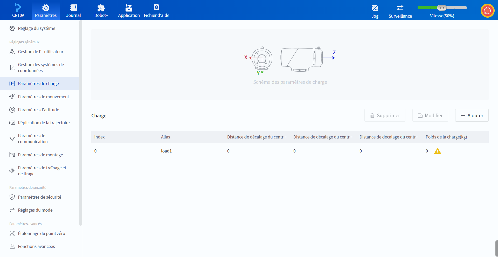

# Paramètres de mouvement

<h3 class="lua-cmd" id="list" >Liste des commandes</h3>

La fonction de paramètre de mouvement est utilisée pour définir ou obtenir les paramètres liés au mouvement du bras du robot, **veuillez lire la [description générale](common.md) avant de l'utiliser**.

| Instruction| Fonction|
|----------|----------|
| [CP](#cp)| Définir le taux de transition lisse|
| [VelJ](#velj)| Définir le taux de vitesse du mouvement articulaire|
| [AccJ](#accj)| Définir le taux d'accélération du mouvement articulaire|
| [VelL](#vell)| Définir le taux de vitesse du mouvement linéaire et arc|
| [AccL](#accl)| Définir le taux d'accélération du mouvement linéaire et arc|
| [Facteur de vitesse](#speedfactor)| Définit le facteur de vitesse global du bras|
| [SetPayload](#setpayload)| Définir la charge terminale|
| [Utilisateur](#user)| Définir le système de coordonnées d'utilisateurs global|
| [SetUser](#setuser)| Modifier le système de coordonnées d'utilisateurs|
| [CalcUser](#calcuser)| Calculer le système de coordonnées d'utilisateurs|
| [Outil](#tool)| Définir le système de coordonnées d'outils global|
| [SetTool](#settool)| Modifier le système de coordonnées d'outils spécifié|
| [CalcTool](#calctool)| Calculer le système de coordonnées d'outils|
| [GetPose](#getpose)| Obtenir en temps réel la posture du bras dans le système de coordonnées articulaire|
| [GetAngle](#getangle)| Obtenir l'angle d'articulation en temps réel du bras|
| [GetABZ](#getabz)| Obtenir la position actuelle du codeur|
| [CheckMovJ](#checkmovj)| Vérifie l'exécution des commandes de mouvement des articulations.|
| [CheckMovL](#checkmovl)| Vérifie l'exécution des commandes de mouvement linéaire ou d'arc.|
| [SetSafeWallEnable](#setsafewallenable)| Activez ou désactiver le mur de sécurité désigné|
| [SetWorkZoneEnable](#setworkzoneenable) | Activez ou désactiver le mur de sécurité désigné|
| [SetCollisionLevel](#setcollisionlevel)| Définir le niveau de collision|
| [SetBackDistance](#setbackdistance)| Distance de retour après collision %1|

<h3 class="lua-cmd" >CP</h3>

**Prototype :**

```python
CP(R)
```

**Description :**

Définit le ratio de transition en douceur, c'est-à-dire lorsque le bras du robot passe par plusieurs points de manière continue, que la transition par le point central soit sous forme d'angle droit ou sous forme de courbe.

Le ratio de transition douce défini par cette commande ne prend effet que dans le projet en cours, et la valeur par défaut est 0 lorsqu'il n'est pas défini.


**Paramètres obligatoires :**

R : Taux de transition lisse. Plage de valeurs : [0, 100].

**Exemple :**

```python
# Le bras robotique se déplace du point P1 au point P3 en passant par le point P2 avec une transition lisse de 50%.
CP(50)
MovL(P1)
MovL(P2)
MovL(P3)
```

<h3 class="lua-cmd" >VelJ</h3>

**Prototype :**

```python
VelJ(R)
```

**Description :**

Définit le rapport de vitesse du mode de mouvement conjoint (MovJ/MovJIO/RelMovJTool/RelMovJUser/RelJointMovJ).

Le rapport de vitesse défini par cette commande ne prend effet qu'au cours de l'exécution du projet actuel. La valeur par défaut est 100 si elle n'est pas définie.

**Paramètres obligatoires :**

R : Taux de vitesse (V) Plage de valeurs : [1,&nbsp;100].

**Exemple :**

```python
# Le bras robotique se déplace au point P1 avec un taux de vitesse de 20%.
VelJ(20)
MovJ(P1)
```

<h3 class="lua-cmd" >AccJ</h3>

**Prototype :**

```python
AccJ(R)
```

**Description :**

Définit le rapport d'accélération du mode de mouvement conjoint (MovJ/MovJIO/RelMovJTool/RelMovJUser/RelJointMovJ).

Le rapport d'accélération défini par cette commande ne prend effet qu'au cours de l'exécution du projet actuel. La valeur par défaut est 100 lorsqu'elle n'est pas définie.

**Paramètres obligatoires :**

R : Taux d'accélération. Plage de valeurs : [1,&nbsp;100].

**Exemple :**

```python
# Le bras robotique se déplace au point P1 avec un taux d’accélération de 50%.
AccJ(50)
MovJ(P1)
```

<h3 class="lua-cmd" >VelL</h3>

**Prototype :**

```python
VelL(R)
```

**Description :**

Définit le rapport de vitesse du mode de mouvement linéaire et arc (MovL/Arc/Circle/MovLIO/RelMovLTool/RelMovLUser).

Le rapport de vitesse défini par cette commande ne prend effet qu'au cours de l'exécution du projet actuel. La valeur par défaut est 100 si elle n'est pas définie.

**Paramètres obligatoires :**

R : Taux de vitesse (V) Plage de valeurs : [1,&nbsp;100].

**Exemple :**

```python
# Le bras robotique se déplace au point P1 avec un taux de vitesse de 20%.
VelL(20)
MovL(P1)
```

<h3 class="lua-cmd" >AccL</h3>

**Prototype :**

```python
AccL(R)
```

**Description :**

Définit le rapport d'accélération du mode de mouvement linéaire et d'arc (MovL/Arc/Circle/MovLIO/RelMovLTool/RelMovLUser).

Le rapport d'accélération défini par cette commande ne prend effet qu'au cours de l'exécution du projet actuel. La valeur par défaut est 100 lorsqu'elle n'est pas définie.

**Paramètres obligatoires :**

R : Taux d'accélération. Plage de valeurs : [1,&nbsp;100].

**Exemple :**

```python
# Le bras robotique se déplace au point P1 avec un taux d’accélération de 50%.
AccL(50)
MovL(P1)
```

<h3 class="lua-cmd" >SpeedFactor</h3>

**Prototype :**

```python
SpeedFactor(ratio)
```

**Description :**

Définit la vitesse de déplacement globale du bras du robot, voir la [description générale](Motion.md#common) de la commande motion pour plus de détails.

La vitesse globale définie par cette commande ne prend effet que dans l'opération de projet en cours ; si elle n'est pas définie, elle suit la valeur définie par le logiciel de commande (lorsque le script est exécuté via le logiciel de commande) ou l'instruction TCP (lorsque le script est exécuté via l'instruction TCP) avant l'exécution du script.

**Paramètres obligatoires :**

ratio : ratio de vitesse de mouvement. Plage de valeurs : [1,&nbsp;100].

**Exemple :**

```python
# Définir le facteur de vitesse global à 50%.
SpeedFactor(50)
```

<h3 class="lua-cmd" >SetPayload</h3>

**Prototype :**

```python
SetPayload(payload, [x, y, z])
SetPayload(name)
```

**Description :**

Définit le poids et les coordonnées d'excentricité de la charge d'extrémité. Cette commande prend en charge à la fois le réglage direct et le réglage par la méthode du groupe de paramètres prédéfinis. Les paramètres définis par cette commande ne prennent effet que dans le projet en cours d'exécution, en remplaçant les paramètres précédents ; ils sont rétablis aux paramètres d'origine après l'arrêt du projet.

**Paramètres obligatoires 1 :**

- charge utile : poids de la charge finale. Unité : kg.
- [x, y, z] : coordonnées excentriques de la charge d'extrémité, se référer à la figure suivante pour la direction des axes. Unité : mm.



**Exemple 1 :**

```python
# Définir la charge terminale à 1.5 kg avec des coordonnées excentriques de [0, 0, 10].
SetPayload(1.5, [0, 0, 10])
```

**Paramètres obligatoires 2 :**

- nom : le nom du groupe de paramètres de charge prédéfini, vous devez d'abord enregistrer le groupe de paramètres correspondant dans le logiciel de contrôle.



**Exemple 2 :**

```python
# Utiliser le groupe de paramètres de charge prédéfini nommé "load1" pour configurer la charge terminale.
SetPayload("load1")
```

<h3 class="lua-cmd" >User</h3>

**Prototype :**

```python
User(user)
```

**Description :**

Définir le système de coordonnées d'utilisateurs global. Si l'utilisateur ne spécifie pas le système de coordonnées de l'utilisateur au moyen du paramètre facultatif lorsqu'il invoque d'autres commandes, le système utilisera le système de coordonnées de l'utilisateur global.

Le système global de coordonnées de l'utilisateur défini par cette commande ne prend effet que dans l'opération de projet en cours, et le système global de coordonnées de l'utilisateur par défaut est le système de coordonnées de l'utilisateur 0 lorsqu'il n'est pas défini.

**Paramètres obligatoires :**

utilisateur : le système de coordonnées de l'utilisateur après la commutation, spécifié par le numéro d'index, vous devez d'abord ajouter le système de coordonnées correspondant dans le logiciel de contrôle. Si l'index du système de coordonnées spécifié n'existe pas, l'exécution du projet sera interrompue et une erreur sera signalée.

**Exemple :**

```python
# Basculer le système de coordonnées d’utilisateurs global au système de coordonnées d’utilisateurs 1.
User(1)
```

<h3 class="lua-cmd" >SetUser</h3>

**Prototype :**

```python
SetUser(index,table,type)
```

**Description :**

Modifier le système de coordonnées d'utilisateurs

**Paramètres obligatoires :**

- index : index du système de coordonnées de l'utilisateur, vous devez d'abord ajouter le système de coordonnées correspondant dans le logiciel de contrôle. Si l'index du système de coordonnées spécifié n'existe pas, l'exécution du projet sera interrompue et une erreur sera signalée.
- table : système de coordonnées utilisateur modifié, le format est [x, y, z, rx, ry, rz], il est conseillé d'utiliser la commande CalcUser pour l'obtenir.

**Paramètres facultatifs :**

- type : sauvegarde globale ou non.
  - 0 : le système de coordonnées modifié par cette commande ne prend effet que dans le projet en cours, et sera restauré à sa valeur d'origine après l'arrêt du projet.
  - 1：Le système de coordonnées modifié par cette commande est sauvegardé globalement, et la valeur sera conservée après l'arrêt du projet. Cependant, lors de la sauvegarde globale `type=1`, les utilisateurs doivent passer manuellement à l'interface de réglage du système de coordonnées correspondant, puis revenir pour voir la valeur mise à jour, c'est-à-dire qu'ils doivent rafraîchir l'interface manuellement.

**Exemple :**

```python
# Modifier le système de coordonnées d’utilisateurs 1 pour qu'il soit le nouveau système de coordonnées calculé par "CalcUser", avec effet uniquement pendant l'exécution du projet.
newUser = CalcUser(1,1,[10,10,10,10,10,10])
SetUser(1,newUser,0)
```

<h3 class="lua-cmd" >CalcUser</h3>

**Prototype :**

```python
CalcUser(index,matrix_direction,table)
```

**Description :**

Calculer le système de coordonnées d'utilisateurs

**Paramètres obligatoires :**

- index : index du système de coordonnées de l'utilisateur, plage de valeurs : [0,50], système de coordonnées de l'utilisateur 0 valeur initiale pour le système de coordonnées de base.
- matrix_direction : direction du calcul.
  - 1 : multiplication à gauche, indiquant que le système de coordonnées spécifié par l'index dévie la valeur spécifiée par la table le long du système de coordonnées de base.
  - 0 : multiplication à droite, indiquant que le système de coordonnées spécifié par l'index dévie la valeur spécifiée par la table le long du système de coordonnées de base.
- table : la valeur de décalage du système de coordonnées de l'utilisateur au format [x, y, z, rx, ry, rz].

**Retour :**

Système de coordonnées utilisateur calculé au format [x, y, z, rx, ry, rz].

**Exemple :**

```python
# Le processus de calcul ci-dessous peut être considéré comme équivalent à : un système de coordonnées initial ayant la même pose que le système de coordonnées d’utilisateurs 1, qui est translité de [x=10, y=10, z=10] et rotaté de [rx=10, ry=10, rz=10] par rapport au système de coordonnées de base, aboutissant à un nouveau système de coordonnées appelé "newUser".
newUser = CalcUser(1,1,[10,10,10,10,10,10])
```

```python
# Le processus de calcul ci-dessous peut être considéré comme équivalent à : un système de coordonnées initial ayant la même pose que le système de coordonnées d’utilisateurs 1, qui est translité de [x=10, y=10, z=10] et rotaté de [rx=10, ry=10, rz=10] par rapport au système de coordonnées d’utilisateurs 1, aboutissant à un nouveau système de coordonnées appelé "newUser".
newUser = CalcUser(1,0,[10,10,10,10,10,10])
```

<h3 class="lua-cmd" >Tool</h3>

**Prototype :**

```python
Tool(tool)
```

**Description :**

Basculer au système de coordonnées d'outils global Si l'utilisateur invoque d'autres commandes sans spécifier le système de coordonnées de l'outil au moyen de paramètres facultatifs, le système utilisera le système de coordonnées global de l'outil.

Le système global de coordonnées de l'outil défini par cette commande ne prend effet que dans le projet en cours d'exécution ; s'il n'est pas défini, le système global de coordonnées de l'outil par défaut est le système de coordonnées de l'outil 0.

**Paramètres obligatoires :**

outil : le système de coordonnées de l'outil après la commutation, spécifié par le numéro d'index, vous devez d'abord ajouter le système de coordonnées correspondant dans le logiciel de contrôle. Si l'index du système de coordonnées spécifié n'existe pas, le projet s'arrêtera et une erreur sera signalée.

**Exemple :**

```python
# Basculer le système de coordonnées d’outils global au système de coordonnées d’outils 1.
Tool(1)
```

<h3 class="lua-cmd" >SetTool</h3>

**Prototype :**

```python
SetTool(index,table,type)
```

**Description :**

Modifier le système de coordonnées d'outils

**Paramètres obligatoires :**

- index : index du système de coordonnées de l'outil, vous devez d'abord ajouter le système de coordonnées correspondant dans le logiciel de contrôle. Si l'index du système de coordonnées spécifié n'existe pas, le projet s'arrêtera et une erreur sera signalée.
- table : le système de coordonnées de l'outil modifié, le format est [x, y, z, rx, ry, rz], il est recommandé d'utiliser la commande CalcTool pour l'obtenir.

**Paramètres facultatifs :**

- type : sauvegarde globale ou non.
  - 0 : le système de coordonnées modifié par cette commande ne prend effet que dans le projet en cours, et sera restauré à sa valeur d'origine après l'arrêt du projet.
  - 1：Le système de coordonnées modifié par cette commande est sauvegardé globalement, et la valeur sera conservée après l'arrêt du projet. Cependant, lors de la sauvegarde globale `type=1`, les utilisateurs doivent passer manuellement à l'interface de réglage du système de coordonnées correspondant, puis revenir pour voir la valeur mise à jour, c'est-à-dire qu'ils doivent rafraîchir l'interface manuellement.

**Exemple :**

```python
# Modifier le système de coordonnées d’outils 1 pour qu'il soit le nouveau système de coordonnées calculé par "CalcTool", avec effet uniquement pendant l'exécution du projet.
newTool = CalcTool(1,1,[10,10,10,10,10,10])
SetTool(1,newTool,0)
```

<h3 class="lua-cmd" >CalcTool</h3>

**Prototype :**

```python
CalcTool(index,matrix_direction,table)
```

**Description :**

Calculer le système de coordonnées d'outils.

**Paramètres obligatoires :**

- index : index du système de coordonnées de l'outil, plage de valeurs : [0,50], conformément à la valeur initiale du système de coordonnées 0 pour le système de coordonnées de la bride (TCP0).
- matrix_direction : direction du calcul.
  - 1 : multiplication à gauche, indiquant que le système de coordonnées spécifié par l'index dévie la valeur spécifiée par la table le long du système de coordonnées de la bride (TCP0).
  - 0 : multiplication à droite, indiquant que le système de coordonnées spécifié par l'index dévie la valeur spécifiée par la table le long du système de coordonnées de base.
- table : système de coordonnées de l'outil au format [x, y, z, rx, ry, rz].

**Retour :**

Système de coordonnées de l'outil calculé au format [x, y, z, rx, ry, rz].

**Exemple :**

```python
# Le processus de calcul ci-dessous peut être considéré comme équivalent à : un système de coordonnées initial ayant la même pose que le système de coordonnées d'outils 1, qui est translété de [x=10, y=10, z=10] et rotaté de [rx=10, ry=10, rz=10] par rapport au système de coordonnées de la flange (TCP0), aboutissant à un nouveau système de coordonnées appelé "newTool".
newTool = CalcTool(1,1,[10,10,10,10,10,10])
```

```python
# Le processus de calcul ci-dessous peut être considéré comme équivalent à : un système de coordonnées initial ayant la même pose que le système de coordonnées d’outils 1, qui est translité de [x=10, y=10, z=10] et rotaté de [rx=10, ry=10, rz=10] par rapport au système de coordonnées d’outils 1, aboutissant à un nouveau système de coordonnées appelé "newTool".
newTool = CalcTool(1,0,[10,10,10,10,10,10])
```

<h3 class="lua-cmd" >GetPose</h3>

**Prototype :**

```python
GetPose(user_index, tool_index)
```

**Description :**

Obtenir en temps réel la posture du bras dans le système de coordonnées articulaire.

Si cette commande est appelée entre deux commandes de mouvement, la position du point acquis est affectée par le paramètre de transition douce :

- Si la fonction de transition douce est désactivée (cp ou r est égal à 0), le point cible est acquis avec précision.
- Si la fonction de transition douce est activée, un point situé sur la courbe de transition sera acquis.

**Paramètres facultatifs :**

- user_index : index du système de coordonnées de l'utilisateur correspondant à la position, vous devez d'abord ajouter le système de coordonnées correspondant dans le logiciel de contrôle. S'il n'est pas défini, le système de coordonnées global de l'utilisateur est utilisé.
- tool_index : index du système de coordonnées de l'outil correspondant à la position, vous devez d'abord ajouter le système de coordonnées correspondant dans le logiciel de contrôle. S'il n'est pas défini, le système de coordonnées global de l'outil est utilisé.

**Retour :**

Enregistrer la posture actuelle du bras comme un nouveau point : `{"pose":[x, y, z, rx, ry, rz]}`.

**Exemple :**

```python
# Le bras robotique se déplace d'abord à la position P1, puis revient à sa position actuelle.
currentPose = GetPose()
MovJ(P1)
MovJ(currentPose)
```

```python
# Le bras robotique se déplace vers la position P1, puis vers la position P2, et récupère la pose de P1.
MovJ(P1,{"cp":0})
currentPose = GetPose() #Obtenir la pose de P1
MovJ(P2)
```

<h3 class="lua-cmd" >GetAngle</h3>

**Prototype :**

```python
GetAngle()
```

**Description :**

Obtenir l'angle d'articulation en temps réel du bras du robot.

Si cette instruction est appelée entre deux instructions de mouvement, l'angle d'articulation acquis sera affecté par le paramètre de transition en douceur :

- Si la fonction de transition en douceur est désactivée (cp ou r est égal à 0), l'angle d'articulation correspondant au point cible peut être acquis avec précision.
- Si la fonction de transition progressive est activée, l'angle d'articulation correspondant à un point de la courbe de transition sera acquis.

**Retour :**

L'angle d'articulation actuel du bras du robot : `{"joint":[j1, j2, j3, j4, j5, j6]}`.

**Exemple :**

```python
# Le bras robotique se déplace d'abord à la position P1, puis revient à sa position actuelle.
currentAngle = GetAngle()
MovJ(P1)
MovJ(currentAngle)
```

```python
# Le bras robotique se déplace vers la position P1, puis vers la position P2, et récupère l’angle articulaire de P1.
MovJ(P1,{"cp":0})
currentAngle = GetAngle()  #Obtenir l’angle articulaire de P1
MovJ(P2)
```

<h3 class="lua-cmd" >GetABZ</h3>

**Prototype :**

```python
GetABZ()
```

**Description :**

Obtenir la position actuelle du codeur.

**Valeur de retour :**

Obtenir la position actuelle du codeur.

**Exemple :**

```python
# Obtenir la position actuelle du codeur ABZ configuré et l'assigner à la variable "abz".
abz = GetABZ()
```

<h3 class="lua-cmd" >CheckMovJ</h3>

**Prototype :**

```python
CheckMovJ(P, {"user":1, "tool":0, "a":20, "v":50, "cp":100})
```

**Description :**

Vérifier l'exécution du mouvement de l'articulation entre le point actuel et le point cible. Le système calcule l'ensemble de la trajectoire du mouvement et vérifie s'il existe des points inaccessibles dans la trajectoire.

**Paramètres obligatoires :**

P : Point cible.

**Paramètres facultatifs :**

- utilisateur : système de coordonnées de l'utilisateur pour le point cible.
- outil : système de coordonnées de l'outil au point cible.
- a : taux d'accélération du bras du robot lors de l'exécution de cette instruction. Plage de valeurs : (0,&nbsp;100].
- v : rapport de la vitesse du mouvement du bras lors de l'exécution de cette instruction. Plage de valeurs : (0,&nbsp;100].
- CP : Taux de transition lisse. Plage de valeurs :[0,&nbsp;100].

Pour plus de détails, veuillez vous reporter à la [description générale](common.md).

**Retour :**

Résultat de vérification.

- 0 : Erreur
- 16 : Point final proche de l'épaule
- 17 : Point final solution inverse sans solution
- 18 : Limite de la solution d'inversion du point final
- 22 : Erreur de commutation de geste
- 26 : Point final proche du poignet impair
- 27：Point final proche du coude
- 29 : Erreur de paramètre de vitesse
- 30：Échec de la solution inverse des paramètres complets
- 32：Trajectoire avec singularité de l'épaule
- 33：Trajectoire avec un point non résoluble de la solution inverse
- 34：Trajectoire avec point limite de la solution inverse
- 35：Trajectoire avec singularité au poignet
- 36：Trajectoire avec singularité axiale
- 37 : La trajectoire existe avec des points de saut d'articulation

**Exemple :**

```python
# Vérifier si la position P1 est atteignable avec les paramètres par défaut du mouvement articulaire. Si elle est atteignable, effectuer le mouvement articulaire jusqu'à P1.
status=CheckMovJ(P1)
if status==0:
	MovJ(P1)
    status=CheckMovJ(P2) # La vérification de la faisabilité du mouvement de P1 à P2 doit être effectuée après que le bras robotique se soit déplacé jusqu'à P1.
	if(status==0)
		MovJ(P2)
```

<h3 class="lua-cmd" >CheckMovL</h3>

**Prototype :**

```python
CheckMovL(P, {"user":1, "tool":0, "a":20, "v":50, "speed":500, "cp":100, "r":5})
```

**Description :**

Vérifier la faisabilité du mouvement linéaire entre le point actuel et le point cible. Le système calcule l'ensemble de la trajectoire du mouvement et vérifie s'il existe des points inaccessibles dans la trajectoire.

**Paramètres obligatoires :**

P : Point cible.

**Paramètres facultatifs :**

- utilisateur : système de coordonnées de l'utilisateur pour le point cible. Lorsque le point cible est une variable conjointe, le paramètre du système de coordonnées n'est pas valide.

- outil : système de coordonnées de l'outil au point cible. Lorsque le point cible est une variable conjointe, le paramètre du système de coordonnées n'est pas valide.

- a : taux d'accélération du bras du robot lors de l'exécution de cette instruction. Plage de valeurs : (0,&nbsp;100].

- v : rapport de la vitesse du mouvement du bras lors de l'exécution de cette instruction. Plage de valeurs : (0,&nbsp;100].

- vitesse : la vitesse cible de mouvement du bras robotique lors de l’exécution de cette instruction, avec une plage de valeurs : [1, vitesse maximale de mouvement], unité : mm/s.
  
  Une fois ce paramètre défini, le paramètre v est ignoré.

- CP : Taux de transition lisse. Plage de valeurs : [0,&nbsp;100].

- r : rayon de transition lisse, plage de valeurs : [0,100], unité : mm.
  
  Lorsque ce paramètre est défini, le paramètre cp est ignoré.

Pour plus de détails, veuillez vous reporter à la [description générale](common.md).

**Retour :**

Résultat de vérification,

- 0 : Erreur
- 16 : Point final proche de l'épaule
- 17 : Point final solution inverse sans solution
- 18 : Limite de la solution d'inversion du point final
- 22 : Erreur de commutation de geste
- 26 : Point final proche du poignet impair
- 27：Point final proche du coude
- 29 : Erreur de paramètre de vitesse
- 30：Échec de la solution inverse des paramètres complets
- 32：Trajectoire avec singularité de l'épaule
- 33：Trajectoire avec un point non résoluble de la solution inverse
- 34：Trajectoire avec point limite de la solution inverse
- 35：Trajectoire avec singularité au poignet
- 36：Trajectoire avec singularité axiale
- 37 : La trajectoire existe avec des points de saut d'articulation

**Exemple :**

```python
# Vérifier si la position P1 est atteignable avec les paramètres par défaut du mouvement linéaire. Si elle est atteignable, effectuer le mouvement linéaire jusqu'à P1.
status=CheckMovL(P1)
if(status==0)
	MovL(P1)
    status=CheckMovL(P2) # La vérification de la faisabilité du mouvement de P1 à P2 doit être effectuée après que le bras robotique se soit déplacé jusqu'à P1.
	if(status==0)
		MovL(P2)
```

<h3 class="lua-cmd" >SetSafeWallEnable</h3>

**Prototype :**

```python
SetSafeWallEnable(index,value)
```

**Description :**

Activez ou désactiver le mur de sécurité désigné. L'état de la paroi de sécurité défini par cette commande ne prend effet qu'au cours de l'exécution du projet en cours et revient à sa valeur initiale après l'arrêt du projet.

**Paramètres obligatoires :**

- index : index de la paroi de sécurité à définir, vous devez d'abord ajouter la paroi de sécurité correspondante dans le logiciel de contrôle. Plage de valeurs : [1, 8].
- valeur :
  - Vraie : active le mur de sécurité.
  - Fausse : désactive le mur de sécurité.

**Exemple :**

```python
# Activer le mur de sécurité avec l' index 1.
SetSafeWallEnable(1,True)
```

<h3 class="lua-cmd" >SetWorkZoneEnable</h3>

**Prototype :**

```python
SetWorkZoneEnable(index,value)
```

**Description :**

Activez ou désactiver le mur de sécurité désigné L'état de la zone de sécurité défini par cette commande n'est effectif que dans l'opération de projet en cours, et rétablit la valeur d'origine après l'arrêt du projet.

**Paramètres obligatoires :**

- index : index de la zone de sécurité à définir, vous devez d'abord ajouter la zone de sécurité correspondante dans le logiciel de contrôle. Plage de valeurs : [1, 6].
- valeur :
  - Vraie : ouvrir la zone de sécurité.
  - Fausse : désactive la zone de sécurité.

**Exemple :**

```python
# Activer la zone de sécurité avec l' index 1.
SetWorkZoneEnable(1,True)
```

<h3 class="lua-cmd" >SetCollisionLevel</h3>

**Prototype :**

```python
SetCollisionLevel(level)
```

**Description :**

Définir le niveau de collision La valeur définie par cette commande n'est effective que dans l'opération de projet en cours, et sera rétablie à sa valeur d'origine après l'arrêt du projet.

**Paramètres obligatoires :**

niveau : niveau de détection des collisions, 0 signifie que la détection des collisions est désactivée, 1~5, plus le nombre est élevé, plus la sensibilité est grande.

**Exemple :**

```python
# Définir le niveau de détection de collision sur 3.
SetCollisionLevel(3)
```

<h3 class="lua-cmd" >SetBackDistance</h3>

**Prototype :**

```python
SetBackDistance(distance)
```

**Description :**

Définir la distance de retour du bras après avoir détecté une collision La valeur définie par cette commande n'est effective que dans l'opération de projet en cours, et sera rétablie à sa valeur d'origine après l'arrêt du projet.

**Paramètres obligatoires :**

distance : distance de recul des collisions, plage : [0,50], unité : mm.

**Exemple :**

```python
# Distance de retour après collision est 20 mm.
SetBackDistance(20)
```