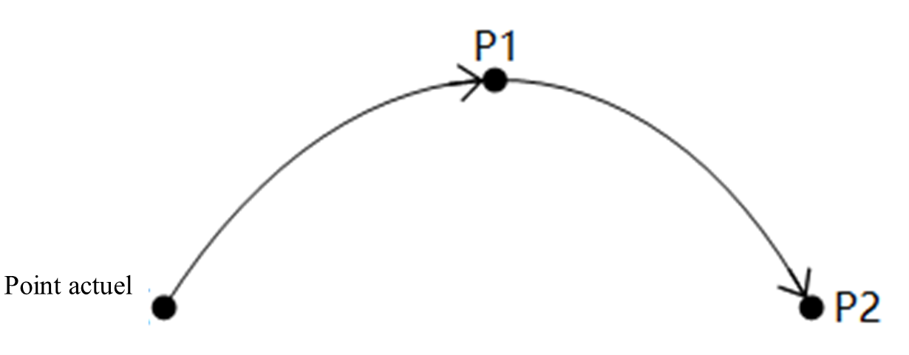
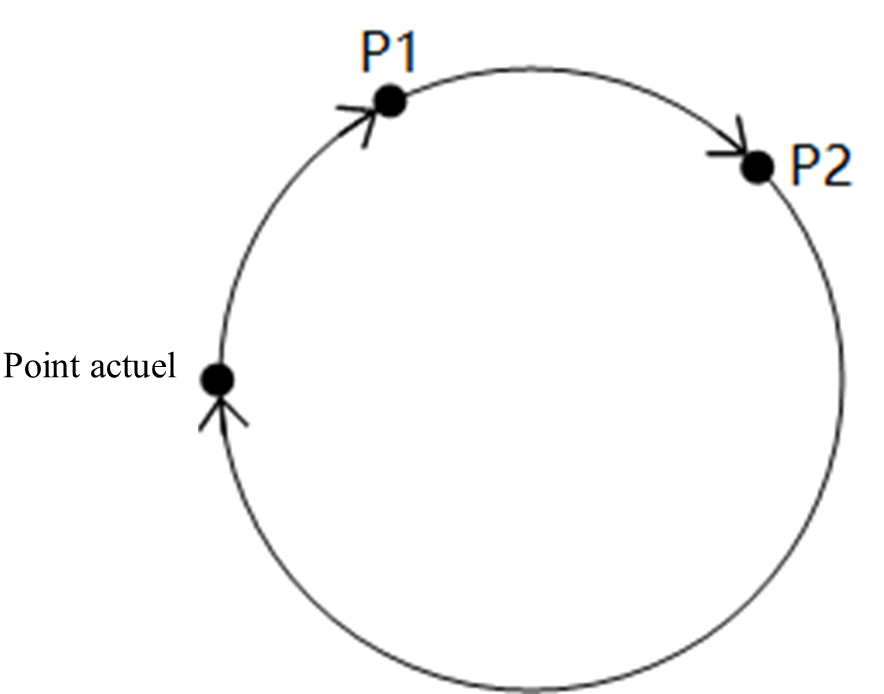
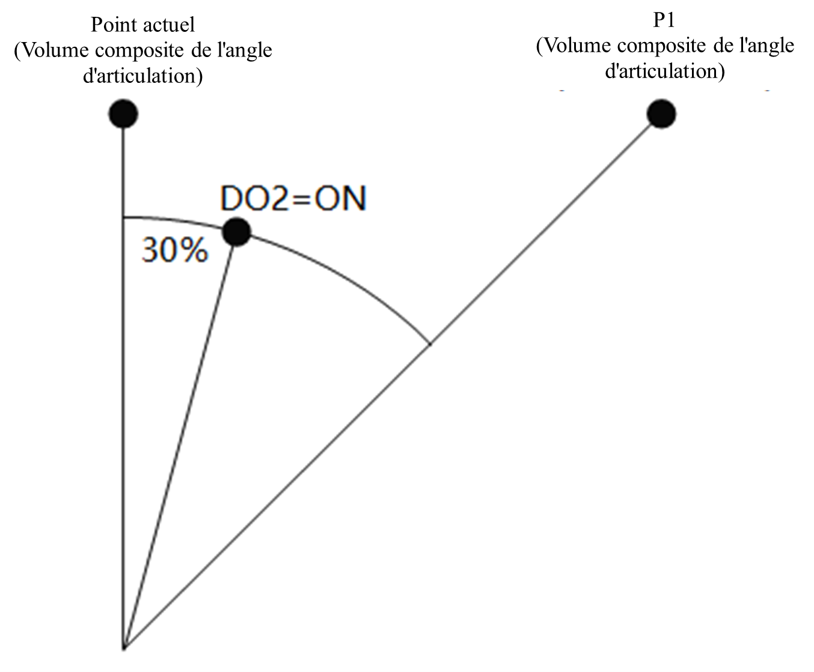
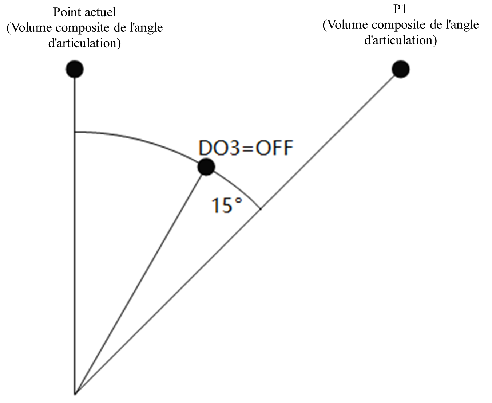
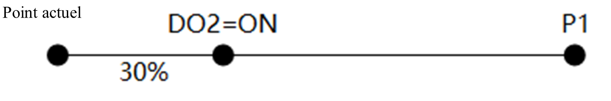
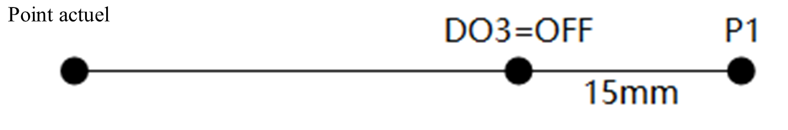

# Commande de mouvement

<h3 class="lua-cmd" id="list" >Liste des commandes</h3>

Les commandes de mouvement sont utilisées pour contrôler le bras robotique afin d'effectuer des mouvements. **Veuillez lire la [description générale](common.md) avant de les utiliser.**

| Instruction| Fonction|
|----------|----------|
| [MovJ](#movj)| Mouvement articulaire|
| [MovL](#movl)| Mouvement linéaire|
| [Arc](#arc)| Mouvement curviligne|
| [Cercle](#circle)| Mouvement circulaire|
| [MovJIO](#movjio)| Mouvement articulaire avec sortie|
| [MovLIO](#movlio)| Mouvement linéaire avec sortie DO|
| [Chemin de départ](#startpath)| Reproduit le chemin de départ enregistré|
| [GetPathStartPose](#getpathstartpose)| Obtenir le point de départ de la trajectoire|
| [PositiveKin](#positivekin)| Analyser l’angle articulaire en posture|
| [InverseKin](#inversekin)| Analyser la posture en angle articulaire|

<h3 class="lua-cmd" >MovJ</h3>

**Prototype :**

```python
MovJ(point, {"user":1, "tool":0, "a":20, "v":50, "cp":100})
```

**Description :**

Déplacement de la position actuelle vers le point cible avec un mouvement articulé.

**Paramètres obligatoires :**

point : le point cible.

**Paramètres facultatifs :**

- utilisateur : système de coordonnées de l'utilisateur pour le point cible.
- outil : système de coordonnées de l'outil au point cible.
- a : rapport d'accélération du mouvement du bras du robot lors de l'exécution de cette instruction. Plage de valeurs : (0,&nbsp;100].
- v : rapport de la vitesse du mouvement du bras lors de l'exécution de cette instruction. Plage de valeurs : (0,&nbsp;100].
- CP : Taux de transition lisse. Plage de valeurs : [0,&nbsp;100].

Pour plus de détails, veuillez vous reporter à la [description générale](common.md).

**Exemple :**

```python
# Le bras robotique se déplace en suivant les paramètres par défaut le long des axes articulaires jusqu'au point P1.
MovJ(P1)
```

```python
# Le bras robotique se déplace en suivant les paramètres par défaut le long des axes articulaires jusqu'à l’angle articulaire spécifié.
MovJ({"joint":[0,0,90,0,90,0]})
```

```python
# Le bras robotique se déplace en mode articulaire vers la pose spécifiée, la pose étant définie dans le système de coordonnées d’utilisateurs 1 et le système de coordonnées d'outils 1. L'accélération et la vitesse de mouvement sont toutes deux réglées à 50%, et la proportion de transition lisse est de 50%.
MovJ({"pose":[300,200,300,180,0,0]},{"user":1, "tool":1, "a":50, "v":50, "cp":50})
```

```python
# Définir d'abord les positions, puis les appeler dans l'instruction de mouvement, l'effet d'exécution est identique à la commande précédente.
customPoint={"pose":[300,200,300,180,0,0]}
MovJ(customPoint,{"user":1, "tool":1, "a":50, "v":50, "cp":50})
```

<h3 class="lua-cmd" >MovL</h3>

**Prototype :**

```python
MovL(point, {"user":1, "tool":0, "a":20, "v":50, "speed":500, "cp":100, "r":5})
```

**Description :**

Déplacement de la position actuelle vers le point cible dans un mouvement linéaire.

**Paramètres obligatoires :**

point : le point cible.

**Paramètres facultatifs :**

- utilisateur : système de coordonnées de l'utilisateur pour le point cible.

- outil : système de coordonnées de l'outil au point cible.

- a : rapport d'accélération du mouvement du bras du robot lors de l'exécution de cette instruction. Plage de valeurs : (0,&nbsp;100].

- v : rapport de la vitesse du mouvement du bras lors de l'exécution de cette instruction. Plage de valeurs : (0,&nbsp;100].

- vitesse : la vitesse cible de mouvement du bras robotique lors de l’exécution de cette instruction, avec une plage de valeurs : [1, vitesse maximale de mouvement], unité : mm/s.
  
  Une fois ce paramètre défini, le paramètre v est ignoré.

- CP : Taux de transition lisse. Plage de valeurs : [0,&nbsp;100].

- r : rayon de transition lisse, plage de valeurs : [0,100], unité : mm.
  
  Lorsque ce paramètre est défini, le paramètre cp est ignoré.

Pour plus de détails, veuillez vous reporter à la [description générale](common.md).

**Exemple :**

```python
# Le bras robotique se déplace en suivant les paramètres par défaut le long des axes linéaires jusqu'au point P1.
MovL(P1)
```

```python
# Le bras robotique se déplace en ligne droite à une vitesse absolue de 500 m/s jusqu'au point P1.
MovL(P1,{"speed":500})
```

```python
# Le bras robotique se déplace en suivant les paramètres par défaut le long des axes linéaires jusqu'à l’angle articulaire spécifié.
MovL({"joint":[0,0,90,0,90,0]})
```

```python
# Le bras robotique se déplace en mode linéaire vers la pose spécifiée, la pose étant définie dans le système de coordonnées d’utilisateurs 1 et le système de coordonnées d'outils 1. L'accélération et la vitesse de mouvement sont toutes deux réglées à 50%, et le rayon de transition lisse est de 5 mm.
MovL({"pose":[300,200,300,180,0,0]},{"user":1, "tool":1, "a":50, "v":50, "r":5})
```

```python
# Définir d'abord les positions, puis les appeler dans l'instruction de mouvement, l'effet d'exécution est identique à la commande précédente.
customPoint={"pose":[300,200,300,180,0,0]}
MovL(customPoint,{"user":1, "tool":1, "a":50, "v":50, "r":5})
```

```python
# Lorsque les deux paramètres speed et v sont spécifiés simultanément, c'est speed qui prend effet, et le contrôleur génère un journal d'avertissement correspondant.
# Lorsque les deux paramètres cp et r sont spécifiés simultanément, c'est r qui prend effet, et le contrôleur génère un journal d'avertissement correspondant.
MovL(P1,{"v":50,"speed":500,"cp":60,"r":5}) # Lors de l'exécution, seuls les paramètres speed et r sont actifs.
```

<h3 class="lua-cmd" >Arc</h3>

**Prototype :**

```python
Arc(P1, P2, {"user":1, "tool":0, "a":20, "v":50, "speed":500, "cp":100, "r":5})
```

**Description :**

Déplacement de la position actuelle au point cible par interpolation circulaire.

Il est nécessaire de déterminer un arc de cercle à partir de trois points : position actuelle, P1, P2, de sorte que la position actuelle ne peut pas être sur la ligne droite déterminée par P1 et P2.



L'attitude finale du bras du robot pendant le mouvement est calculée en interpolant l'attitude du point actuel et de P2, et l'attitude de P1 n'intervient pas dans le calcul (c'est-à-dire que l'attitude du bras du robot lorsqu'il arrive à P1 pendant le mouvement peut être différente de l'attitude enseignée).

**Paramètres obligatoires :**

- P1 : point central de l'arc.
- P2 : point cible.

**Paramètres facultatifs :**

- utilisateur : système de coordonnées de l'utilisateur pour le point cible.

- outil : système de coordonnées de l'outil au point cible.

- a : rapport d'accélération du mouvement du bras du robot lors de l'exécution de cette instruction. Plage de valeurs : (0,&nbsp;100].

- v : rapport de la vitesse du mouvement du bras lors de l'exécution de cette instruction. Plage de valeurs : (0,&nbsp;100].

- vitesse : la vitesse cible de mouvement du bras robotique lors de l’exécution de cette instruction, avec une plage de valeurs : [1, vitesse maximale de mouvement], unité : mm/s.
  
  Une fois ce paramètre défini, le paramètre v est ignoré.

- CP : Taux de transition lisse. Plage de valeurs : [0,&nbsp;100].

- r : rayon de transition lisse, plage de valeurs : [0,100], unité : mm.
  
  Lorsque ce paramètre est défini, le paramètre cp est ignoré.

Pour plus de détails, veuillez vous reporter à la [description générale](common.md).

**Exemple :**

```python
# Le bras robotique se déplace jusqu'au point P1, puis effectue un mouvement circulaire jusqu'au point P3 en passant par le point P2, avec les paramètres par défaut.
MovJ(P1)
Arc(P2,P3)
```

```python
# Le bras robotique se déplace jusqu'au point P1, puis effectue un mouvement circulaire jusqu'au point P3 en passant par le point [300, 200, 300, 180, 0, 0], avec le système de coordonnées d’utilisateurs et le système de coordonnées d'outils tous deux définis sur 1. Les paramètres d'accélération et de vitesse de mouvement sont réglés à 50%.
MovJ(P1)
Arc({pose:[300,200,300,180,0,0]},P3,{"user":1, "tool":1, "a":50, "v":50})
```

<h3 class="lua-cmd" >Circle</h3>

**Prototype :**

```python
Circle(P1, P2, Count, {"user":1, "tool":0, "a":20, "v":50, "speed":500, "cp":100, "r":5})
```

**Description :**

Effectue un mouvement d'interpolation du cercle entier à partir de la position actuelle et revient à la position actuelle après le nombre de tours spécifié.

Il est nécessaire de déterminer un cercle entier à travers la position actuelle, P1, P2 trois points, de sorte que la position actuelle ne peut pas être dans la ligne droite déterminée par P1 et P2, et le cercle entier déterminé par les trois points ne peut pas être au-delà de la portée du mouvement du bras du robot.



L'attitude finale du bras du robot pendant le mouvement est calculée en interpolant l'attitude du point actuel et de P2, et l'attitude de P1 n'intervient pas dans le calcul (c'est-à-dire que l'attitude du bras du robot lorsqu'il arrive à P1 pendant le mouvement peut être différente de l'attitude enseignée).

**Paramètres obligatoires :**

- P1 : point de positionnement 1 du cercle entier.
- P2 : point de positionnement 2 du cercle entier.
- Count : nombre de mouvements du cercle entier, plage [1, 999].

**Paramètres facultatifs :**

- utilisateur : système de coordonnées de l'utilisateur pour le point cible.

- outil : système de coordonnées de l'outil au point cible.

- a : rapport d'accélération du mouvement du bras du robot lors de l'exécution de cette instruction. Plage de valeurs : (0,&nbsp;100].

- v : rapport de la vitesse du mouvement du bras lors de l'exécution de cette instruction. Plage de valeurs : (0,&nbsp;100].

- vitesse : la vitesse cible de mouvement du bras robotique lors de l’exécution de cette instruction, avec une plage de valeurs : [1, vitesse maximale de mouvement], unité : mm/s.
  
  Une fois ce paramètre défini, le paramètre v est ignoré.

- CP : Taux de transition lisse. Plage de valeurs : [0,&nbsp;100].

- r : rayon de transition lisse, plage de valeurs : [0,100], unité : mm.
  
  Lorsque ce paramètre est défini, le paramètre cp est ignoré.

Pour plus de détails, veuillez vous reporter à la [description générale](common.md).

**Exemple :**

```python
# Le bras robotique se déplace jusqu'au point P1, puis effectue un mouvement circulaire complet selon le cercle déterminé par les points P1, P2 et P3.
MovJ(P1)
Circle(P2,P3,1)
```

```python
# Le bras robotique se déplace jusqu'au point P1, puis effectue un mouvement circulaire complet de 10 tours selon le cercle déterminé par les points P1, [300, 200, 300, 180, 0, 0] et P3. Le système de coordonnées d’utilisateurs et le système de coordonnées d'outils sont tous deux définis sur 1. Les paramètres d'accélération et de vitesse de mouvement sont réglés à 50%.
MovJ(P1)
Circle({pose:[300,200,300,180,0,0]},P3,10,{"user":1, "tool":1, "a":50, "v":50})
```

<h3 class="lua-cmd" >MovJIO</h3>

**Prototype :**

```python
MovJIO(P,[[Mode,Distance,Index,Status],[Mode,Distance,Index,Status]...], {"user":1, "tool":0, "a":20, "v":50, "cp":100})
```

**Description :**

Se déplacer de la position actuelle au point cible dans un mouvement articulé et définir l'état du port de sortie numérique en parallèle pendant le mouvement.

**Paramètres obligatoires :**

- P : Point cible.
- Paramètre de sortie numérique parallèle : réglez la sortie numérique spécifiée pour qu'elle soit déclenchée lorsque le bras du robot se déplace à la distance ou au pourcentage spécifié. Plusieurs groupes peuvent être définis et chaque groupe contient les paramètres suivants :
  - Mode : Mode de déclenchement 0 pour le déclenchement en pourcentage, 1 pour le déclenchement en distance. Le système combine chaque angle d'articulation en un vecteur d'angle et calcule la différence d'angle entre le point final et le point initial en tant que distance totale du mouvement.
  - Distance : spécifiez le pourcentage/angle. Étant donné que le calcul de l'angle utilise le vecteur d'angle synthétisé, il est recommandé d'utiliser le mode pourcentage pour un effet plus intuitif.
    - Lorsque la distance est positive, il s'agit du pourcentage/angle par rapport au point de départ.
    - Si la distance est négative, il s'agit du pourcentage/angle à partir du point cible.
    - Lorsque le mode est 0, la distance correspond au pourcentage de l'angle total. Plage de valeurs : (0,&nbsp;100].
    - Lorsque le mode est 1, la distance indique la valeur de l'angle. Unité : °.
  - Index : Le numéro de la borne DO.
  - État : statut DO à définir, 0 et OFF signifie qu'il n'y a pas de signal, 1 et ON signifie qu'il y a un signal.

**Paramètres facultatifs :**

- utilisateur : système de coordonnées de l'utilisateur pour le point cible.
- outil : système de coordonnées de l'outil au point cible.
- a : rapport d'accélération du mouvement du bras du robot lors de l'exécution de cette instruction. Plage de valeurs : (0,&nbsp;100].
- v : rapport de la vitesse du mouvement du bras lors de l'exécution de cette instruction. Plage de valeurs : (0,&nbsp;100].
- CP : Taux de transition lisse. Plage de valeurs : [0,&nbsp;100].

Une transition en douceur modifiera la trajectoire du mouvement du bras du robot et affectera la synchronisation de la sortie DO, il convient donc de l'utiliser avec précaution.

Pour plus de détails, veuillez vous reporter à la [description générale](common.md).

**Exemple :**

```python
# Le bras robotique effectue un mouvement articulaire vers le point P1 avec les paramètres par défaut. Lorsqu'il atteint une position située à 30% de la distance du point de départ, DO2 est configuré sur ON.
MovJIO(P1, [[0, 30, 2, 1]])
```



```python
# Le bras robotique effectue un mouvement articulaire vers le point P1 avec les paramètres par défaut. Lorsqu'il atteint une position située à 15° de la distance de l'arrivée, DO3 est configuré sur OFF.
MovJIO(P1,[[1, -15, 3, 0]])
```



<h3 class="lua-cmd" >MovLIO</h3>

**Prototype :**

```python
MovLIO(P,[[Mode,Distance,Index,Status],[Mode,Distance,Index,Status]...],{"user":1, "tool":0, "a":20, "v":50, "speed":500, "cp":100, "r":5})
```

**Description :**

Déplacez-vous de la position actuelle au point cible dans un mouvement linéaire et définissez l'état du port de sortie numérique en parallèle pendant le mouvement.

**Paramètres obligatoires :**

- P : Point cible.
- Paramètre de sortie numérique parallèle : réglez la sortie numérique spécifiée pour qu'elle soit déclenchée lorsque le bras du robot se déplace à la distance ou au pourcentage spécifié. Plusieurs groupes peuvent être définis et chaque groupe contient les paramètres suivants :
  - Mode : Mode de déclenchement 0 pour le déclenchement en pourcentage, 1 pour le déclenchement en distance.
  - Distance : Spécifiez le pourcentage/la distance.
    - Lorsque la distance est un nombre positif, elle indique le pourcentage/la distance par rapport au point de départ.
    - Lorsque la distance est négative, elle indique le pourcentage/la distance par rapport au point cible.
    - Lorsque le mode est 0, la distance indique le pourcentage de la distance totale. Plage de valeurs : (0,&nbsp;100].
    - Lorsque le mode est 1, la distance indique la valeur de la distance. Unité : mm
  - Index : Le numéro de la borne DO.
  - État : statut DO à définir, 0 et OFF signifie qu'il n'y a pas de signal, 1 et ON signifie qu'il y a un signal.

**Paramètres facultatifs :**

- utilisateur : système de coordonnées de l'utilisateur pour le point cible.

- outil : système de coordonnées de l'outil au point cible.

- a : rapport d'accélération du mouvement du bras du robot lors de l'exécution de cette instruction. Plage de valeurs : (0,&nbsp;100].

- v : rapport de la vitesse du mouvement du bras lors de l'exécution de cette instruction. Plage de valeurs : (0,&nbsp;100].

- vitesse : la vitesse cible de mouvement du bras robotique lors de l’exécution de cette instruction, avec une plage de valeurs : [1, vitesse maximale de mouvement], unité : mm/s.
  
  Une fois ce paramètre défini, le paramètre v est ignoré.

- CP : Taux de transition lisse. Plage de valeurs : [0,&nbsp;100].

- r : rayon de transition lisse, plage de valeurs : [0,100], unité : mm.
  
  Lorsque ce paramètre est défini, le paramètre cp est ignoré.

Une transition en douceur modifiera la trajectoire du mouvement du bras du robot et affectera la synchronisation de la sortie DO, il convient donc de l'utiliser avec précaution.

Pour plus de détails, veuillez vous reporter à la [description générale](common.md).

**Exemple :**

```python
# Le bras robotique effectue un mouvement linéaire vers le point P1 avec les paramètres par défaut. Lorsqu'il atteint une position située à 30% de la distance du point de départ, DO2 est configuré sur ON.
MovLIO(P1, [[0, 30, 2, 1]])
```



```python
# Le bras robotique effectue un mouvement linéaire vers le point P1 avec les paramètres par défaut. Lorsqu'il atteint une position située à 15 mm de la distance de l’arrivée, DO3 est configuré sur OFF.
MovLIO(P1, [[1, -15, 3, 0]])
```



<h3 class="lua-cmd" >StartPath</h3>

**Prototype :**

```python
StartPath(string, {"multi":1, "isConst":0, "sample":50， "freq":0.2, "user":0, "tool":0})
```

**Description :**

Reproduit la trajectoire enregistrée dans le fichier de trajectoire spécifié. L'utilisateur doit déplacer lui-même le bras du robot jusqu'au point de départ de la trajectoire avant d'appeler cette instruction.

**Paramètres obligatoires :**

string : le nom du fichier de trajectoire (suffixe compris).

**Paramètres facultatifs :**

- multi : multiplicateur de vitesse, valable uniquement lorsque isConst=0. Plage : [0,1, 2], la valeur par défaut est 1 sans paramètre.
- isConst : si la vitesse est uniforme ou non. La valeur par défaut est 0 sans référence.
  - 1 signifie reproduction à vitesse constante, le bras du robot reproduira la trajectoire à vitesse constante en fonction du taux global.
  - 0 signifie que la trajectoire est reproduite à la vitesse d'origine lors de l'enregistrement, et peut utiliser le multi paramètre pour échelonner la vitesse de mouvement, la vitesse de mouvement du bras n'est pas affectée par le taux global.
- sample : intervalle d'échantillonnage des points de la trajectoire, c'est-à-dire la différence de temps d'échantillonnage entre deux points voisins lors de la génération du fichier de trajectoire. Plage de valeurs : [8, 1000], unité : ms, la valeur par défaut est 50 sans paramètre (l'intervalle d'échantillonnage lorsque le contrôleur enregistre le fichier de trajectoire).
- freq : coefficient de filtrage, plus la valeur de ce paramètre est petite, plus la courbe de la trajectoire reproduite est lisse, mais plus la déformation de la trajectoire originale est importante, veuillez régler le coefficient de filtrage approprié en fonction de la fluidité de la trajectoire originale. Plage de valeurs : (0,1), 1 signifie que le filtrage est désactivé, la valeur par défaut est 0,2 sans paramètre.
- utilisateur : spécifie l'index du système de coordonnées de l'utilisateur correspondant au point de la trajectoire, si non spécifié, utilise l'index du système de coordonnées de l'utilisateur enregistré dans le fichier de trajectoire.
- outil : spécifie l'index du système de coordonnées de l'outil correspondant au point de la trajectoire, si non spécifié, utilise l'index du système de coordonnées de l'outil enregistré dans le fichier de trajectoire.

**Exemple :**

```python
# Après avoir effectué un mouvement articulaire jusqu'au point de départ du fichier de trajectoire track.csv, le bras robotique reproduit la trajectoire enregistrée dans le fichier à une vitesse double de l'originale.
StartPoint = GetPathStartPose("track.csv")
MovJ(StartPoint)
StartPath("track.csv", {"multi":2, "isConst":0})
```

```python
# Après avoir effectué un mouvement articulaire jusqu'au point de départ du fichier de trajectoire track.csv, le bras robotique reproduit la trajectoire enregistrée dans le fichier à une vitesse constante.
StartPoint = GetPathStartPose("track.csv")
MovJ(StartPoint)
StartPath("track.csv", {"isConst":1})
```

<h3 class="lua-cmd" >GetPathStartPose</h3>

**Prototype :**

```python
GetPathStartPose(string)
```

**Description :**

Obtenir le point de départ de la trajectoire. Selon le fichier de trajectoire, le type de données de point (point d'apprentissage/joint/position) peut être différent.

**Paramètres obligatoires :**

string : le nom du fichier de trajectoire (suffixe compris).

**Exemple :**

```python
# Obtenir le point de départ du fichier de trajectoire track.csv et l’imprimer.
StartPoint = GetPathStartPose("track.csv")
print(StartPoint)  
```

<h3 class="lua-cmd" >PositiveKin</h3>

**Prototype**

```python
PositiveKin(joint, {"user":1, "tool":0})
```

**Description**

Effectue une opération de résolution positive : étant donné l'angle de chaque articulation du bras, calcule la valeur de la coordonnée de l'extrémité du bras dans le système de coordonnées cartésiennes donné.

**Paramètres obligatoires**

joint : variable d'articulation, au format `{"joint":[j1, j2, j3, j4, j5, j6]}`.

**Paramètres facultatifs**

- utilisateur : index du système de coordonnées de l'utilisateur, utilise le système de coordonnées global de l'utilisateur s'il n'est pas spécifié.
- outil : index du système de coordonnées de l'outil, utiliser le système de coordonnées global de l'outil s'il n'est pas spécifié.

**Retour**

Variable de position dérivée de la solution orthogonale, au format `{"pose":[x, y, z, rx, ry, rz]}`.

**Exemple**

```python
PositiveKin({"joint":[0,0,-90,0,90,0]},{"user":1, "tool":1})
```

Les coordonnées de l'articulation sont [0,0,-90,0,90,0], et les coordonnées cartésiennes de l'extrémité du bras du robot sont calculées dans le système de coordonnées de l'utilisateur 1 et le système de coordonnées de l'articulation 1.

<h3 class="lua-cmd" >InverseKin</h3>

**Prototype**

```python
InverseKin(pose, {"useJointNear":True, "jointNear":joint, "user":1, "tool":0})
```

**Description**

Effectuer l'opération de solution inverse : étant donné les valeurs des coordonnées de l'extrémité du bras robotique dans le système de coordonnées cartésiennes donné, calculer l'angle de chaque articulation du bras robotique.

Comme les coordonnées cartésiennes ne définissent que les coordonnées spatiales du TCP avec l'angle d'inclinaison, le bras robotique peut atteindre la même position en adoptant un certain nombre de postures différentes, ce qui signifie qu'une variable de position peut correspondre à plusieurs variables d'articulation. Pour parvenir à une solution unique, le système a besoin d'une coordonnée articulaire spécifiée et sélectionne la solution la plus proche de cette coordonnée articulaire comme résultat de la solution inverse.

**Paramètres obligatoires**

pose : variable de pose au format `{"pose":[x, y, z, rx, ry, rz]}`

**Paramètres facultatifs**

- useJointNear : valeur booléenne, utilisée pour déterminer si le paramètre JointNear est valide ou non.
  - Vraie signifie que la solution est sélectionnée en fonction de la proximité du paramètre JointNear.
  - Fausse ou aucun paramètre signifie que le paramètre JointNear n'est pas valide, le système sélectionne la solution en fonction de l'angle d'articulation actuel du bras.
  - Si seul ce paramètre est pris en compte, mais pas le paramètre JointNear, ce paramètre n'est pas valide.
- jointNear : la variable d'articulation utilisée pour la sélection de la proximité, le format est `{"joint":[j1, j2, j3, j4, j5, j6]}`.
- utilisateur : index du système de coordonnées de l'utilisateur, utilise le système de coordonnées global de l'utilisateur s'il n'est pas spécifié.
- outil : index du système de coordonnées de l'outil, utiliser le système de coordonnées global de l'outil s'il n'est pas spécifié.

**Retour**

- code d'erreur, 0 signifie que la solution inverse réussit, -1 signifie que la solution inverse échoue (pas de solution).
- Les variables conjointes dérivées de la solution inverse, au format : `{"joint":[j1, j2, j3, j4, j5, j6]}`, j1~j6 sont toutes à 0 lorsque la solution inverse échoue.

**Exemple**

```python
errId, jointPoint = InverseKin({"pose":[300, 200, 300, 180, 0, 0]}, {"useJointNear" :True, "jointNear":{"joint":[90, 30, -90, 180, 30, 0]} })
```

Les coordonnées cartésiennes de l'extrémité du bras robotique dans le système global de coordonnées de l'utilisateur et dans le système global de coordonnées de l'articulation sont [300, 200, 300, 180, 0, 0], les coordonnées de l'articulation sont calculées et la solution la plus proche de l'angle de l'articulation [90, 30, -90, 180, 30, 0] est sélectionnée.