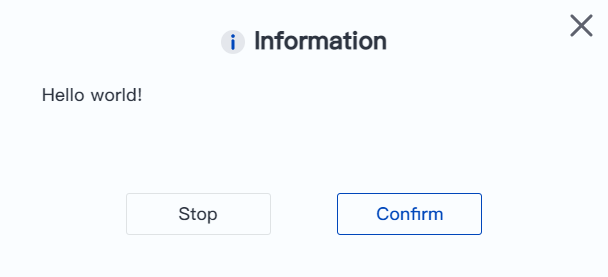

# Contrôle du processus

<h3 class="lua-cmd" id="list" >Liste des commandes</h3>

Les fonctions de contrôle du programme sont des fonctions générales liées au contrôle du fonctionnement du programme.

| Instruction| Fonction|
|----------|----------|
| [Imprimer](#print)| Imprime des informations de débogage sur la console.|
| [Journal](#log)| Sortir des infos de journal personnalisées|
| [Attendre](#wait)| Attendre pendant une période de temps spécifiée ou jusqu'à ce qu'une condition spécifiée soit remplie avant de passer à la commande suivante.|
| [Pause](#pause)| Suspendre l’exécution du script|
| [Halte](#halt)| Arrêter l’exécution du script|
| [Réinitialiser le temps écoulé](#resetelapsedtime)| Réinitialiser le comptage-temps|
| [Temps écoulé](#elapsedtime)| Terminer le comptage-temps|
| [Systime](#systime)| Obtenir l'heure du système|
| [SetGlobalVariable](#setglobalvariable)| Variables globales|
| [Popup](#popup)| Définit une fenêtre contextuelle lors de l'exécution du script|

<h3 class="lua-cmd" >Print</h3>

**Prototype :**

```lua
Print(value)
```

**Description :**

Imprime des informations de débogage sur la console (le nom de la commande peut également être écrit comme `print`).

<div class="info1"><b> Description : </b><div>Le format dans lequel les variables sont imprimées peut différer de celui décrit dans ce document, mais elles représentent le même format de données. Vous pouvez vous référer au format décrit dans ce document pour comprendre et utiliser les données. </div></div>

<br/>

```lua
-- Par exemple, le format de la variable est {pose={x,y,z,rx,ry,rz}}, et l’impression ressemble à :
table:0x123abc{
[pose] => table:0x123abc{
[1] => x
[2] => y
[3] => z
[4] => rx
[5] => ry
[6] => rz
}
}
```
**Paramètres obligatoires :**

valeur : les données à imprimer.

**Exemple :**

```lua
-- Imprimer la chaîne de caractères Success sur la console.
Print('Success')
```

<h3 class="lua-cmd" >Log</h3>

**Prototype :**

```lua
Log(value)
```

**Description :**

Affiche des messages de journal de niveau personnalisé qui peuvent être visualisés et exportés dans la page de journal du logiciel de contrôle.


**Paramètres obligatoires :**

valeur : message de journal.

**Exemple :**

```lua
-- Le contenu imprimé est l’infos de journal du test.
Log('test')
```

<h3 class="lua-cmd" >Wait</h3>

**Prototype :**

```lua
Wait(time_ms)
Wait(check_str)
Wait(check_str, timeout_ms)
```

**Description :**

Une fois que le bras robotique a terminé la commande précédente, attendez le temps spécifié ou remplissez les conditions spécifiées avant de poursuivre l'exécution de la commande suivante. La valeur maximale du temps d'attente est de 2147483647ms. Si vous dépassez la valeur maximale, l'instruction ne sera pas valide.

**Paramètres obligatoires :**

- time_ms : lorsque la valeur du paramètre est de type entier, il s'agit de spécifier le temps d'attente, lorsqu'il est inférieur ou égal à 0, il s'agit de ne pas attendre. Unité : ms
- check_str : si la valeur du paramètre est une chaîne de caractères, il s'agit d'une logique de jugement, la logique est vraie avant de continuer à exécuter la commande suivante.

**Paramètres facultatifs :**

timeout_ms : délai d'attente en ms.

- Si la logique de jugement est toujours fausse et que le temps d'attente dépasse ce délai, le système continuera à exécuter l'instruction suivante et renverra un message faux.
- S'il est inférieur ou égal à 0, cela signifie qu'il n'y a pas d'attente et que le délai d'attente est immédiatement respecté.
- Si ce paramètre n'est pas défini, il n'y aura pas de délai d'attente et le système attendra jusqu'à ce que la logique de jugement soit vraie.

**Retour :**

- Si la condition est remplie et que l'exécution se poursuit, true est renvoyé ;
- Si la condition n'est pas remplie et que l'exécution se poursuit en raison d'un dépassement de délai, fausse est renvoyé.

**Exemple :**

```lua
-- Attendre 300 ms.
Wait(300)
```

```lua
-- Continuer à fonctionner lorsque DI1 est sur ON.
Wait("DI(1) == ON")
```

```lua
-- Continuer à fonctionner lorsque DO1 est sur ON et AI(1) est inférieur à 7.
Wait("GetDO(1) == ON and AI(1) < 7")
```

```lua
-- Exécuter des logiques d'affaires différentes en fonction de l'état de DI1 au cours de 1 seconde.
flag=Wait("DI(1) == ON", 1000)
if(flag==true)
then
    -- L’état de DI1 est sur ON
else
    -- L'état de DI1 est sur OFF et le délai dépasse 1 seconde
end
```

<h3 class="lua-cmd" >Pause</h3>

**Prototype :**

```lua
Pause()
```

**Description :**

Suspendre l’exécution du script. Doit être commandé par un logiciel de contrôle ou une télécommande pour continuer à fonctionner.

**Exemple :**

```lua
-- Le bras robotique s'arrête après avoir atteint le point P1, et ne continue à fonctionner vers le point P2 qu'après avoir reçu un contrôle externe pour reprendre l'exécution.
MovJ(P1)
Pause()
MovJ(P2)
```

<h3 class="lua-cmd" >Halt</h3>

**Prototype :**

```lua
Halt()
```

**Description :**

Arrêter l’exécution du script

**Exemple :**

```lua
-- Arrêter l’exécution du script lorsque la variable count = 100.
if(count==100)
then
	Halt()
end
```

<h3 class="lua-cmd" >ResetElapsedTime</h3>

**Prototype :**

```lua
ResetElapsedTime()
```

**Description :**

Commence à chronométrer l'exécution de toutes les instructions avant cette instruction, doit être utilisé avec ElapsedTime(), peut être utilisé pour calculer le temps d'exécution.

**Exemple :**

Veuillez vous référer à l'exemple de ElapsedTime.

<h3 class="lua-cmd" >ElapsedTime</h3>

**Prototype :**

```lua
ElapsedTime()
```

**Description :**

Fin du chronométrage, renvoi de la différence de temps, à utiliser avec ResetElapsedTime().

**Retour :**

Différence de temps entre l'heure de début et l'heure de fin, en millisecondes.

Le maximum peut être compté 4294967295ms (environ 49,7 jours), après avoir dépassé ce temps, le décompte recommence à partir de 0.

**Exemple :**

```lua
-- Calculer le temps nécessaire pour effectuer un mouvement linéaire aller-retour 10 fois entre les points P1 et P2, et l’imprimer dans la console.
MovJ(P2)
ResetElapsedTime()
for i=1,10 do
	MovL(P1)
	MovL(P2)
end
print (ElapsedTime())
```

<h3 class="lua-cmd" >Systime</h3>

**Prototype :**

```lua
Systime()
```

**Description :**

Obtenir l'heure du système

**Retour :**

Horodatage Unix de l'heure actuelle du système, converti en millisecondes, c'est-à-dire le nombre de millisecondes entre 00:00 GMT le 1er janvier 1970 et l'heure actuelle, généralement utilisé pour calculer le décalage horaire.

Si vous avez besoin d'obtenir l'heure locale, veuillez utiliser la conversion de l'heure moyenne de Greenwich obtenue en fonction du fuseau horaire local.

**Exemple :**

```lua
-- Obtenir l’heure actuel du système.
local time1 = Systime() 
print(time1)  -- > 1686304295963, converti en heure de Beijing est 09/06/2023 17:51:35 (ajout de 963 millisecondes)
local time2 = Systime() 
print(time2)  -- > 1686304421968, converti en heure de Beijing est 09/06/2023 17:53:41 (ajout de 968 millisecondes)

-- Calculer le temps du bras robotique met pour se déplacer jusqu'au point P1, unité : millisecondes.
local time1 = Systime()
MovL(P1)
local time2 = Systime()
print(time2-time1)
```

<h3 class="lua-cmd" >SetGlobalVariable</h3>

**Prototype :**

```lua
SetGlobalVariable(key,val)
```

**Description :**

Définir les variables globales Si vous devez assigner une valeur à une variable globale, il est recommandé d'utiliser cette fonction au lieu de "=".

**Paramètres obligatoires :**

- key : le nom de la variable globale à définir.
- val : la valeur de la variable globale à définir. Les types de données pris en charge sont les suivants : bool, table, string, number.

**Exemple :**

```lua
-- Définir la variable globale g1 sur 10
SetGlobalVariable("g1",10)
```

<h3 class="lua-cmd" >Popup</h3>

**Prototype :**

```lua
Popup(message, title, type, logControl)
```

**Description :**

Utilisé pour faire apparaître une fenêtre contenant des informations définies par l'utilisateur lors de l'exécution du script. DobotStudio Pro n'affichera qu'une seule fenêtre popup à la fois avec le dernier message popup.

Si le projet est en cours d'exécution sans que DobotStudio Pro soit ouvert (par exemple, en démarrant le projet via IO ou Modbus), aucune fenêtre popup n'apparaîtra, mais les commandes popup de type avertissement et erreur entraîneront toujours la mise en pause du projet.

**Paramètres obligatoires :**

- message : le contenu du message à afficher. Diverses [variables Lua](lua_var.md), y compris les chaînes de caractères, sont prises en charge. S'il s'agit d'une chaîne, sa longueur ne peut excéder 128 ; s'il s'agit d'un autre type de variable, elle sera convertie en caractère, et la taille du caractère converti ne peut excéder 512 octets.

- title : titre de la fenêtre contextuelle à afficher. La longueur ne peut pas dépasser 128 caractères

- type : le type de message.
  
  - 0 : Informations Ce type de fenêtre contextuelle n'affecte pas le fonctionnement du projet. Cliquer sur **Arrêter** arrête le projet et cliquer sur **OK** ferme la fenêtre pop-up. Après l'apparition de la fenêtre contextuelle, les utilisateurs peuvent également arrêter le projet via IO ou Modbus, et la fenêtre contextuelle disparaît automatiquement après l'arrêt du projet.
    
    
  
  - 1 : Avertissement Ce type de fenêtre contextuelle met le projet en pause. Cliquez sur **Arrêter** pour arrêter le projet, cliquez sur **Continuer** pour continuer à exécuter le projet. Après l'apparition de la fenêtre contextuelle, l'utilisateur peut également arrêter/continuer le projet via IO ou Modbus, et la fenêtre contextuelle disparaît automatiquement après l'arrêt/continuation du projet.
    
    
  
  - 2 : Erreur Ce type de fenêtre contextuelle met le projet en pause. Cliquez sur **Arrêter** pour arrêter le projet, cliquez sur **Continuer** pour continuer à exécuter le projet. Après l'apparition de la fenêtre contextuelle, l'utilisateur peut également arrêter/continuer le projet via IO ou Modbus, et la fenêtre contextuelle disparaît automatiquement après l'arrêt/continuation du projet.
    
    

- logControl : le contenu de la fenêtre contextuelle est écrit ou non dans le journal.
  
  - 0 : Aucun journal n'est écrit.
  - 1 : écrit le type de journal correspondant (où le message popup de type "Information" correspond au journal de type "Personnalisé"). Le contenu du journal est le suivant : "Popup Title : Popup Content".
  
  

**Exemple 1 :**

```lua
-- Fenêtre contextuelle d’avertissement avec un contenu sous forme de chaîne de caractères, enregistré dans le journal.
Popup (“Veuillez placer la pièce avant de cliquer sur Continuer”, “Aucune pièce détectée”, 1, 1)
```


<br />

**Exemple 2 :**

```lua
-- Fenêtre contextuelle d’information avec un contenu sous forme de variable, sans enregistrement dans le journal.
Popup (a, "la variable a est", 0, 0)
```


