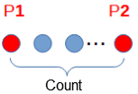
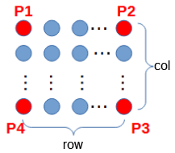
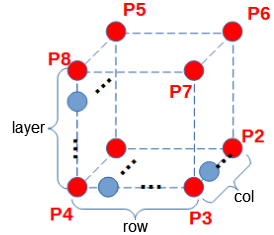
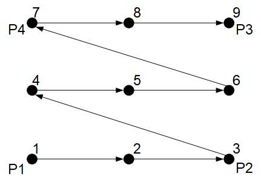

# Palette

<h3 class="lua-cmd" id="list" >Liste des commandes</h3>

Les palettes sont des dispositifs de support de charge qui contiennent des lots de matériaux dans un arrangement régulier, souvent utilisés dans les processus de chargement et de déchargement automatisés. Une palette contient généralement un ensemble d'encoches, chacune d'entre elles pouvant contenir un seul matériau. La commande pallet permet de créer un ensemble complet de points de palettes en enseignant un petit nombre de points, et d'obtenir les points spécifiques de la palette créée afin d'automatiser rapidement le chargement et le déchargement des robots.

| Instruction| Fonction|
|----------|----------|
| [Créer la palette](#createtray)| Créer une palette|
| [Obtenir le point de la palette](#gettraypoint)| Obtenir les points de palette|

<h3 class="lua-cmd" >CreateTray</h3>

**Prototype :**

```lua
CreateTray(Trayname, {Count}, {P1,P2})  -- Palette 1D
CreateTray(Trayname, {row,col}, {P1,P2,P3,P4})  -- Palette 2D
CreateTray(Trayname, {row,col,layer}, {P1,P2,P3,P4,P5,P6,P7,P8})  -- Palette 3D
```

**Description :**

Crée des plateaux, prend en charge la création de plateaux 1D, 2D et 3D.

Il est possible de créer jusqu'à 20 palettes. Lors de la création de palettes portant le même nom, les palettes existantes sont écrasées et le nombre de palettes n'est pas augmenté.

**Paramètres obligatoires :**

- Nom de palette : le nom du plateau, d'une longueur maximale de 32 octets, qui ne peut être ni un nombre ni un espace.

Les deux derniers paramètres sont des variables de tableau. En fonction de la dimension du plateau à créer, le nombre de valeurs dans le tableau sera différent, comme décrit ci-dessous.

- Créer un plateau unidimensionnel : un plateau unidimensionnel est un ensemble de points répartis de manière équidistante sur une ligne droite.
  
  - {Count} : Count représente le nombre de points, plage : [2, 50], si le nombre saisi n'est pas entier, il sera automatiquement arrondi à la valeur inférieure.
  - {P1,P2} : P1 et P2 sont les deux points d'extrémité d'une palette ; ils prennent en charge les points d'apprentissage et les variables de position.

<div align=center></div>

- Créer une palette 2D : une palette 2D est un ensemble de points répartis dans un tableau sur un plan.
  
  - {row,col} : row indique le nombre de points dans la direction de la ligne (direction P1 à P2), col indique le nombre de points dans la direction de la colonne (direction P1 à P4), la plage de valeurs est la même que le nombre de palettes 1D.
  - {P1,P2,P3,P4} : P1, P2, P3, P4 sont les 4 sommets du plateau 2D, supportant les points d'apprentissage et les variables de position.

<div align=center></div>

- Créer une palette 3D : une palette à trois bits est un ensemble de points répartis en trois dimensions dans l'espace, qui peut être considéré comme plusieurs palettes 2D disposées verticalement.
  
  - {row,col,layer} : row indique le nombre de points dans la direction de la ligne (direction P1 à P2), col indique le nombre de points dans la direction de la colonne (direction P1 à P4), layer indique le nombre de couches (direction P1 à P5).
  - {P1,P2,P3,P4,P5,P6,P7,P8} : P1~P8 sont respectivement les 8 sommets de la palette 3D, les points schématiques de support et les variables de position.

<div align=center></div>

<div class="caution1"><b>Attention : </b><div>Si vous utilisez un outil de terminal, assurez-vous de sélectionner le système de coordonnées d' outils correspondant lors de l' enseignement des points. </div></div>

**Exemple :**

```lua
-- Créer une palette 1D de 5 points nommé t1.
CreateTray("t1", {5}, {P1,P2})
-- Créer une palette 2D 4x5 nommé t2.
CreateTray("t2", {4,5}, {P1,P2,P3,P4})
-- Créer une palette 3D 4x5x6 nommé t3.
CreateTray("t2", {4,5,6}, {P1,P2,P3,P4,P5,P6,P7,P8})
```

<h3 class="lua-cmd" >GetTrayPoint</h3>

**Prototype :**

```lua
GetTrayPoint(Trayname, index)
```

**Description :**

Obtenir la position du point de la palette spécifiée avec le numéro de série spécifié. Le numéro de série du point est lié à l'ordre des points transmis lors de la création de la palette.

- Plateau unidimensionnel : le numéro de série du point P1 est 1, le numéro de série du point P2 est le même que le nombre de points, etc.

- Plateau bidimensionnel : la figure suivante illustre la relation entre le point d'enseignement et le numéro de série du point pour un plateau 3x3 à titre d'exemple.
  
  <div align=center></div>

- Plateau tridimensionnel : par référence au plateau bidimensionnel, la deuxième couche du premier point du numéro de série de la première couche du dernier point du numéro de série plus un, etc.

**Paramètres obligatoires :**

- Nom de la palette : nom du plateau créé, chaîne de 32 octets maximum.
- index : le numéro de série du point à récupérer.

**Retour :**

Les coordonnées du point correspondant au numéro de série.

- Si le point utilisé pour créer le plateau est un point tutorial, le format du point retourné est également un point tutorial.
- Si le point utilisé pour créer le plateau est une variable de pose, le format du point retourné est également une variable de pose.

**Exemple :**

```lua
-- Obtenir la position du point d’index 3 de la palette nommé t1.
GetTrayPoint("t1",3)
```