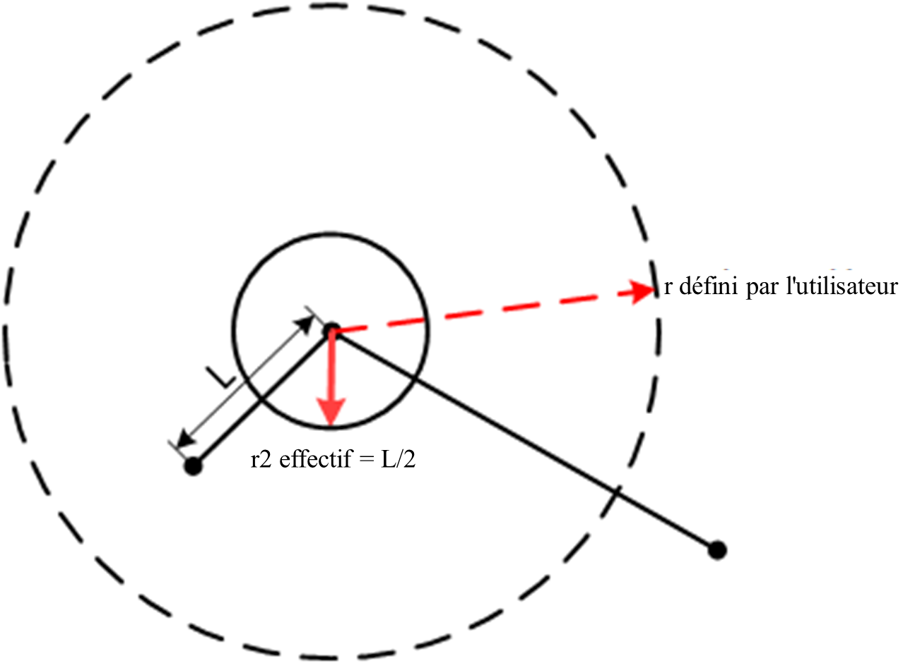

# Description générale

<h3 class="lua-cmd" id="motion_type" >Mode de mouvement</h3>


**Mouvement articulaire**

Le bras robotique planifie le mouvement de chaque articulation en fonction de la différence entre l'angle actuel de chaque articulation et l'angle de chaque articulation au point cible, de sorte que chaque articulation effectue le mouvement en même temps. Le mouvement des articulations n'est pas limité par la trajectoire du point central de l'outil (TCP), qui n'est généralement pas linéaire.


Le mouvement conjoint n'est pas contraint par la position de singularité (voir le manuel du matériel correspondant du bras robotique pour plus de détails sur la position de singularité), il est donc recommandé d'utiliser le mouvement conjoint s'il n'y a pas d'exigence concernant la trajectoire du mouvement ou si le point cible est proche de la position de singularité.

**Mouvement linéaire**

Le bras du robot planifie la trajectoire du mouvement en fonction de la position actuelle et de la position du point cible, de sorte que la trajectoire du mouvement du TCP est une ligne droite et que la position finale change à une vitesse uniforme au cours du mouvement.


Lorsque la trajectoire de mouvement passe par la position singulière, l'envoi d'une commande de mouvement en ligne droite au bras robotique génère un rapport d'erreur ; il est donc recommandé de replanifier la position du point ou d'utiliser un mouvement conjoint à proximité de la position singulière.

**Mouvement en arc**

Le bras robotique détermine un arc ou un cercle entier passant par la position actuelle, P1, P2 trois points non colinéaires. L'attitude finale du bras du robot pendant le mouvement est calculée en interpolant l'attitude du point actuel et de P2, et l'attitude de P1 n'intervient pas dans le calcul (c'est-à-dire que l'attitude du bras du robot lorsqu'il arrive à P1 pendant le mouvement peut être différente de l'attitude enseignée).


Lorsque la trajectoire du mouvement passe par la position impaire, l'envoi de la commande de mouvement d'arc au bras robotique génère un rapport d'erreur, et il est recommandé de replanifier la position du point ou d'utiliser le mouvement de l'articulation à proximité de la position impaire.

<h3 class="lua-cmd" id="point" >Paramètres de jog</h3>

Sauf indication contraire, tous les paramètres de point figurant dans ce manuel peuvent être exprimés de trois manières différentes :

- Variables d'articulation : utilisez l'angle de chaque articulation de chaque bras de robot (j1~j6) pour exprimer la position du point cible.
  
  Lorsque les variables d'articulation sont utilisées comme paramètres de mouvement linéaire ou d'arc, le système les convertit en variables de position par le biais de l'opération de résolution positive, mais l'algorithme garantit que les angles d'articulation du bras robotique lorsqu'il arrive au point cible sont identiques à la valeur définie.

```lua
{joint = {j1, j2, j3, j4, j5, j6} }
```

- Variables de position : les coordonnées cartésiennes (x, y, z) sont utilisées pour représenter la position spatiale du point cible dans le système de coordonnées de l'utilisateur, et les angles eulériens (rx, ry, rz) sont utilisés pour représenter l'angle de rotation du système de coordonnées de l'outil par rapport au système de coordonnées de l'utilisateur lorsque le PCT atteint le point.
  
  Lorsque la variable de position est utilisée comme paramètre de point pour le mouvement de l'articulation, le système la convertit en variable d'articulation (la solution la plus proche de l'angle d'articulation actuel du bras du robot) par le biais de l'opération de solution inverse.

```lua
{pose = {x, y, z, rx, ry, rz} }
```

L'ordre de rotation du bras robotique Echidna lors du calcul des angles d'Euler est X->Y->Z, et chaque axe est tourné autour d'un axe fixe (système de coordonnées de l'utilisateur) comme indiqué dans la figure ci-dessous (rx=γ, ry=β, rz=α).


Une fois l'ordre de rotation déterminé, la matrice de rotation (où cα est une abréviation pour cosα, sα est une abréviation pour sinα, et ainsi de suite) peut être


Dérivée sous forme d'équation


L'équation est utilisée pour calculer l'attitude de l'extrémité du bras du robot.

- Points d'apprentissage : les points obtenus par apprentissage à l'aide du logiciel de commande sont sauvegardés en tant que constantes dans le format suivant.

```lua
--[[
	name : nom des points d’enseignement.
	joint : les coordonnées articulaires des points d’enseignement.
	tool : index du système de coordonnées de l'outil utilisé lors de l’enseignement.
	user : index du système de coordonnées de l'utilisateur utilisé lors de l’enseignement.
	pose : valeur de variables de position des points d’enseignement.
--]]
{
    name = "name",
    joint = {j1, j2, j3, j4, j5, j6},
    tool = index,
    user = index,
    pose = {x, y, z, rx, ry, rz}
}
```

<h3 class="lua-cmd" id="coord" >Paramètres de systèmes de coordonnées</h3>

L'utilisateur et l'outil dans les paramètres optionnels de l'instruction de mouvement sont utilisés pour spécifier le système de coordonnées de l'utilisateur et de l'outil du point cible, qui n'est pris en charge que par le numéro d'index à l'heure actuelle, et vous devez d'abord ajouter le système de coordonnées correspondant dans le logiciel de commande.
Le système sélectionne le système de coordonnées du point dans l'ordre de priorité suivant :

1. Si le système de coordonnées est spécifié par le paramètre optionnel de l'instruction de mouvement, le système de coordonnées spécifié est utilisé. Si le paramètre de point est un point d'apprentissage, les coordonnées de la position du bit du point d'apprentissage sont converties en valeur dans le système de coordonnées spécifié pour être utilisées.
2. Lorsque le système de coordonnées n'est pas spécifié par le paramètre optionnel :
   - Si le point est un point d'instruction, l'index du système de coordonnées fourni avec le point d'instruction est utilisé.
   - Si le point est une variable d'articulation ou d'attitude, le système de coordonnées global défini dans le paramètre de mouvement est utilisé (voir les commandes Utilisateur et Outil pour plus de détails, le système de coordonnées par défaut est 0 lorsque la commande n'est pas appelée).

<br/>

<div class="info2"><b> Description : </b><div><ul><li>Lors du démarrage du Script, le système de coordonnées global par défaut est réinitialisé à zéro, indépendamment des valeurs définies dans le panneau de jog avant le démarrage du script. </li><li>Si le point cible est une variable articulaire, le paramètre du système de coordonnées est invalide. </li></ul></div></div>

<h3 class="lua-cmd" id="speed" >Paramètres de vitesse</h3>

**Vitesse relative**

Les paramètres facultatifs a et v sont utilisés pour spécifier l'échelle d'accélération et de vitesse du bras robotique lors de l'exécution de cette commande de mouvement.

```
Vitesse de mouvement réelle du robot = Vitesse maximale x Taux global x Taux de commande
Accélération de mouvement réelle du robot = Accélération maximale x Taux de commande
```

La vitesse/accélération maximale est contrôlée par le **paramètre de reproduction**, qui peut être consulté et modifié dans la page [Paramètres de mouvement](../setting/speed_setting.md) de DobotStudio Pro.

Le taux global peut être visualisé et modifié à partir de la page [Speed Adjustment](../operation/speed.md) de DobotStudio Pro ou à partir de la page [SpeedFactor](.... /python/Motion Params.md#speedfactor).

Le taux de commande est le ratio porté par les paramètres optionnels de la commande de mouvement ; lorsque le ratio accélération/vitesse du mouvement n'est pas spécifié via les paramètres optionnels, la valeur définie dans les paramètres de mouvement est utilisée par défaut (voir les commandes VelJ, AccJ, VelL et AccL pour plus de détails ; les valeurs par défaut lorsque les paramètres de commande ne sont pas appelés sont toutes de 100).

Exemple :

```lua
AccJ(50) -- Définir l'accélération par défaut pour le mouvement articulaire à 50%
VelJ(60) -- Définir la vitesse par défaut pour le mouvement articulaire à 60%
AccL(70) -- Définir l'accélération par défaut pour le mouvement linéaire à 70%
VelL(80) -- Définir la vitesse par défaut pour le mouvement linéaire à 80%

-- Le taux global est 20% ;

MovJ(P1) -- Se déplacer articulairement vers P1 avec une accélération (valeur maximale d’accélération x 50%) et une vitesse (valeur maximale de vitesse articulaire x 20% x 60%)
MovJ(P2,{a = 30, v = 80}) -- Se déplacer articulairement vers P1 avec une accélération (valeur maximale d’accélération x 30%) et une vitesse (valeur maximale de vitesse articulaire x 20% x 80%)

MovL(P1) -- Se déplacer en ligne droite vers P1 avec une accélération (valeur maximale d’accélération cartésienne x 70%) et une vitesse (valeur maximale de vitesse cartésienne x 20% x 80%)
MovL(P1,{a = 40, v = 90}) -- Se déplacer en ligne droite vers P1 avec une accélération (valeur maximale d’accélération cartésienne x 40%) et une vitesse (valeur maximale de vitesse cartésienne x 20% x 90%)
```

**Vitesse absolue**

La vitesse du paramètre facultatif de l'instruction de mouvement linéaire et arc est utilisée pour spécifier la vitesse absolue du bras lorsqu'il exécute cette instruction de mouvement.

La vitesse absolue n'est pas affectée par la vitesse globale, mais elle est limitée par la vitesse maximale dans le **paramètre de reproduction** (si le bras du robot passe en mode réduit, il est limité par la vitesse maximale après la réduction), c'est-à-dire que si la vitesse cible définie par le paramètre de vitesse est supérieure à la vitesse maximale dans le paramètre de reproduction, c'est la vitesse maximale qui prévaut.

Exemple :

```lua
MovL(P1,{speed = 1000})  -- Déplacer en ligne droite jusqu'à P1 à une vitesse absolue de 1000 mm/s
```

MovL a réglé la vitesse sur 1000, ce qui est inférieur à 2000 de la vitesse maximale du paramètre de reproduction, alors le bras du robot se déplacera avec la vitesse cible de 1000 mm/s, ce qui n'a rien à voir avec le taux global à ce moment-là. Toutefois, si le bras robotique est en mode de réduction (en supposant un taux de réduction de 10 %), la vitesse maximale devient 200, ce qui est inférieur à 1000, et le bras robotique se déplacera à une vitesse cible de 200 mm/s à ce moment-là.

Le paramètre de vitesse et le paramètre v s'excluent mutuellement, s'ils existent en même temps, la vitesse prévaudra.

<h3 class="lua-cmd" id="cp_r" >Paramètres de transition lisse</h3>

Lorsque le bras robotique passe par plusieurs points en continu, il peut passer par le point central en effectuant une transition en douceur, afin d'éviter que le bras robotique ne tourne trop fort. Si les points de trajectoire spécifiés par l'utilisateur sont basés sur des systèmes de coordonnées d'outil différents, la transition en douceur n'est pas possible.
Le paramètre facultatif cp ou r est utilisé pour spécifier le ratio de transition douce (cp) ou le rayon de transition douce (r) entre l'instruction de mouvement actuelle et l'instruction de mouvement suivante. **Le paramètre cp est ignoré lorsque r est défini**.

<div class="info1"><b> Description : </b><div>Les commandes de mouvement articulaire ne prennent pas en charge la définition du rayon de transition lisse (r), veuillez consulter les paramètres facultatifs de chaque commande. </div></div>

<br/>

**CP**

Lors du réglage du rapport de transition douce, le système calcule automatiquement la courbure de la courbe de transition. Plus la valeur CP est élevée, plus la courbe est douce, comme le montre la figure ci-dessous. La courbe de transition CP est affectée par la vitesse/accélération du mouvement, même si la position du point et la valeur CP sont identiques, l'arc de la courbe de transition sera différent lorsque la vitesse/accélération du mouvement est différente.


**R**

Lorsque vous définissez le rayon de transition lisse, le système prend le point de transition comme centre et calcule la courbe de transition en fonction du rayon spécifié. La courbe de transition R n'est pas affectée par la vitesse/accélération du mouvement, elle est uniquement déterminée par la position du point et le rayon de transition.


Si le rayon de transition défini par l'utilisateur est trop grand (supérieur à la distance entre le point de départ/fin et le point de transition), le système utilise automatiquement la moitié de la distance la plus courte entre le point de départ/fin et le point de transition comme rayon de transition pour calculer la courbe de transition.



Lorsque deux rayons de transition consécutifs (r1 et r2 dans la figure ci-dessous) coïncident, le système utilise le point après la fin de la transition du premier mouvement comme point de départ du second mouvement, puis calcule le second r qui est réellement en vigueur en fonction de la logique selon laquelle le rayon de transition est trop grand.


**Valeur par défaut**

Lorsque le ratio ou le rayon de transition douce n'est pas spécifié via un paramètre facultatif, le ratio de transition douce défini dans le paramètre de mouvement est utilisé par défaut (voir la commande CP pour plus de détails ; la valeur par défaut est 0 lorsque le paramètre de commande n'est pas appelé).

**Précautions à prendre**

La transition douce fait en sorte que le mouvement du bras du robot ne passe pas par le point intermédiaire, de sorte que lorsque la transition douce est définie, la sortie du signal d'E/S ou la commande de réglage de la fonction (par exemple, la commutation de la peau de sécurité) entre deux commandes de mouvement **sera exécutée pendant la transition**.

Si vous souhaitez pouvoir exécuter l'instruction lorsque le bras du robot atteint exactement le point intermédiaire, réglez le paramètre Smooth Transition de l'instruction précédente sur zéro.

En raison de la différence d'implémentation de cp et r, si d'autres instructions qui n'affectent pas le mouvement (telles que le jugement conditionnel, l'IO, l'énergie de réglage de fonction) sont insérées entre deux instructions de mouvement qui nécessitent une transition en douceur, le traitement de cp et r diffère.

- Si une transition **cp** est utilisée, **la plupart des instructions n'affecteront pas la transition**, sauf si le temps de traitement de l'instruction est trop long (par exemple, l'instruction Wait).

Dans l'exemple suivant, l'insertion d'une instruction if entre deux instructions de mouvement n'affecte pas la transition en douceur en mode cp.

```lua
-- La transition peut se faire normalement, le robot évaluera l'état de DI1 juste avant d'arriver au point P1. Si DI1 est ON, il effectuera la transition vers la prochaine commande de mouvement avec un facteur de transition lisse de 50%.
MovL(P1,{cp=50})
if (DI(1)==ON) 
then
	MovL(P2)
end
```

- Si vous utilisez la transition en mode **r**, **seules les instructions figurant sur la liste blanche ci-dessous n'affecteront pas la transition en douceur**. L'insertion de toute autre instruction désactivera la transition en mode r.

```
RelPointTool, RelPointUser, DOGroup, DO, AO, ToolDO, 
SetUser, SetTool, User, Tool, CP, AccJ, AccL, VelL, VelJ,
SetPayload, SetCollisionLevel, SetBackDistance, EnableSafeSkin, SetSafeSkin
```

Dans l'exemple suivant, l'insertion d'une instruction if entre deux instructions de mouvement invalidera le réglage de la transition en douceur du mode r.

```lua
-- Le paramètre de transition lisse est invalide. Le robot évaluera l'état de DI1 uniquement après avoir atteint le point P1.
MovL(P1,{r=5})
if (DI(1)==ON) 
then
	MovL(P2)
end
```

<h3 class="lua-cmd" id="stopcond" >Conditions d'arrêt</h3>

Le paramètre facultatif stopcond est utilisé pour spécifier une condition d'arrêt du mouvement, qui est une expression sous forme de chaîne de caractères. Si une condition d'arrêt est spécifiée, le robot vérifie la condition d'arrêt en temps réel pendant l'exécution de l'instruction de mouvement, met fin au mouvement en cours lorsque la condition d'arrêt est satisfaite et exécute directement l'instruction suivante.
La condition d'arrêt prend en charge toute expression conforme à la syntaxe Lua et est considérée comme satisfaite lorsque l'expression est vraie :

```lua
-- Arrêter le mouvement lorsque DI1 est sur ON
MovJ(P1,{stopcond="DI(1) == ON"})
-- Arrêter le mouvement lorsque DI1 et DO1 sont sur ON
MovJ(P1,{stopcond="DI(1) == ON and GetDO(1) == ON"})
-- Arrêter le mouvement lorsque la valeur stockée dans l'adresse du registre de maintien 100 est inférieure à 10
MovJ(P1,{stopcond="GetHoldRegs(id, 100, 1)[1] < 10"})
-- Arrêter le mouvement lorsque la variable var1 n'est pas égale à 5
MovJ(P1,{stopcond="var1 ~= 5"})
```

<div class="info2"><b> Description : </b><div><ul><li>La spécification d'une condition d'arrêt rendra les paramètres de transition lisse invalides. </li><li>Après avoir spécifié une condition d'arrêt, les paramètres de transition lisse cp peuvent entrer en vigueur, mais la zone de transition (partie courbe) n'est pas comprise dans la portée d'application de la condition d'arrêt. </li><li>Si une transition lisse est ajoutée à l'instruction précédant celle contenant la condition d'arrêt, la condition d'arrêt ne sera déclenchée qu'après avoir quitté la zone de transition. </li></ul></div></div>

<h3 class="lua-cmd" id="io" >Représentation des signaux d'E/S</h3>

Les variables ON et OFF sont prédéfinies dans le système pour indiquer si l'E/S numérique a un signal ou non.

- ON = 1, signifie qu'il y a un signal

- OFF = 0, signifie qu'il n'y a pas de signal

ON|OFF dans le paramètre signifie que le paramètre prend la valeur ON ou OFF, les utilisateurs peuvent également utiliser 1 ou 0 comme entrée.